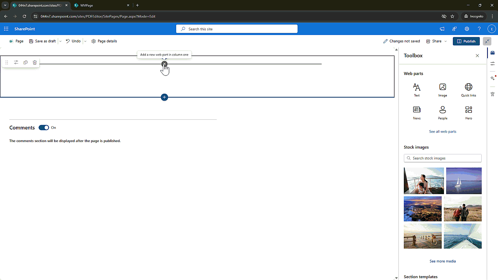

# Nutrient Document Viewer

## Summary

This a custom PDF viewer web part for SharePoint Online by integrating Nutrient for Web using the SharePoint Framework (SPFx).

## Compatibility

| :warning: Important          |
|:---------------------------|
| Every SPFx version is optimally compatible with specific versions of Node.js. In order to be able to build this sample, you need to ensure that the version of Node on your workstation matches one of the versions listed in this section. This sample will not work on a different version of Node.|
|Refer to <https://aka.ms/spfx-matrix> for more information on SPFx compatibility.   |

This sample is optimally compatible with the following environment configuration:

-Incompatible-red.svg "SharePoint Server 2016 Feature Pack 2 requires SPFx 1.1")

## Applies to

* [SharePoint Framework](https://learn.microsoft.com/sharepoint/dev/spfx/sharepoint-framework-overview)
* [Microsoft 365 tenant](https://learn.microsoft.com/sharepoint/dev/spfx/set-up-your-development-environment)

> Get your own free development tenant by subscribing to [Microsoft 365 developer program](https://aka.ms/m365/devprogram)

## Prerequisites

* **[Nutrient for Web SDK](https://www.nutrient.io/sdk)**  
  A powerful JavaScript-based PDF rendering and annotation tool that brings a modern PDF experience to the browser.

* **SharePoint Framework (SPFx)**  
  The recommended development model for customizing SharePoint Online. It allows you to build client-side web parts that integrate seamlessly into the SharePoint experience.

* **React**  
  Used for building the UI layer of the SPFx web part. Provides a responsive and interactive user interface.

## Version history

| Version | Date             | Comments        |
| ------- | ---------------- | --------------- |
| 1.0     | March 25,2025  | Initial release |

## Contributors

* [Clavin Fernandes](https://github.com/cfernandes-muhimbi)

## Minimal Path to Awesome

* Clone this repository
* Ensure that you are at the solution folder
* in the command line run:
  * `npm install`
  * `gulp serve`

## Features

* **View PDF Files** directly from SharePoint document libraries.
* **Annotate PDFs** with highlights, comments, and shapes.
* **Navigation Tools** – page thumbnails, outlines, and search.
* **Custom Toolbar Options** – configure what tools are visible to users.
* **Zoom and Pan** for better document viewing.
* **Works on All Modern Browsers** – optimized for performance and responsiveness.
* **Looking for more features?** - check out the full list of capabilities at [nutrient.io/low-code](https://www.nutrient.io/low-code)
* **For more interesting use case** - see [nutrient.io/low-code](https://github.com/PSPDFKit/awesome-nutrient)

## References

* [Getting started with SharePoint Framework](https://docs.microsoft.com/en-us/sharepoint/dev/spfx/set-up-your-developer-tenant)
* [Building for Microsoft teams](https://docs.microsoft.com/en-us/sharepoint/dev/spfx/build-for-teams-overview)
* [Use Microsoft Graph in your solution](https://docs.microsoft.com/en-us/sharepoint/dev/spfx/web-parts/get-started/using-microsoft-graph-apis)
* [Publish SharePoint Framework applications to the Marketplace](https://docs.microsoft.com/en-us/sharepoint/dev/spfx/publish-to-marketplace-overview)
* [Microsoft 365 Patterns and Practices](https://aka.ms/m365pnp) - Guidance, tooling, samples and open-source controls for your Microsoft 365 development

## Help

We do not support samples, but this community is always willing to help, and we want to improve these samples. We use GitHub to track issues, which makes it easy for  community members to volunteer their time and help resolve issues.

If you're having issues building the solution, please run [spfx doctor](https://pnp.github.io/cli-microsoft365/cmd/spfx/spfx-doctor/) from within the solution folder to diagnose incompatibility issues with your environment.

You can try looking at [issues related to this sample](https://github.com/pnp/sp-dev-fx-webparts/issues?q=label%3A%22sample%3A%20react-nutrient-document-viewer%22) to see if anybody else is having the same issues.

You can also try looking at [discussions related to this sample](https://github.com/pnp/sp-dev-fx-webparts/discussions?discussions_q=react-nutrient-document-viewer) and see what the community is saying.

If you encounter any issues using this sample, [create a new issue](https://github.com/pnp/sp-dev-fx-webparts/issues/new?assignees=&labels=Needs%3A+Triage+%3Amag%3A%2Ctype%3Abug-suspected%2Csample%3A%20react-nutrient-document-viewer&template=bug-report.yml&sample=react-nutrient-document-viewer&authors=@cfernandes-muhimbi&title=react-nutrient-document-viewer%20-%20).

For questions regarding this sample, [create a new question](https://github.com/pnp/sp-dev-fx-webparts/issues/new?assignees=&labels=Needs%3A+Triage+%3Amag%3A%2Ctype%3Aquestion%2Csample%3A%20react-nutrient-document-viewer&template=question.yml&sample=react-nutrient-document-viewer&authors=@cfernandes-muhimbi&title=react-nutrient-document-viewer%20-%20).

Finally, if you have an idea for improvement, [make a suggestion](https://github.com/pnp/sp-dev-fx-webparts/issues/new?assignees=&labels=Needs%3A+Triage+%3Amag%3A%2Ctype%3Aenhancement%2Csample%3A%20react-nutrient-document-viewer&template=suggestion.yml&sample=react-nutrient-document-viewer&authors=@cfernandes-muhimbi&title=react-nutrient-document-viewer%20-%20).

## Disclaimer

**THIS CODE IS PROVIDED *AS IS* WITHOUT WARRANTY OF ANY KIND, EITHER EXPRESS OR IMPLIED, INCLUDING ANY IMPLIED WARRANTIES OF FITNESS FOR A PARTICULAR PURPOSE, MERCHANTABILITY, OR NON-INFRINGEMENT.**

