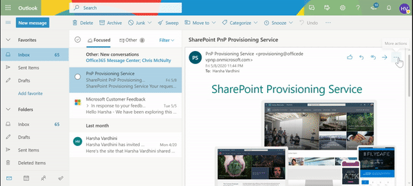

# Save Outlook email to SharePoint Document Library Add-in

## Summary

This Add-in helps the user to save current selected email to SharePoint document Library.

## Features and usage

In Outlook web, select an email and select more options. Select 'More actions' at the top of the message. Scroll to the bottom and select **Save Email to SharePoint** Add-in. The add-in loads the taskpane that list's the sites user has access. Once the user selects the site, it loads the list of document libraries that are present in that site. After selecting a library, the user can save the email by clicking **Save** button. Once it is saved, a link will be generated to view the email preview. The email will be saved in `.eml` format.  

## Used SharePoint Framework Version

## Applies to

* [SharePoint Framework](https:/dev.office.com/sharepoint)
* [Office 365 tenant](https://dev.office.com/sharepoint/docs/spfx/set-up-your-development-environment)

## Solution

Solution|Author(s)
--------|---------
save-email-to-sharepoint-client-side-solution | [Harsha Vardhini](https://twitter.com/harshagracy)

## Version history

Version|Date|Comments
-------|----|--------
1.0|May 15, 2020|Initial Release

## Disclaimer

**THIS CODE IS PROVIDED *AS IS* WITHOUT WARRANTY OF ANY KIND, EITHER EXPRESS OR IMPLIED, INCLUDING ANY IMPLIED WARRANTIES OF FITNESS FOR A PARTICULAR PURPOSE, MERCHANTABILITY, OR NON-INFRINGEMENT.**

---

## Minimal Path to Awesome

* Clone this repository
* in the command line run:
  * `npm install`
  * `gulp bundle --ship`
  * `gulp package-solution --ship`
* Deploy the `save-email-to-sharepoint.sppkg` to SharePoint App Catalog

## Graph API approval

* Move to the SharePoint tenant administrative UIs located at https://tenant-admin.sharepoint.com
* Move to API management under the Advance left menu option to see the currently pending permission requests. Notice that the request for Mail.ReadWrite permission for in Graph API is pending for approval.
  * Select the pending permission row and choose Approve from the toolbar.

## Publish Office Add-ins using Centralized Deployment via the Office 365 admin center

* For deployment in your tenant, Please refer this article - https://docs.microsoft.com/en-us/microsoft-365/admin/manage/manage-deployment-of-add-ins?view=o365-worldwide

## Personally deploy in your outlook web app

Before deploying tenant wide, you can use the below steps to test it for your outlook web app.
* In Outlook web, select an email and select more options
* Select **More actions** at the top of the message.
* Go to the bottom of the list and select **Get Add-ins**.
* On the **Add-ins for Outlook** page, select the **My add-ins**.
* Scroll to the bottom to **Custom Add-ins**
* Select **Custom Add-ins from a file**. Upload the manifest file `e6083c02-3280-4430-a877-22cbc6251d21_outlookManifest.xml` from the `OfficeAddin` folder. 
* Click +**Install** in the warning window.
* Now you can use the Add-in for your outlook web login.

