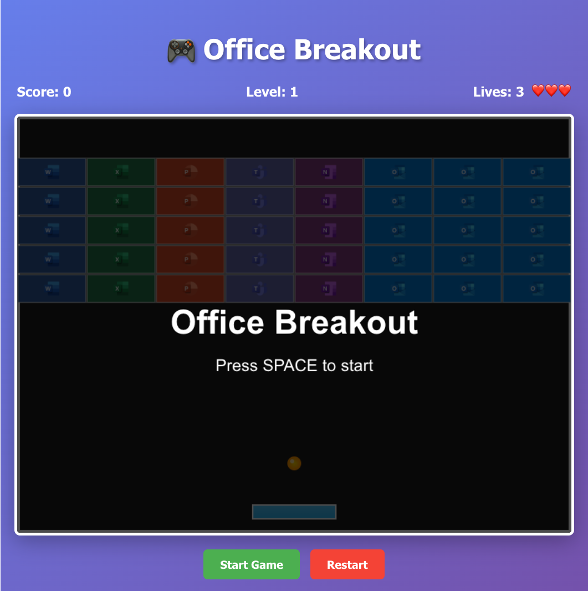
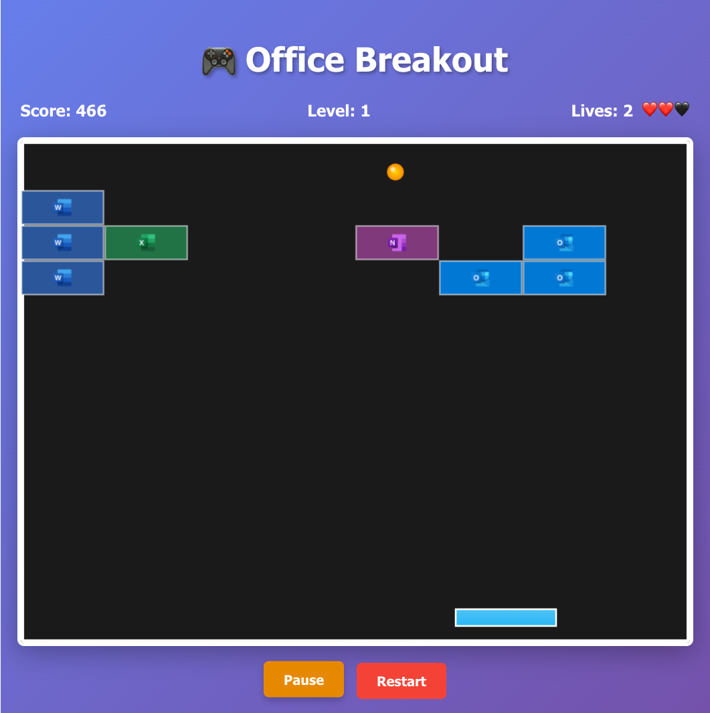
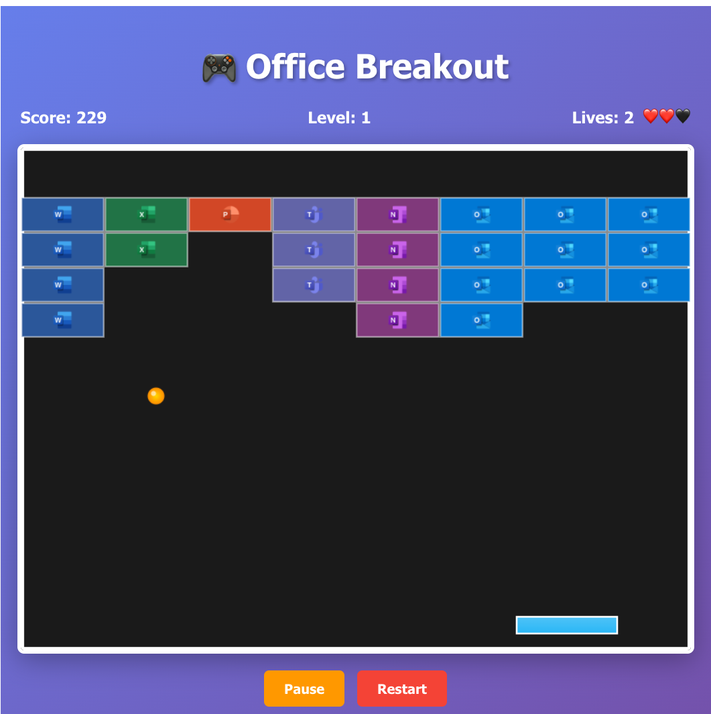
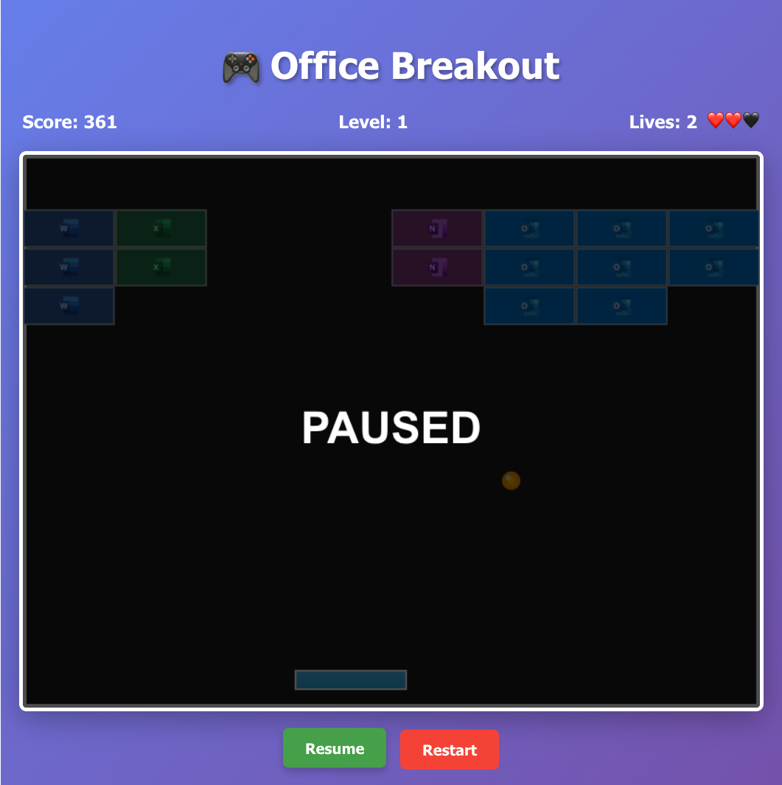
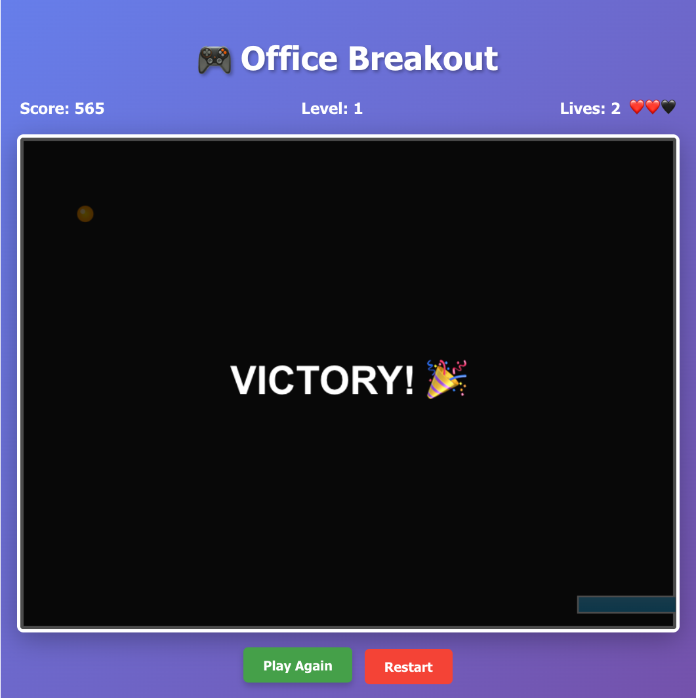

# react-office-breakout

## Summary

A modern take on the classic breakout game built with React 17, TypeScript, and HTML5 Canvas. Features Office-themed blocks with authentic Microsoft app icons, demonstrates advanced React patterns including Context API and custom hooks. Perfect for SharePoint Framework environments and showcases high-performance Canvas rendering with responsive keyboard controls.

## Compatibility

| :warning: Important          |
|:---------------------------|
| Every SPFx version is optimally compatible with specific versions of Node.js. In order to be able to build this sample, you need to ensure that the version of Node on your workstation matches one of the versions listed in this section. This sample will not work on a different version of Node.|
|Refer to <https://aka.ms/spfx-matrix> for more information on SPFx compatibility.   |

This sample is optimally compatible with the following environment configuration:

-Incompatible-red.svg "SharePoint Server 2016 Feature Pack 2 requires SPFx 1.1")

## Applies to

- [SharePoint Framework](https://aka.ms/spfx)

## Contributors

- [Peter Paul Kirschner](https://github.com/petkir)

## Version history

|Version|Date|Comments|
|-------|----|--------|
|1.0|Okt, 2025|Initial release|

## Prerequisites

## Minimal Path to Awesome

- Clone this repository
- Ensure that you are at the solution folder
- in the command-line run:
  - `npm install`
  - `gulp serve`

>  This sample can also be opened with [VS Code Remote Development](https://code.visualstudio.com/docs/remote/remote-overview). Visit https://aka.ms/spfx-devcontainer for further instructions.

## Features

## Features

This sample demonstrates advanced React patterns and modern web technologies through an engaging Office-themed breakout game:

### Architecture

- **HTML5 Canvas** for high-performance game rendering
- **Context API** for centralized game state management
- **Custom hooks** for reusable game logic
- **Provider pattern** to eliminate prop drilling

### Game

- **Smooth keyboard controls** with responsive paddle movement
- **Multiple game states** including pause, victory, and game over
- **Visual effects** with ball glow and gradient rendering
- **Canvas rendering** for efficient graphics operations
- **Image caching** for fast asset loading
- **requestAnimationFrame** for smooth animations
- **Optimized event handling** for responsive controls

### Motivation

All these techniques are typically used in business cases with computer vision and webcams, but here they are presented in a more fun way.

## Help

We do not support samples, but we do use GitHub to track issues and constantly want to improve these samples.

You can try looking at [issues related to this sample](https://github.com/pnp/sp-dev-fx-webparts/issues?q=label%3A%22sample%3A%20react-organization-chart") to see if anybody else is having the same issues.

You can also try looking at [discussions related to this sample](https://github.com/pnp/sp-dev-fx-webparts/discussions?discussions_q=react-organization-chart) and see what the community is saying.

If you encounter any issues while using this sample, [create a new issue](https://github.com/pnp/sp-dev-fx-webparts/issues/new?assignees=&labels=Needs%3A+Triage+%3Amag%3A%2Ctype%3Abug-suspected%2Csample%3A%20react-organisation-chart&template=bug-report.yml&sample=react-organisation-chart&authors=@joaojmendes&title=react-organisation-chart%20-%20).

For questions regarding this sample, [create a new question](https://github.com/pnp/sp-dev-fx-webparts/issues/new?assignees=&labels=Needs%3A+Triage+%3Amag%3A%2Ctype%3Aquestion%2Csample%3A%20react-organisation-chart&template=question.yml&sample=react-organisation-chart&authors=@joaojmendes&title=react-organisation-chart%20-%20).

Finally, if you have an idea for improvement, [make a suggestion](https://github.com/pnp/sp-dev-fx-webparts/issues/new?assignees=&labels=Needs%3A+Triage+%3Amag%3A%2Ctype%3Aenhancement%2Csample%3A%20react-organisation-chart&template=question.yml&sample=react-organisation-chart&authors=@joaojmendes&title=react-organisation-chart%20-%20).

## Disclaimer

**THIS CODE IS PROVIDED *AS IS* WITHOUT WARRANTY OF ANY KIND, EITHER EXPRESS OR IMPLIED, INCLUDING ANY IMPLIED WARRANTIES OF FITNESS FOR A PARTICULAR PURPOSE, MERCHANTABILITY, OR NON-INFRINGEMENT.**

