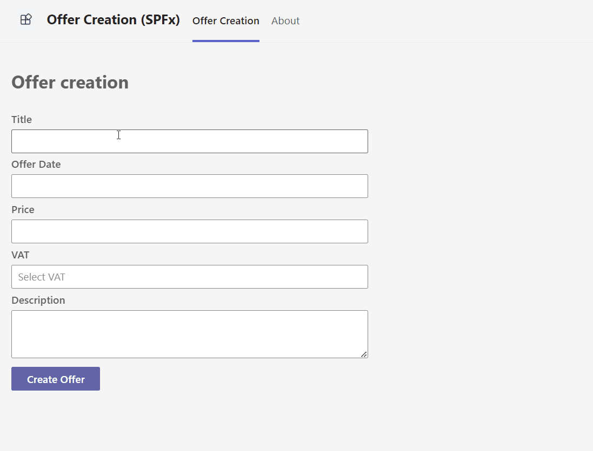
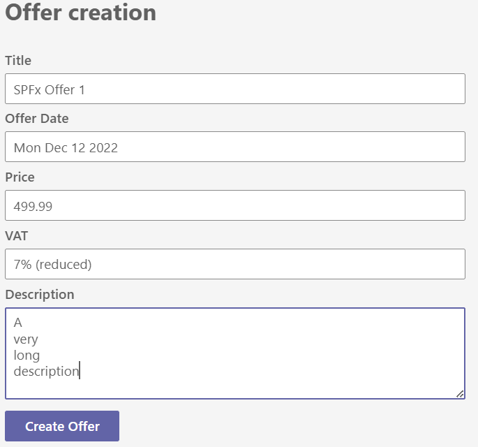
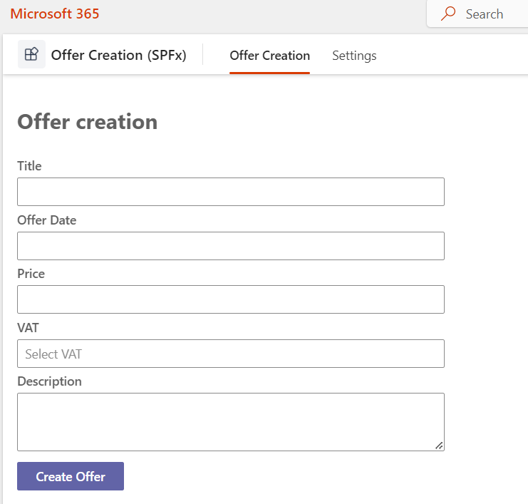
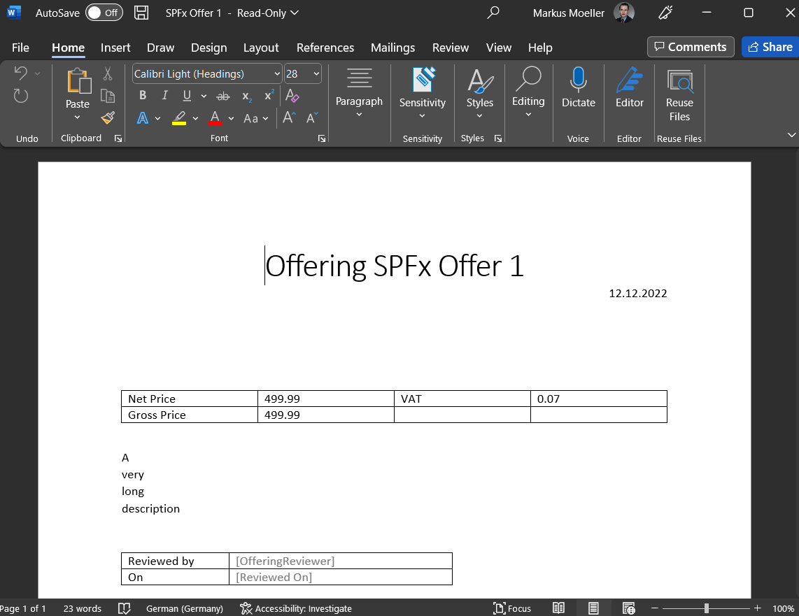
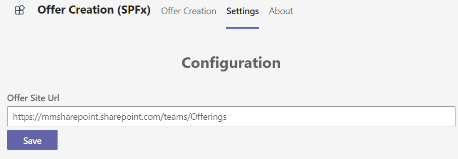

# Offer Creation

## Summary

This sample is a Teams personal Tab to act as a Microsoft 365 across application (Teams, Outlook, Office) to generate documents. It is realized with SharePoint Framework (SPFx).

App live in action inside Teams



Create Offer form with FluentUI controls



Create Offer form with FluentUI controls opened in Microsoft 365



Created Offer with filled metadata opened 1in Word



Configuration settings form to set Site Url (Offer location)



For further details see the author's [blog series](https://mmsharepoint.wordpress.com/2022/12/28/a-sharepoint-document-generator-as-microsoft-365-app-ii-spfx/)

## Compatibility

| :warning: Important          |
|:---------------------------|
| Every SPFx version is only compatible with specific version(s) of Node.js. In order to be able to build this sample, please ensure that the version of Node on your workstation matches one of the versions listed in this section. This sample will not work on a different version of Node.|
|Refer to <https://aka.ms/spfx-matrix> for more information on SPFx compatibility.   |

This sample is optimally compatible with the following environment configuration:


-Incompatible-red.svg "SharePoint Server 2016 Feature Pack 2 requires SPFx 1.1")


For more information about SPFx compatibility, please refer to <https://aka.ms/spfx-matrix>

## Applies to

* [SharePoint Framework](https://learn.microsoft.com/sharepoint/dev/spfx/sharepoint-framework-overview)
* [Microsoft 365 tenant](https://learn.microsoft.com/sharepoint/dev/spfx/set-up-your-development-environment)

> Get your own free development tenant by subscribing to [Microsoft 365 developer program](http://aka.ms/m365devprogram)

## Contributors

* [Markus Moeller](https://github.com/mmsharepoint)

## Version history

Version|Date|Author|Comments
-------|----|----|--------
1.0|Dec 28, 2022|[Markus Moeller](https://github.com/mmsharepoint) <https://twitter.com/moeller2_0>|Initial release

## Minimal Path to Awesome

* Clone this repository (or [download this solution as a .ZIP file](https://pnp.github.io/download-partial/?url=https://github.com/pnp/sp-dev-fx-webparts/tree/main/samples/react-office-offer-creation) then unzip it)
* From your command line, change your current directory to the directory containing this sample (`react-office-offer-creation`, located under `samples`)
* Create the content-type for your offers in a site / default document library of your choice
  * With PnP-PowerShell for instance call the deploy script with your site URL as parameter

    ```bash
    .\templates\deploy.ps1 -siteUrl <YourFullSiteUrl>
    ```

    > This should put the same site URL to your tenant-property named 'CreateOfferSiteUrl'

* in the command line run:
  * `npm install`
  * `gulp serve`
* Now you can run the web part inside SharePoint.
* To use it as a Teams, Outlook, Microsoft 365 App as well:
  * Bundle and Package the solution:
    * `gulp bundle --ship`
    * `gulp package-solution --ship`
  * Upload the solution to your tenant's app catalog and "install" it tenant-wide
  * Package the icons and your manifest from the solution's \teams folder in a ZIP
  * Upload this ZIP as a custom solution or to your org's Teams' app catalog

> This sample can also be opened with [VS Code Remote Development](https://code.visualstudio.com/docs/remote/remote-overview). Visit <https://aka.ms/spfx-devcontainer> for further instructions.

## Features

* Using SharePoint Rest API to copy files and edit it's metadata
* [Extend Teams SPFx apps across Microsoft 365](https://learn.microsoft.com/en-us/sharepoint/dev/spfx/office/overview?WT.mc_id=M365-MVP-5004617)
* [Use FluentUI Label, DatePicker, Dropdown, IDropdownOption, Spinner, TextField](https://developer.microsoft.com/en-us/fluentui#/?WT.mc_id=M365-MVP-5004617)
* [Use SharePoint tenant properties for org-wide SPFx app configurations](https://learn.microsoft.com/en-us/sharepoint/dev/spfx/tenant-properties?tabs=sprest#getread-tenant-properties?WT.mc_id=M365-MVP-5004617)
* [Configure Microsoft Teams personal apps built using SharePoint Framework](https://learn.microsoft.com/en-us/sharepoint/dev/spfx/build-for-teams-configure-in-teams#configure-microsoft-teams-personal-apps-built-using-sharepoint-framework?WT.mc_id=M365-MVP-5004617)

## References

- [Getting started with SharePoint Framework](https://docs.microsoft.com/en-us/sharepoint/dev/spfx/set-up-your-developer-tenant)
- [Building for Microsoft teams](https://docs.microsoft.com/en-us/sharepoint/dev/spfx/build-for-teams-overview)
- [Use Microsoft Graph in your solution](https://docs.microsoft.com/en-us/sharepoint/dev/spfx/web-parts/get-started/using-microsoft-graph-apis)
- [Publish SharePoint Framework applications to the Marketplace](https://docs.microsoft.com/en-us/sharepoint/dev/spfx/publish-to-marketplace-overview)
- [Microsoft 365 Patterns and Practices](https://aka.ms/m365pnp) - Guidance, tooling, samples and open-source controls for your Microsoft 365 development

## Help

We do not support samples, but this community is always willing to help, and we want to improve these samples. We use GitHub to track issues, which makes it easy for  community members to volunteer their time and help resolve issues.

If you're having issues building the solution, please run [spfx doctor](https://pnp.github.io/cli-microsoft365/cmd/spfx/spfx-doctor/) from within the solution folder to diagnose incompatibility issues with your environment.

You can try looking at [issues related to this sample](https://github.com/pnp/sp-dev-fx-webparts/issues?q=label%3A%22sample%3A%20react-office-offer-creation%22) to see if anybody else is having the same issues.

You can also try looking at [discussions related to this sample](https://github.com/pnp/sp-dev-fx-webparts/discussions?discussions_q=react-office-offer-creation) and see what the community is saying.

If you encounter any issues using this sample, [create a new issue](https://github.com/pnp/sp-dev-fx-webparts/issues/new?assignees=&labels=Needs%3A+Triage+%3Amag%3A%2Ctype%3Abug-suspected%2Csample%3A%20react-office-offer-creation&template=bug-report.yml&sample=react-office-offer-creation&authors=@mmsharepoint&title=react-office-offer-creation%20-%20).

For questions regarding this sample, [create a new question](https://github.com/pnp/sp-dev-fx-webparts/issues/new?assignees=&labels=Needs%3A+Triage+%3Amag%3A%2Ctype%3Aquestion%2Csample%3A%20react-office-offer-creation&template=question.yml&sample=react-office-offer-creation&authors=@mmsharepoint&title=react-office-offer-creation%20-%20).

Finally, if you have an idea for improvement, [make a suggestion](https://github.com/pnp/sp-dev-fx-webparts/issues/new?assignees=&labels=Needs%3A+Triage+%3Amag%3A%2Ctype%3Aenhancement%2Csample%3A%20react-office-offer-creation&template=suggestion.yml&sample=react-office-offer-creation&authors=@mmsharepoint&title=react-office-offer-creation%20-%20).

## Disclaimer

**THIS CODE IS PROVIDED *AS IS* WITHOUT WARRANTY OF ANY KIND, EITHER EXPRESS OR IMPLIED, INCLUDING ANY IMPLIED WARRANTIES OF FITNESS FOR A PARTICULAR PURPOSE, MERCHANTABILITY, OR NON-INFRINGEMENT.**


