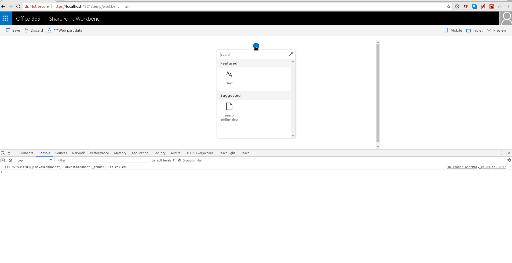

# Offline First React Webpart built using LocalForage, Whatwg-Fetch, ES6-Promise

## Summary

Sample Webpart that demonstrates how to use offline storage in a way that is more
offline first.

This webpart would not be possible without the great tools provided, please
read the documentation for 
* [LocalForage](https://github.com/localForage/localForage)
* [ES6-Promise](https://github.com/stefanpenner/es6-promise)
* [Whatwg-Fetch](https://github.com/whatwg/fetch)

## Used SharePoint Framework Version

## Applies to

* [SharePoint Framework Developer Preview](https://docs.microsoft.com/sharepoint/dev/spfx/sharepoint-framework-overview)
* [Office 365 developer tenant](https://docs.microsoft.com/sharepoint/dev/spfx/set-up-your-developer-tenant)

## Solution

Solution            |Author(s)
--------------------|---------
react-offline-first |[Austin Breslin](https://github.com/AustinBreslinDev)

## Version history

Version |Date       | Comments
------- |----       | --------
0.0.1   |17/Feb/18  | Got the HTTP Requests to work.
0.0.2   |17/Feb/18  | Separated interfaces into their own files.
0.0.3   |18/Feb/18  | Updated JSDocs, and and created readme.

## Disclaimer
**THIS CODE IS PROVIDED *AS IS* WITHOUT WARRANTY OF ANY KIND, EITHER EXPRESS OR IMPLIED, INCLUDING ANY IMPLIED WARRANTIES OF FITNESS FOR A PARTICULAR PURPOSE, MERCHANTABILITY, OR NON-INFRINGEMENT.**

---

## Minimal Path to Awesome

- Clone this repo
- In the command line run:
  - `npm install`
  - `tsd install`
  - `gulp serve`
  - Open the *workbench* on your Office 365 Developer tenant
  - Test out the web part

## Features

This webpart demonstrates using the OfflineFirstHTTPService how to do offline
first HTTP Requests.

HTTP Get requests are first retrieved from an offline storage system. Either
localStorage, IndexedDB, WebSQL or SessionStorage, but maybe not in that order.
Then the live request is using fetch, then stored locally, errors are placed into
a queue for when available. 

HTTP Posts/Updates/Deletes are executed differently to GET requests, they always
make a HTTP request using fetch, but on failure are added to the queue.

The Queue system collects all failed HTTP Requests and when the user is online
will try to make the requests again, all requests are async so will not cause
any blocking for the user.

This Web Part illustrates the following concepts on top of the SharePoint Framework:

- Using offline first techniques, store locally, retrieve locally before making
HTTP requests.
- Async looping, can be found in the Queue System.
- Performance techniques for browsers, async looping does not block render,
using local storage first reduces the time to draw the initial page load.

