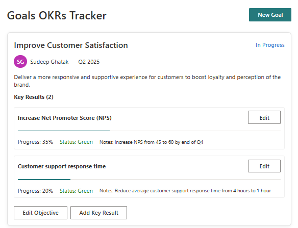

# goals-okrs-tracker

## Summary

This SharePoint web part is an Objectives and Key Results (OKR) tracking system with a modern, responsive UI. It allows users to create, track, and manage organizational objectives and their associated key results. The application provides a structured way to set goals, track progress, and maintain alignment across teams. Built with React, TypeScript, and Fluent UI, it integrates seamlessly with SharePoint while providing advanced functionality for performance management.

## Prerequisites

A SharePoint list named "Objectives" to store the objective information with the following columns:

 - Title (Single line of text)
 - Quarter (Choice - Q1, Q2, Q3, Q4)
 - Year (Number)
 - Status (Choice - Not Started, In Progress, Completed, On Hold)
 - Notes (Multiple lines of text)
 - Author (Person or Group)

A SharePoint list named "KeyResults" to store the key results with the following columns:

 - Title (Single line of text)
 - ObjectiveId (Number - lookup to Objectives list)
 - Status (Choice - Not Started, In Progress, Completed, On Hold)
 - Progress (Number - percentage)
 - Notes (Multiple lines of text)

  Use can use the [Powershell script](./scripts/SharePointLists.ps1) to provision the list.

## Compatibility

| :warning: Important          |
|:---------------------------|
| Every SPFx version is only compatible with specific version(s) of Node.js. In order to be able to build this sample, please ensure that the version of Node on your workstation matches one of the versions listed in this section. This sample will not work on a different version of Node.|
|Refer to <https://aka.ms/spfx-matrix> for more information on SPFx compatibility.   |

-Incompatible-red.svg "SharePoint Server 2016 Feature Pack 2 requires SPFx 1.1")

## Applies to

- [SharePoint Framework Developer Preview](https://learn.microsoft.com/sharepoint/dev/spfx/sharepoint-framework-overview)
- [Office 365 developer tenant](https://learn.microsoft.com/sharepoint/dev/spfx/set-up-your-developer-tenant)

## Contributors

- [Sudeep Ghatak](https://github.com/sudeepghatak)

## Version history

|Version|Date|Comments|
|-------|----|--------|
|1.0|August 3, 2025|Initial release|

## Disclaimer

**THIS CODE IS PROVIDED _AS IS_ WITHOUT WARRANTY OF ANY KIND, EITHER EXPRESS OR IMPLIED, INCLUDING ANY IMPLIED WARRANTIES OF FITNESS FOR A PARTICULAR PURPOSE, MERCHANTABILITY, OR NON-INFRINGEMENT.**

---

## Minimal Path to Awesome

### Build and Test

> This sample can also be opened with [VS Code Remote Development](https://code.visualstudio.com/docs/remote/remote-overview). Visit <https://aka.ms/spfx-devcontainer> for further instructions.

1. Clone this repo
1. In the command line run
    - `npm i`
    - `gulp build`
    - `gulp serve --nobrowser`
1. Create a custom list (e.g. Bookmarks)
1. Navigate to the hosted version of SharePoint workbench, e.g. **https://\<tenant>.sharepoint.com/sites/\<your site>/_layouts/15/workbench.aspx**
1. Add the Web Part to the canvas and configure it.

### Package and deploy

## Features

### Core Functionality
- Create, view, edit, and delete objectives  
- Add key results linked to objectives  
- Track progress against key results  
- Filter and view objectives by quarter and year  

### Dashboard & Views
- Comprehensive overview of all objectives  
- Detailed objective view with associated key results  
- New objective creation form with validation  
- In-place key result editing experience  

### Metadata & Tracking
- Support for quarterly planning cycles  
- Real-time status tracking of objectives and key results  
- Visual progress indicators (e.g., bars, RAG status)  
- Automatic author attribution and timestamps  

### User Experience
- Clean, modern, and responsive UI  
- Card-based layout for easy scanning  
- Intuitive navigation and interaction flows  
- Optimized for desktop and mobile devices  

### SharePoint Integration
- Data stored in SharePoint lists  
- Leverages user profile data from SharePoint  
- Respects SharePoint permissions and security  
- Real-time data updates using SharePoint framework APIs  

## References

- [Getting started with SharePoint Framework](https://docs.microsoft.com/en-us/sharepoint/dev/spfx/set-up-your-developer-tenant)
- [Building for Microsoft teams](https://docs.microsoft.com/en-us/sharepoint/dev/spfx/build-for-teams-overview)
- [Use Microsoft Graph in your solution](https://docs.microsoft.com/en-us/sharepoint/dev/spfx/web-parts/get-started/using-microsoft-graph-apis)
- [Publish SharePoint Framework applications to the Marketplace](https://docs.microsoft.com/en-us/sharepoint/dev/spfx/publish-to-marketplace-overview)
- [Microsoft 365 Patterns and Practices](https://aka.ms/m365pnp) - Guidance, tooling, samples and open-source controls for your Microsoft 365 development
