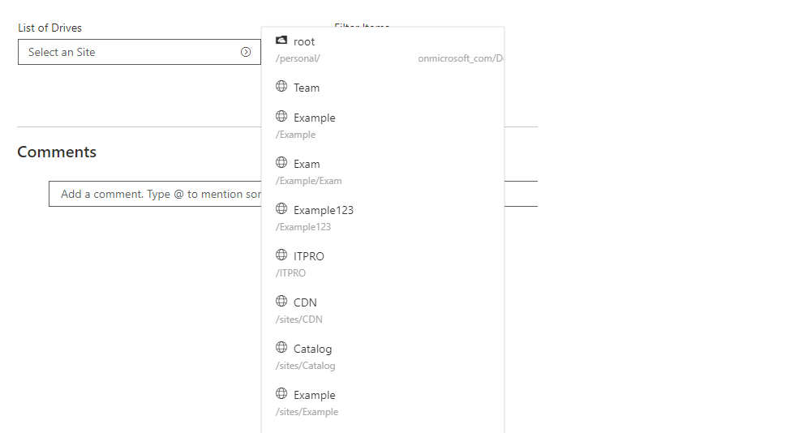
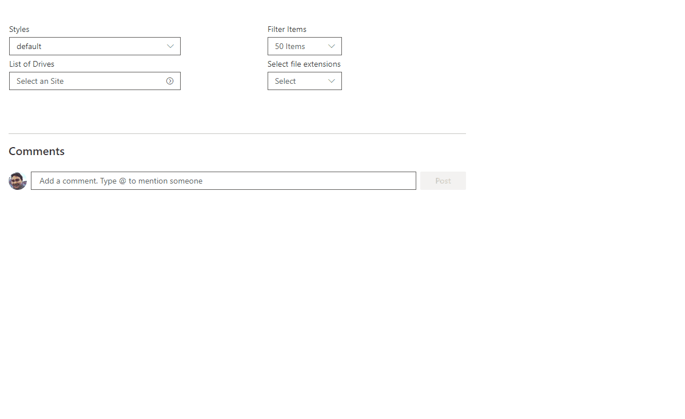

# OneDrive finder

## Summary

This sample access drives from OneDrive and navigate between his content using **Graph OneDrive and Site API and [Microsoft Graph Toolkit](https://github.com/microsoftgraph/microsoft-graph-toolkit) react controls "@microsoft/mgt-react**" with the addition of new controls **Mgt-File-List [FileList](https://github.com/microsoftgraph/microsoft-graph-toolkit/blob/next/file/stories/components/fileList.stories.js)** and **Mgt-File [File](https://github.com/microsoftgraph/microsoft-graph-toolkit/blob/next/file/stories/components/file.stories.js) "Beta version"** . This new control provides the ability to retrieve the Drive Library with associated Files and folders making easier to develop and navigate between tenant content and access to file.

**[FileList](https://github.com/microsoftgraph/microsoft-graph-toolkit/blob/next/file/specs/mgt-file-list.md)** control allow to load files base on graph querys or parameters ids.

**[File](https://github.com/microsoftgraph/microsoft-graph-toolkit/blob/next/file/specs/mgt-file.md)** control allow to File component is used to represent an individual file/folder from OneDrive or SharePoint base on graph querys or parameters ids.

Below a draw resuming the custom query's made and what control uses to retrieve associated folders and files from different locations.


### Retrieve Sites with drives associate



### Navigate between folders and Breadcrumb


### Navigate, search Files and filter extensions




## Compatibility

 
 
 
 


## Applies to

- [SharePoint Framework](https://aka.ms/spfx)
- [Microsoft 365 tenant](https://docs.microsoft.com/en-us/sharepoint/dev/spfx/set-up-your-developer-tenant)


## Solution

Solution|Author(s)
--------|---------
react-onedrive-finder | [André Lage](http://aaclage.blogspot.com) ([@aaclage](https://twitter.com/aaclage))

## Version history

Version|Date|Comments
-------|----|--------
1.2|April 30, 2021|Include content Search on Drive Library, file details and Minimal style change.
1.1|April 24, 2021|Fixes, optimization, Styling and extension filter included
1.0|April 16, 2021|Initial release

## Disclaimer

**THIS CODE IS PROVIDED *AS IS* WITHOUT WARRANTY OF ANY KIND, EITHER EXPRESS OR IMPLIED, INCLUDING ANY IMPLIED WARRANTIES OF FITNESS FOR A PARTICULAR PURPOSE, MERCHANTABILITY, OR NON-INFRINGEMENT.**

---

## Minimal Path to Awesome

- Clone this repository
- Ensure that you are at the solution folder
- in the command-line run:
  - **npm install**
  - **gulp serve**
  - **gulp bundle --ship**
  - **gulp package-solution --ship**
  - Add to AppCatalog and deploy 

## Grant the service principal permission to the Microsoft Graph API

Once installed, the solution will request the required permissions via the **Office 365 admin portal > SharePoint > Advanced > API access**.
If you prefer to approve the permissions in advance, for example when testing the solution in the Workbench page without installing it, you can do so using the [CLI for Microsoft 365](https://pnp.github.io/cli-microsoft365/):

```bash
o365 spo login https://contoso-admin.sharepoint.com
o365 spo serviceprincipal grant add --resource 'Microsoft Graph' --scope 'Files.Read'
o365 spo serviceprincipal grant add --resource 'Microsoft Graph' --scope 'Files.Read.All'
o365 spo serviceprincipal grant add --resource 'Microsoft Graph' --scope 'Sites.Read.All'
```

## Features

Description of the extension that expands upon high-level summary above.

This extension illustrates the following concepts:

- Easy to navigate between shared Drives using **Graph API and Breadcrumb**
- Search in OneDrive Library
- Filter by File Extension
- Change theme of control
- **[FileList](https://github.com/microsoftgraph/microsoft-graph-toolkit/blob/next/file/specs/mgt-file-list.md)** New mgt-file-list control.
- **[File](https://github.com/microsoftgraph/microsoft-graph-toolkit/blob/next/file/specs/mgt-file.md)** New mgt-file control.


