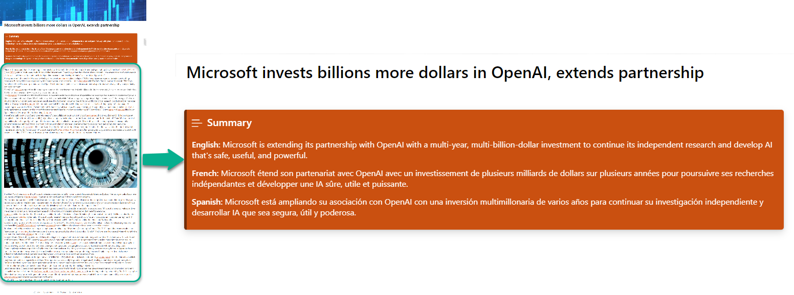

# Multilingual SharePoint Page Summarization with Open AI API and Microsoft Graph Pages API

## Summary

This sample contains a SharePoint Framework web part and an Azure function that uses the Open AI API to summarize a SharePoint page in multiple languages. The web part uses the Microsoft Graph Pages API to get the page content and the Azure function uses the Open AI API to summarize the page content. The web part then displays the summary in the selected language.

## Used SharePoint Framework Version

| :warning: Important          |
|:---------------------------|
| Every SPFx version is optimally compatible with specific versions of Node.js. In order to be able to build this sample, you need to ensure that the version of Node on your workstation matches one of the versions listed in this section. This sample will not work on a different version of Node.|
|Refer to <https://aka.ms/spfx-matrix> for more information on SPFx compatibility.   |

This sample is optimally compatible with the following environment configuration:

-Incompatible-red.svg "SharePoint Server 2016 Feature Pack 2 requires SPFx 1.1")

## Applies to

- [SharePoint Framework](https://aka.ms/spfx)
- [Microsoft 365 tenant](https://docs.microsoft.com/sharepoint/dev/spfx/set-up-your-developer-tenant)

> Get your own free development tenant by subscribing to [Microsoft 365 developer program](http://aka.ms/m365devprogram)

## Prerequisites

> Open AI API key. You can get a key from <https://platform.openai.com/account/api-keys>
> See the [Minimal Path to Awesome section](#minimal-path-to-awesome) below for more details related app registration, Azure function and SharePoint site configuration.

## Contributors

- [Anoop Tatti](https://github.com/anoopt)

## Version history

| Version | Date             | Comments        |
| ------- | ---------------- | --------------- |
| 1.0     | March 06, 2023 | Initial release |

## Minimal Path to Awesome

- Clone this repository

### App registration

- Register an Azure AD application in your tenant
- Get the client ID
- Replace the `APP_ID` in the `/webpart/src/constants/constants.ts` file with the client ID
- Copy the app name

### Azure Function

- Create an Azure Function App in your tenant with `PowerShell Core` as the runtime stack and version as `7.2`
- Copy the name of the Azure Function App
- Publish the code in `/azure-function` to the Azure Function App by following the steps in <https://learn.microsoft.com/en-us/azure/azure-functions/functions-run-local?tabs=v4%2Clinux%2Ccsharp%2Cportal%2Cbash#publish>
- Secure the Azure Function App with the app registration created above
  - Go to the Azure Function in the portal and navigate to the "Authentication" configuration blade. Enable authentication and choose "Microsoft" as the "Identity provider". Then, select the app registration created above as the "App registration". Save the configuration.  
- Add the following application settings to the Azure Function App
  | Name | Value             |
  | ------- | ---------------- |
  | API_Endpoint | <https://api.openai.com/v1/chat/completions> |
  | API_Key | Your Open AI API key  |
- Get the function URL of the functions in the Azure Function App
  - Go to the Azure Function in the portal and navigate to the "Functions" blade.
  - Click on the function name - Summarise. Copy the "Function URL" from the "Overview" blade.
  - Replace the `AZURE_FUNCTION_SUMMARISE` in the `/webpart/src/constants/constants.ts` file with the function URL
  - Click on the function name - UpdatePage. Copy the "Function URL" from the "Overview" blade.
  - Replace the `AZURE_FUNCTION_UPDATE_PAGE` in the `/webpart/src/constants/constants.ts` file with the function URL
- Enable managed identity for the Azure Function App
  - Go to the Azure Function in the portal and navigate to the "Identity" configuration blade. Enable the "System assigned" managed identity. Save the configuration.
- Grant the Azure Function App access to the SharePoint site
  - Open the Azure Cloud Shell by clicking on the ">_" icon in the Azure portal toolbar in the top right corner.
  - Run the command `m365 login --authType identity` to login to Microsoft 365.
  - Run the command `m365 aad approleassignment add --displayName "<Azure Function App name>" --resource "SharePoint" --scope "Sites.ReadWrite.All"` to grant the Azure Function App access to SharePoint sites. Replace the `<Azure Function App name>` with the name of the Azure Function App.
  - This permission is required to update the page column and will be used by the `UpdatePage` function.
  - Note: `Sites.Selected` permission cab be used to if needed to restrict the access to the SharePoint site.

### Column in the Site Pages library

- Create a column in the Site Pages library
  - Go to the SharePoint site in the browser where you want to add the web part
  - Navigate to the Site Pages library
  - Create a new column called "Summary" of type "Multiple lines of text"

### SPFx web part

- Edit the `webpart/config/package-solution.json` file and replace the `APP_REG_NAME` with the app registration name created above
- Open command prompt in the `webpart` folder
- in the command line run:
  - `npm install`
  - `gulp build`
  - `gulp bundle --ship`
  - `gulp package-solution --ship`
  - Add and Deploy Package to AppCatalog
- In the API access page approve the following
  - `user_impersonation` permission for the app registration created above
  - `Sites.Read.All` permission for the Microsoft Graph API
- Add the "Summarise" web part to a page in the SharePoint site

### Running the Azure function and web part locally

#### App registration (if not done already)

- Register an Azure AD application in your tenant
- Get the client ID and client secret
- Use [ACS approach](https://learn.microsoft.com/en-us/sharepoint/dev/solution-guidance/security-apponly-azureacs) to provide the write permissions to the SharePoint site where the web part needs to be added
- Replace the `APP_ID` in the `/webpart/src/constants/constants.ts` file with the client ID

#### Azure Function

- Make sure you have Azure functions core tools installed on your machine. You can install it from <https://learn.microsoft.com/en-us/azure/azure-functions/functions-run-local?tabs=v4%2Clinux%2Ccsharp%2Cportal%2Cbash>
- In the file `./azure-functions/UpdatePage/run.ps1` Comment line number 20 and uncomment line number 23
- Update the `./azure-functions/local.settings.json` file with the Open AI API key, client ID and client secret
- Open command prompt in the `azure-function` folder
- in the command line run:
  - `func start`

#### SPFx web part

- Edit the `webpart/config/package-solution.json` file and replace the `APP_REG_NAME` with the app registration name created above
- Open command prompt in the `webpart` folder
- in the command line run:
  - `npm install`
  - `gulp build`
  - `gulp bundle --ship`
  - `gulp package-solution --ship`
  - Add and Deploy Package to AppCatalog
- In the API access page approve the following
  - `user_impersonation` permission for the app registration created above
  - `Sites.Read.All` permission for the Microsoft Graph API
- Add the "Summarise" web part to a page in the SharePoint site
- Open command prompt in the `webpart` folder
- in the command line run:
  - `gulp serve`

- Open a page in the SharePoint site which has some text content
- Append `?loadSPFX=true&debugManifestsFile=https://localhost:4321/temp/manifests.js` to the URL
- Add the "Summarise" web part to the page

## Features

The code illustrates the following concepts:

- using React for building SharePoint Framework client-side web parts
- using OpenAI API in Azure Function
- using Microsoft Graph API to get only the text content of the page
- using custom React Hooks
- using Fluent UI FrameWork

## References

- [Getting started with SharePoint Framework](https://learn.microsoft.com/sharepoint/dev/spfx/set-up-your-developer-tenant)
- [Building for Microsoft teams](https://learn.microsoft.com/sharepoint/dev/spfx/build-for-teams-overview)
- [Use Microsoft Graph in your solution](https://learn.microsoft.com/sharepoint/dev/spfx/web-parts/get-started/using-microsoft-graph-apis)
- [Publish SharePoint Framework applications to the Marketplace](https://learn.microsoft.com/sharepoint/dev/spfx/publish-to-marketplace-overview)
- [Microsoft 365 Patterns and Practices](https://aka.ms/m365pnp) - Guidance, tooling, samples and open-source controls for your Microsoft 365 development
- [Fluent UI version 9](https://github.com/microsoft/fluentui/tree/master/packages/react-components) - Converged Fluent UI components

## Help

We do not support samples, but we this community is always willing to help, and we want to improve these samples. We use GitHub to track issues, which makes it easy for  community members to volunteer their time and help resolve issues.

If you're having issues building the solution, please run [spfx doctor](https://pnp.github.io/cli-microsoft365/cmd/spfx/spfx-doctor/) from within the solution folder to diagnose incompatibility issues with your environment.

If you encounter any issues while using this sample, [create a new issue](https://github.com/pnp/sp-dev-fx-webparts/issues/new?assignees=&labels=Needs%3A+Triage+%3Amag%3A%2Ctype%3Abug-suspected%2Csample%3A%20react-openai-summarise-page-content&template=bug-report.yml&sample=react-openai-summarise-page-content&authors=@anoopt&title=react-openai-summarise-page-content%20-%20).

For questions regarding this sample, [create a new question](https://github.com/pnp/sp-dev-fx-webparts/issues/new?assignees=&labels=Needs%3A+Triage+%3Amag%3A%2Ctype%3Aquestion%2Csample%3A%20react-openai-summarise-page-content&template=question.yml&sample=react-openai-summarise-page-content&authors=@anoopt&title=react-openai-summarise-page-content%20-%20).

Finally, if you have an idea for improvement, [make a suggestion](https://github.com/pnp/sp-dev-fx-webparts/issues/new?assignees=&labels=Needs%3A+Triage+%3Amag%3A%2Ctype%3Aenhancement%2Csample%3A%20react-openai-summarise-page-content&template=question.yml&sample=react-openai-summarise-page-content&authors=@anoopt&title=react-openai-summarise-page-content%20-%20).

## Disclaimer

**THIS CODE IS PROVIDED *AS IS* WITHOUT WARRANTY OF ANY KIND, EITHER EXPRESS OR IMPLIED, INCLUDING ANY IMPLIED WARRANTIES OF FITNESS FOR A PARTICULAR PURPOSE, MERCHANTABILITY, OR NON-INFRINGEMENT.**

