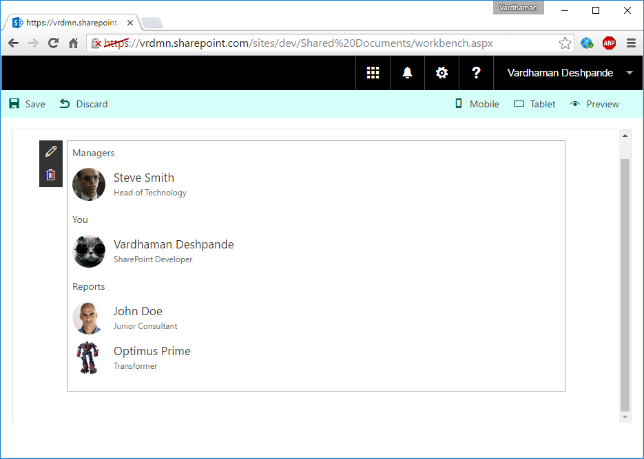

# Organisation Chart

## Summary
A simple Organisation Chart webpart using Office UI Fabric, React, OData batching and ServiceScope plumbing. 

## Applies to

* [SharePoint Framework Developer Preview](http://dev.office.com/sharepoint/docs/spfx/sharepoint-framework-overview)

## Solution

Solution|Author(s)
--------|---------
OrganisationChart | Vardhaman Deshpande ([@vrdmn](https://twitter.com/vrdmn) , [vrdmn.com](http://vrdmn.com))

## Version history

Version|Date|Comments
-------|----|--------
1.0|September 14, 2016|Initial release

## Disclaimer
**THIS CODE IS PROVIDED *AS IS* WITHOUT WARRANTY OF ANY KIND, EITHER EXPRESS OR IMPLIED, INCLUDING ANY IMPLIED WARRANTIES OF FITNESS FOR A PARTICULAR PURPOSE, MERCHANTABILITY, OR NON-INFRINGEMENT.**

---

## Minimal Path to Awesome

- Clone this repository
- in the command line run:
  - `npm install`
  - `tsd install`
  - `gulp serve`

## Features

Please see this post for further details about the web part: [SharePoint Framework: Org Chart web part using Office UI Fabric, React and OData batching](http://www.vrdmn.com/2016/09/sharepoint-framework-org-chart-web-part.html)

This Web Part illustrates the following concepts on top of the SharePoint Framework:

- Office UI Fabric
- React
- OData batching
- ServiceScope and ServiceKeys
- Service Locator pattern to register and consume services

