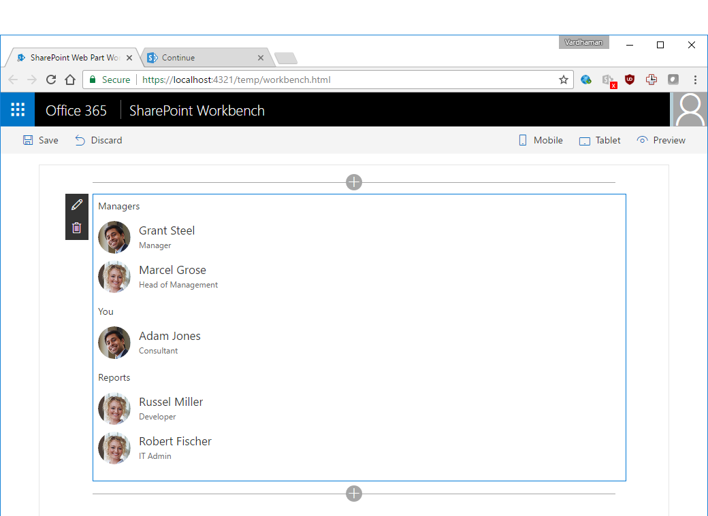

# Organisation Chart

## Summary
A simple Organisation Chart web part using Office UI Fabric, React, REST API batching and ServiceScope plumbing. 

## Compatibility

 

-Compatible-green.svg)

## Applies to

* [SharePoint Framework](https://docs.microsoft.com/sharepoint/dev/spfx/sharepoint-framework-overview)

## Solution

Solution|Author(s)
--------|---------
OrganisationChart | Vardhaman Deshpande ([@vrdmn](https://twitter.com/vrdmn) , [vrdmn.com](http://vrdmn.com))

## Version history

Version|Date|Comments
-------|----|--------
1.0|September 14, 2016|Initial release
2.0|March 12, 2017|Updated for SPFx 1.0
2.1|July 19, 2017|Use office-ui-fabric-react and uifabric/styling

## Minimal Path to Awesome

- Clone this repository
- in the command line run:
  - `npm install`
  - `gulp serve`

>  This sample can also be opened with [VS Code Remote Development](https://code.visualstudio.com/docs/remote/remote-overview). Visit https://aka.ms/spfx-devcontainer for further instructions.

## Features

Please see this post for further details about the web part: [SharePoint Framework: Org Chart web part using Office UI Fabric, React and OData batching](http://www.vrdmn.com/2016/09/sharepoint-framework-org-chart-web-part.html)

This Web Part illustrates the following concepts on top of the SharePoint Framework:

- Office UI Fabric
- React
- REST API operations in SPFx
- REST API batching in SPFx
- ServiceScope and ServiceKeys
- Service Locator pattern to register and consume services

## Disclaimer

**THIS CODE IS PROVIDED *AS IS* WITHOUT WARRANTY OF ANY KIND, EITHER EXPRESS OR IMPLIED, INCLUDING ANY IMPLIED WARRANTIES OF FITNESS FOR A PARTICULAR PURPOSE, MERCHANTABILITY, OR NON-INFRINGEMENT.**

## Disclaimer

**THIS CODE IS PROVIDED *AS IS* WITHOUT WARRANTY OF ANY KIND, EITHER EXPRESS OR IMPLIED, INCLUDING ANY IMPLIED WARRANTIES OF FITNESS FOR A PARTICULAR PURPOSE, MERCHANTABILITY, OR NON-INFRINGEMENT.**

