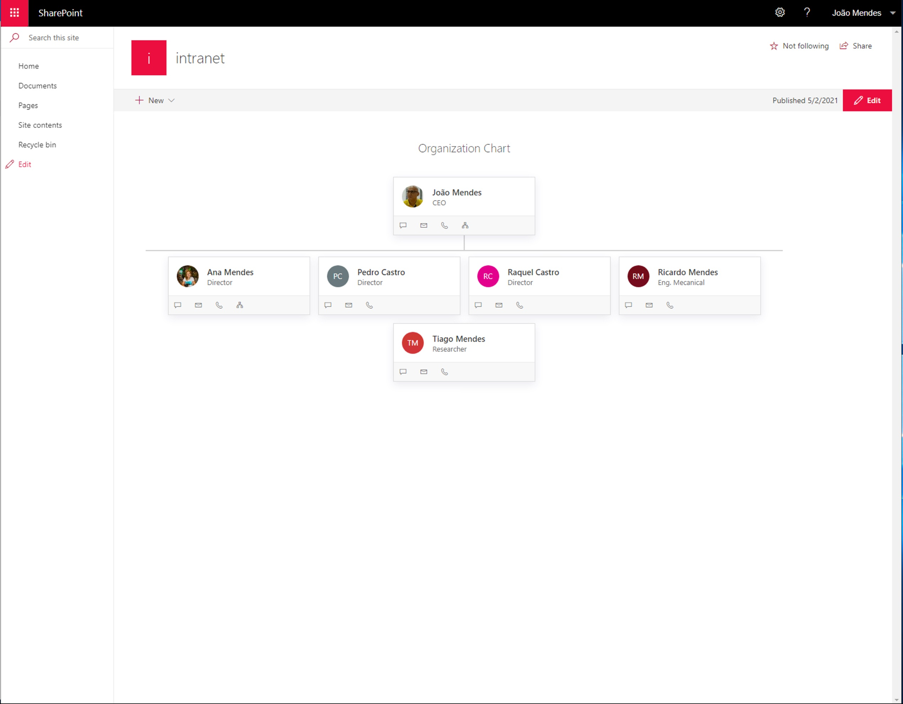

# Organization Chart

## Summary

This web part shows an organization chart based on specified user, and user can navigate to show company organization. This web part can be installed on SharePoint Server 2019, and SharePoint Online.

## Compatibility

## Applies to

- [SharePoint Framework](https://aka.ms/spfx)

## Solution

Solution|Author(s)
--------|---------
react-organisation-chart |[João Mendes](https://github.com/joaojmendes), Storm Technology, ([@joaojmendes](https://twitter.com/joaojmendes))

## Version history

Version|Date|Comments
-------|----|--------
1.0|May, 2021|Initial release

## Prerequisites

No pre-requisites

## Minimal Path to Awesome

- Clone this repository
- Ensure that you are at the solution folder
- in the command-line run:
  - `npm install`
  - `gulp serve`

>  This sample can also be opened with [VS Code Remote Development](https://code.visualstudio.com/docs/remote/remote-overview). Visit https://aka.ms/spfx-devcontainer for further instructions.

## Features

This web part shows how to use PnPjs, Office-ui-fabric-react to create an Organization Chart

This extension illustrates the following concepts:

## Help

We do not support samples, but we do use GitHub to track issues and constantly want to improve these samples.

You can try looking at [issues related to this sample](https://github.com/pnp/sp-dev-fx-webparts/issues?q=label%3A%22sample%3A%20react-organization-chart") to see if anybody else is having the same issues.

You can also try looking at [discussions related to this sample](https://github.com/pnp/sp-dev-fx-webparts/discussions?discussions_q=react-organization-chart) and see what the community is saying.

If you encounter any issues while using this sample, [create a new issue](https://github.com/pnp/sp-dev-fx-webparts/issues/new?assignees=&labels=Needs%3A+Triage+%3Amag%3A%2Ctype%3Abug-suspected%2Csample%3A%20react-organisation-chart&template=bug-report.yml&sample=react-organisation-chart&authors=@joaojmendes&title=react-organisation-chart%20-%20).

For questions regarding this sample, [create a new question](https://github.com/pnp/sp-dev-fx-webparts/issues/new?assignees=&labels=Needs%3A+Triage+%3Amag%3A%2Ctype%3Aquestion%2Csample%3A%20react-organisation-chart&template=question.yml&sample=react-organisation-chart&authors=@joaojmendes&title=react-organisation-chart%20-%20).

Finally, if you have an idea for improvement, [make a suggestion](https://github.com/pnp/sp-dev-fx-webparts/issues/new?assignees=&labels=Needs%3A+Triage+%3Amag%3A%2Ctype%3Aenhancement%2Csample%3A%20react-organisation-chart&template=question.yml&sample=react-organisation-chart&authors=@joaojmendes&title=react-organisation-chart%20-%20).

## Disclaimer

**THIS CODE IS PROVIDED *AS IS* WITHOUT WARRANTY OF ANY KIND, EITHER EXPRESS OR IMPLIED, INCLUDING ANY IMPLIED WARRANTIES OF FITNESS FOR A PARTICULAR PURPOSE, MERCHANTABILITY, OR NON-INFRINGEMENT.**

