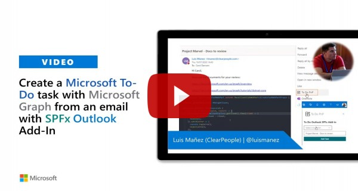

# Create To Do Task from Email (Outlook Add in)

## Summary

This web part allows us to create a new To Do task using the new ToDo MS Graph endpoint. If deployed as an Outlook Add In, the Task title comes from email subject. Let´s say this is similar to the OOTB "Flag" action, but here you can select the ToDo List where to store the Task, and you can modify the Title before adding it.


## Graph To-Do Preview endpoints

As of today, To Do endpoint is not very well documented yet. It was presented in latest Build 2020. Here are some of the basic operations. You can get more information and see the Build session from this link: [https://developer.microsoft.com/en-us/office/blogs/introducing-the-new-microsoft-graph-to-do-api/](https://developer.microsoft.com/en-us/office/blogs/introducing-the-new-microsoft-graph-to-do-api/)

### Get lists 

GET https://graph.microsoft.com/beta/me/todo/lists

### Create new List

POST https://graph.microsoft.com/beta/me/todo/lists

```

>  This sample can also be opened with [VS Code Remote Development](https://code.visualstudio.com/docs/remote/remote-overview). Visit https://aka.ms/spfx-devcontainer for further instructions.json
{
  displayName: "My new List"
}
```

>  This sample can also be opened with [VS Code Remote Development](https://code.visualstudio.com/docs/remote/remote-overview). Visit https://aka.ms/spfx-devcontainer for further instructions.

### Get tasks in list

GET https://graph.microsoft.com/beta/me/todo/lists/{listId}/tasks

### Create new Task in List

POST https://graph.microsoft.com/beta/me/todo/lists/{listId}/tasks

```

>  This sample can also be opened with [VS Code Remote Development](https://code.visualstudio.com/docs/remote/remote-overview). Visit https://aka.ms/spfx-devcontainer for further instructions.json
{
  "importance": "high",
  "status": "notStarted",
  "title": "New task to do",
  "body": {
    "content": "You have a new task to do",
    "contentType": "text"
  }
}
```

>  This sample can also be opened with [VS Code Remote Development](https://code.visualstudio.com/docs/remote/remote-overview). Visit https://aka.ms/spfx-devcontainer for further instructions.

## Compatibility

 
 


-Incompatible-red.svg "SharePoint Server 2016 Feature Pack 2 requires SPFx 1.1")


## Solution

Solution|Author(s)
--------|---------
react-outlook-add-todo-task|[Luis Mañez](https://github.com/luismanez) (MVP, [ClearPeople](http://www.clearpeople.com), @luismanez)

## Version history

Version|Date|Comments
-------|----|--------
1.0.0|Jun 3, 2020|Initial release
1.1.0|Sep 3, 2020|To Do item body coming from email body
1.2.0|Oct 16, 2020|To Do item body included a "open in outlook" link


## Minimal Path to Awesome

* Clone this repository
* From your command line, change your current directory to the directory containing this sample (`react-outlook-add-todo-task`, located under `samples`)
* `gulp bundle --ship`
* `gulp package-solution --ship`
* deploy package to SharePoint App Catalog (check tenant deploy)
* Using [M365 CLI](https://pnp.github.io/cli-microsoft365/) to configure MS Graph permissions to allow creating ToDo tasks
```

>  This sample can also be opened with [VS Code Remote Development](https://code.visualstudio.com/docs/remote/remote-overview). Visit https://aka.ms/spfx-devcontainer for further instructions.ps
m365 spo serviceprincipal grant add --resource "Microsoft Graph" --scope "Tasks.ReadWrite"
```

>  This sample can also be opened with [VS Code Remote Development](https://code.visualstudio.com/docs/remote/remote-overview). Visit https://aka.ms/spfx-devcontainer for further instructions.

* deploy spfx solution as Outlook add-in following instructions here: [https://docs.microsoft.com/en-us/sharepoint/dev/spfx/office-addins-create#deployment-of-your-add-in](https://docs.microsoft.com/en-us/sharepoint/dev/spfx/office-addins-create#deployment-of-your-add-in)

## Features

This sample illustrates the following concepts on top of the SharePoint Framework:

* New ToDo MS Graph endpoint
* Using __MSGraphClient__ 
* Outlook SPFx add-in
* Using _async / await_ for the async calls
* FluentUI components

## Video

[](https://www.youtube.com/watch?v=szu4j46ehOw "Create a To-Do task with Microsoft Graph from an email with SPFx Outlook Add-In")


## Help

We do not support samples, but we this community is always willing to help, and we want to improve these samples. We use GitHub to track issues, which makes it easy for  community members to volunteer their time and help resolve issues.

If you're having issues building the solution, please run [spfx doctor](https://pnp.github.io/cli-microsoft365/cmd/spfx/spfx-doctor/) from within the solution folder to diagnose incompatibility issues with your environment.

You can try looking at [issues related to this sample](https://github.com/pnp/sp-dev-fx-webparts/issues?q=label%3A%22sample%3A%20react-outlook-add-todo-task") to see if anybody else is having the same issues.

You can also try looking at [discussions related to this sample](https://github.com/pnp/sp-dev-fx-webparts/discussions?discussions_q=react-outlook-add-todo-task) and see what the community is saying.

If you encounter any issues while using this sample, [create a new issue](https://github.com/pnp/sp-dev-fx-webparts/issues/new?assignees=&labels=Needs%3A+Triage+%3Amag%3A%2Ctype%3Abug-suspected%2Csample%3A%20react-outlook-add-todo-task&template=bug-report.yml&sample=react-outlook-add-todo-task&authors=@luismanez&title=react-outlook-add-todo-task%20-%20).

For questions regarding this sample, [create a new question](https://github.com/pnp/sp-dev-fx-webparts/issues/new?assignees=&labels=Needs%3A+Triage+%3Amag%3A%2Ctype%3Aquestion%2Csample%3A%20react-outlook-add-todo-task&template=question.yml&sample=react-outlook-add-todo-task&authors=@luismanez&title=react-outlook-add-todo-task%20-%20).

Finally, if you have an idea for improvement, [make a suggestion](https://github.com/pnp/sp-dev-fx-webparts/issues/new?assignees=&labels=Needs%3A+Triage+%3Amag%3A%2Ctype%3Aenhancement%2Csample%3A%20react-outlook-add-todo-task&template=question.yml&sample=react-outlook-add-todo-task&authors=@luismanez&title=react-outlook-add-todo-task%20-%20).

## Disclaimer

**THIS CODE IS PROVIDED *AS IS* WITHOUT WARRANTY OF ANY KIND, EITHER EXPRESS OR IMPLIED, INCLUDING ANY IMPLIED WARRANTIES OF FITNESS FOR A PARTICULAR PURPOSE, MERCHANTABILITY, OR NON-INFRINGEMENT.**


