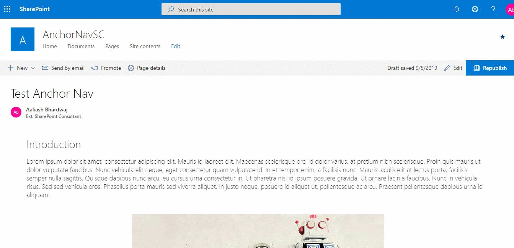

# React Page Navigator

## Summary

This web part fetches all the automatically added Header anchor tags in a SharePoint page and displays them in a Navigation component.

When added to a Vertical Section it can be used as a Contents table for the page

## Used SharePoint Framework Version

## Minimal Path to Awesome

- git clone the repo
- npm i
- gulp bundle --ship
- gulp package-solution --ship
- Add to App Catalog and Install the App
- Add the web part to a page

## Solution

Solution|Author(s)
--------|---------
react-page-navigator|Aakash Bhardwaj

## Disclaimer

**THIS CODE IS PROVIDED *AS IS* WITHOUT WARRANTY OF ANY KIND, EITHER EXPRESS OR IMPLIED, INCLUDING ANY IMPLIED WARRANTIES OF FITNESS FOR A PARTICULAR PURPOSE, MERCHANTABILITY, OR NON-INFRINGEMENT.**

---
