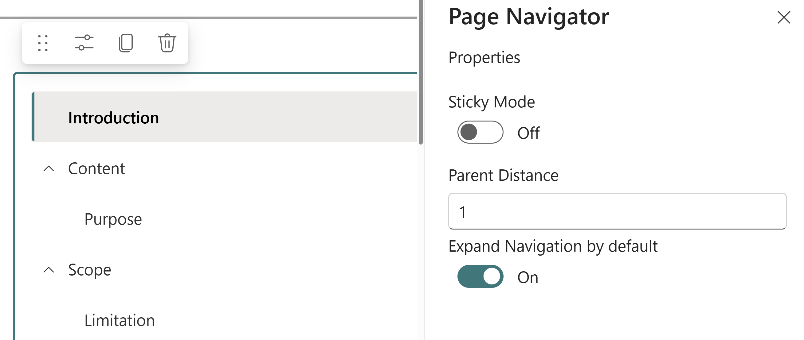

# Page Navigator

## Summary

This web part fetches all the automatically added header anchor tags in a SharePoint page and displays them in a navigation component.

When added to a vertical section it can be used as a contents table for the page:

The Properties `Sticky Mode` and `Parent Distance` can be configured to allow the Page Navigator to remain visible while scrolling.
When Sticky Mode is enabled, CSS will be added to the element `Parent Distance` nodes above the Page Navigator component. For example, `Parent Distance: 1` will apply the CSS to the direct parent element of the webpart, whereas `Parent Distance: 2` will apply the CSS to the parent of the parent, etc.

As this feature involves modifying HTML elements outside of the webpart, it could stop working in the future if Microsoft change their HTML/CSS etc.

At the time of writing, Sticky Parent Distance = 1 works for a Page Navigator configured on a vertical section like the example shown above.

## Compatibility

| :warning: Important          |
|:---------------------------|
| Every SPFx version is only compatible with specific version(s) of Node.js. In order to be able to build this sample, please ensure that the version of Node on your workstation matches one of the versions listed in this section. This sample will not work on a different version of Node.|
|Refer to <https://aka.ms/spfx-matrix> for more information on SPFx compatibility.   |

-Incompatible-red.svg "SharePoint Server 2016 Feature Pack 2 requires SPFx 1.1")

## Version history

Version|Date|Comments
-------|----|--------
1.0|September 5, 2019|Initial release
1.1|October 20, 2021|SPFx Upgraded to 1.12.1 and code refactored
1.2|May, 2022|SPFx Upgraded to 1.14.0
1.3|June 9, 2022|Updated React package from `^16.14.0` to `16.13.1`
1.4|June 29, 2022|Adds the capability to find collapsible section headers and insert them into the navigation
1.5|July 19, 2022|Bug fixes
1.6|August 8, 2022|Add theme provider and bug fixes
1.7|December 22, 2022|Fixed issue with duplicated level 2 headings
1.8|May 13, 2023|Fixed issue when heading has a + symbol
1.9|October 6, 2024|SPFx Upgraded to 1.20.0 and code refactored
1.10|March 15, 2025|Added Sticky Mode options
1.11|October 1, 2025|Fixed issue when page URL (file name) had a & or + symbol in it

## Minimal Path to Awesome

* Clone this repository (or [download this solution as a .ZIP file](https://pnp.github.io/download-partial/?url=https://github.com/pnp/sp-dev-fx-webparts/tree/main/samples/react-page-navigator) then unzip it)
* From your command line, change your current directory to the directory containing this sample (`react-page-navigator`, located under `samples`)
* in the command line run:
  * `npm i`
  * `gulp bundle --ship`
  * `gulp package-solution --ship`
* Add the app package to Site Collection App Catalog and Install the App
* Add the web part to a page in the Site Collection

> This sample can also be opened with [VS Code Remote Development](https://code.visualstudio.com/docs/remote/remote-overview). Visit <https://aka.ms/spfx-devcontainer> for further instructions.

## Contributors

* [Aakash Bhardwaj](https://github.com/aakashbhardwaj619)
* [Jasey Waegebaert](https://github.com/Jwaegebaert)
* [Mike Zimmerman](https://github.com/mikezimm)
* [Tobias Maestrini](https://github.com/tmaestrini)

## Help

We do not support samples, but this community is always willing to help, and we want to improve these samples. We use GitHub to track issues, which makes it easy for  community members to volunteer their time and help resolve issues.

If you're having issues building the solution, please run [spfx doctor](https://pnp.github.io/cli-microsoft365/cmd/spfx/spfx-doctor/) from within the solution folder to diagnose incompatibility issues with your environment.

You can try looking at [issues related to this sample](https://github.com/pnp/sp-dev-fx-webparts/issues?q=label%3A%22sample%3A%20react-page-navigator%22) to see if anybody else is having the same issues.

You can also try looking at [discussions related to this sample](https://github.com/pnp/sp-dev-fx-webparts/discussions?discussions_q=react-page-navigator) and see what the community is saying.

If you encounter any issues using this sample, [create a new issue](https://github.com/pnp/sp-dev-fx-webparts/issues/new?assignees=&labels=Needs%3A+Triage+%3Amag%3A%2Ctype%3Abug-suspected%2Csample%3A%20react-page-navigator&template=bug-report.yml&sample=react-page-navigator&authors=@aakashbhardwaj619&title=react-page-navigator%20-%20).

For questions regarding this sample, [create a new question](https://github.com/pnp/sp-dev-fx-webparts/issues/new?assignees=&labels=Needs%3A+Triage+%3Amag%3A%2Ctype%3Aquestion%2Csample%3A%20react-page-navigator&template=question.yml&sample=react-page-navigator&authors=@aakashbhardwaj619&title=react-page-navigator%20-%20).

Finally, if you have an idea for improvement, [make a suggestion](https://github.com/pnp/sp-dev-fx-webparts/issues/new?assignees=&labels=Needs%3A+Triage+%3Amag%3A%2Ctype%3Aenhancement%2Csample%3A%20react-page-navigator&template=suggestion.yml&sample=react-page-navigator&authors=@aakashbhardwaj619&title=react-page-navigator%20-%20).

## Disclaimer

**THIS CODE IS PROVIDED *AS IS* WITHOUT WARRANTY OF ANY KIND, EITHER EXPRESS OR IMPLIED, INCLUDING ANY IMPLIED WARRANTIES OF FITNESS FOR A PARTICULAR PURPOSE, MERCHANTABILITY, OR NON-INFRINGEMENT.**

