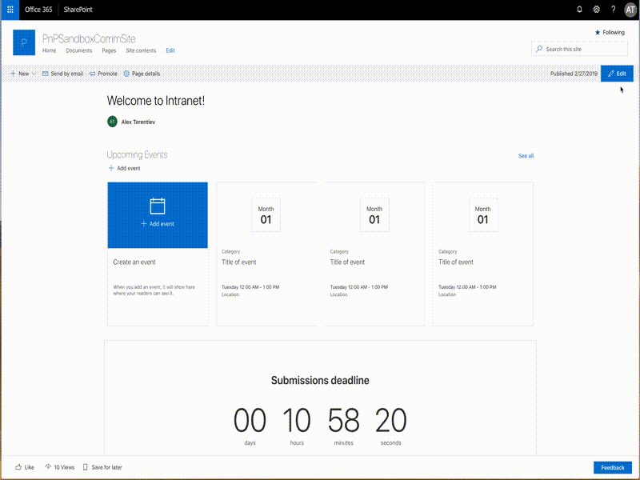

# Page Sections Navigation

Sample web parts allowing to add sections navigation to the SharePoint page.

## Compatibility

 
 

-Incompatible-red.svg "SharePoint Server 2016 Feature Pack 2 requires SPFx 1.1")

## Applies to

* [SharePoint Framework](https://docs.microsoft.com/sharepoint/dev/spfx/sharepoint-framework-overview)
* [Office 365 developer tenant](https://docs.microsoft.com/sharepoint/dev/spfx/set-up-your-developer-tenant)

## Solution

Solution|Author(s)
--------|---------
page-sections-navigation|[Alex Terentiev](https://github.com/AJIXuMuK) (MVP, [Sharepointalist Inc.](http://www.sharepointalist.com), [@alexaterentiev](https://twitter.com/alexaterentiev))

## Version history

Version|Date|Comments
-------|----|--------
1.0|February 27, 2019|Initial release
1.1|March 22, 2019| Update to SPFx 1.8, additional theme, comments

## Minimal Path to Awesome

* clone this repo
* move to right folder
* in the command line run:
  * `npm install`
  * `gulp bundle --ship`
  * `gulp package-solution --ship`
* from the _sharepoint/solution_ folder, deploy the .sppkg file to the App catalog in your tenant
* in the site where you want to test this solution
  * add the app named _page-sections-navigation-client-side-solution_
  * edit a page
  * add _Page Sections Navigation_ web part
  * add as much _Page Sections Navigation Anchor_ web parts as you want - each anchor adds an item to the navigation
  * configure web parts

>  This sample can also be opened with [VS Code Remote Development](https://code.visualstudio.com/docs/remote/remote-overview). Visit https://aka.ms/spfx-devcontainer for further instructions.

## Features

This sample illustrates how to use SharePoint Framework Dynamic Data features to connect web parts on the page.
It also can be used as ready-to-go solution to add page sections navigation to SharePoint pages.

## Custom CSS
The web parts in the sample allow to use custom CSS to override the styles. You can set _Custom CSS URL_ property of *Page Sections Navigation* web part and include css classes for both Navigation and Anchor in referenced file.
Please, refer [custom css sample](./assets/psn-custom.css) for the CSS sample.

## Help

We do not support samples, but this community is always willing to help, and we want to improve these samples. We use GitHub to track issues, which makes it easy for  community members to volunteer their time and help resolve issues.

If you're having issues building the solution, please run [spfx doctor](https://pnp.github.io/cli-microsoft365/cmd/spfx/spfx-doctor/) from within the solution folder to diagnose incompatibility issues with your environment.

You can try looking at [issues related to this sample](https://github.com/pnp/sp-dev-fx-webparts/issues?q=label%3A%22sample%3A%20react-page-sections-navigation%22) to see if anybody else is having the same issues.

You can also try looking at [discussions related to this sample](https://github.com/pnp/sp-dev-fx-webparts/discussions?discussions_q=react-page-sections-navigation) and see what the community is saying.

If you encounter any issues while using this sample, [create a new issue](https://github.com/pnp/sp-dev-fx-webparts/issues/new?assignees=&labels=Needs%3A+Triage+%3Amag%3A%2Ctype%3Abug-suspected%2Csample%3A%20react-page-sections-navigation&template=bug-report.yml&sample=react-page-sections-navigation&authors=@AJIXuMuK&title=react-page-sections-navigation%20-%20).

For questions regarding this sample, [create a new question](https://github.com/pnp/sp-dev-fx-webparts/issues/new?assignees=&labels=Needs%3A+Triage+%3Amag%3A%2Ctype%3Aquestion%2Csample%3A%20react-page-sections-navigation&template=question.yml&sample=react-page-sections-navigation&authors=@AJIXuMuK&title=react-page-sections-navigation%20-%20).

Finally, if you have an idea for improvement, [make a suggestion](https://github.com/pnp/sp-dev-fx-webparts/issues/new?assignees=&labels=Needs%3A+Triage+%3Amag%3A%2Ctype%3Aenhancement%2Csample%3A%20react-page-sections-navigation&template=suggestion.yml&sample=react-page-sections-navigation&authors=@AJIXuMuK&title=react-page-sections-navigation%20-%20).

## Disclaimer

**THIS CODE IS PROVIDED *AS IS* WITHOUT WARRANTY OF ANY KIND, EITHER EXPRESS OR IMPLIED, INCLUDING ANY IMPLIED WARRANTIES OF FITNESS FOR A PARTICULAR PURPOSE, MERCHANTABILITY, OR NON-INFRINGEMENT.**

