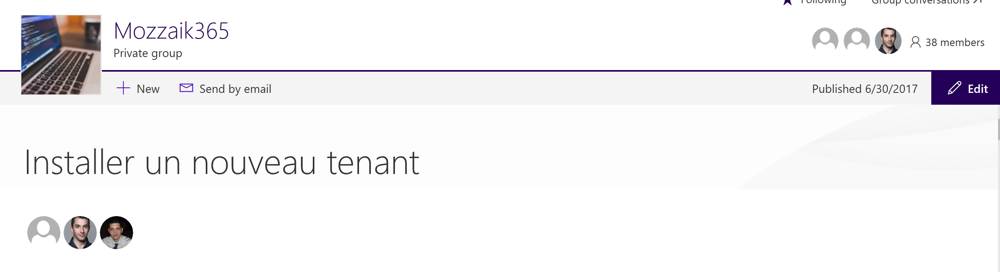
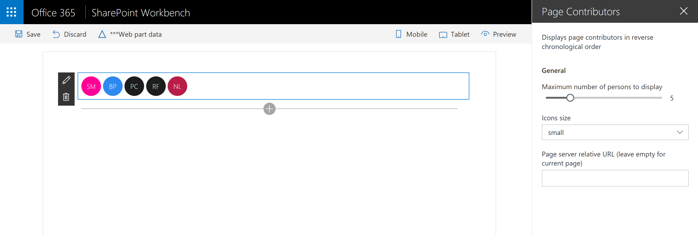

# Page Contributors Web Part

## Summary
Displays page contributors in reverse chronological order.

## Used SharePoint Framework Version 

## Applies to

* [SharePoint Framework](https://docs.microsoft.com/sharepoint/dev/spfx/sharepoint-framework-overview)
* [Office 365 tenant](https://docs.microsoft.com/sharepoint/dev/spfx/set-up-your-development-environment)

## Prerequisites
 
PnP-JS-Core

## Solution

Solution|Author(s)
--------|---------
PageContributors | Stéphane Magne ([@SPParse](https://twitter.com/SPParse))

## Version history

Version|Date|Comments
-------|----|--------
1.0|July 27, 2017|Initial release

## Disclaimer
**THIS CODE IS PROVIDED *AS IS* WITHOUT WARRANTY OF ANY KIND, EITHER EXPRESS OR IMPLIED, INCLUDING ANY IMPLIED WARRANTIES OF FITNESS FOR A PARTICULAR PURPOSE, MERCHANTABILITY, OR NON-INFRINGEMENT.**

---

## Minimal Path to Awesome

- Clone this repository
- in the command line run:
  - `npm install`
  - `gulp serve`

## Features

Settings : 
1. The maximum number of contributors to show
2. The size of their icon
3. A page URL to display contributors from an other page than the current one.

This Web Part illustrates the following concepts on top of the SharePoint Framework:

- Office UI Fabric
- React
- Pnp JS Core

