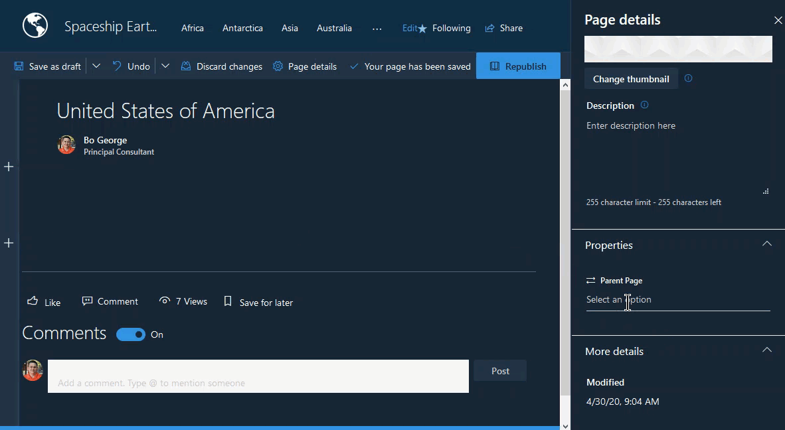

# React Pages Hierarchy

## Summary

This web part allows users to create a faux page hierarchy in their pages library and use it for page-to-page navigation.  It will ask you to create a page parent property on first use which is then used by the web part to either show a breadcrumb of the current pages ancestors or buttons for the pages children.

## Used SharePoint Framework Version

## Applies to

* [SharePoint Framework](https://docs.microsoft.com/sharepoint/dev/spfx/sharepoint-framework-overview)
* [Office 365 Developer Tenant](https://docs.microsoft.com/sharepoint/dev/spfx/set-up-your-development-environment)

## Prerequisites

* Office 365 subscription with SharePoint Online
* SharePoint Framework [development environment](https://docs.microsoft.com/sharepoint/dev/spfx/set-up-your-development-environment) set up

## Solution

Solution|Author(s)
--------|---------
react-pages-hierarchy|Bo George ([@bo_george](https://twitter.com/bo_george))

## Version history

Version|Date|Comments
-------|----|--------
1.0|April 30, 2020|Initial release

## Disclaimer

**THIS CODE IS PROVIDED *AS IS* WITHOUT WARRANTY OF ANY KIND, EITHER EXPRESS OR IMPLIED, INCLUDING ANY IMPLIED WARRANTIES OF FITNESS FOR A PARTICULAR PURPOSE, MERCHANTABILITY, OR NON-INFRINGEMENT.**

---

## Minimal Path to Awesome

* Clone this repository
* in the command line run:
  * `npm install`
  * `gulp serve`

## Features

This web part isn't anything fancy but it's useful for some scenarios.

* Parent Page Property Creation - if the web part is added to a page and the Parent Page property does not exist the user will be asked to enable (create) it.
* Security - if the user editing the page/web part doesn't have 'Manage' permissions on the Pages library they will not get the enable button, instead a message telling them to get a site owner to do the enabling.
* Two page relationship views depending on the direction you want to show
  * Ancestors shows a breadcrumb view (including the current page) up to parent pages until the parent page property is not set.
  * Children shows a button view for all pages that have selected the current page as their parent.

