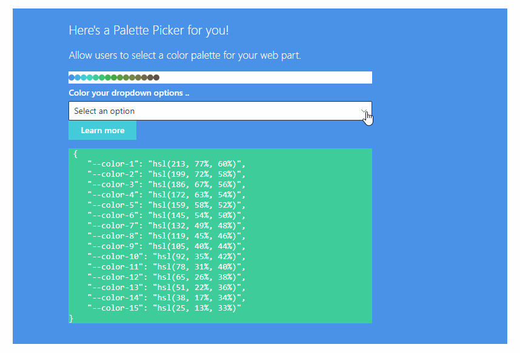

http://aka.ms/m365devprogramhttp://aka.ms/m365devprogramhttp://aka.ms/m365devprogramhttp://aka.ms/m365devprogram# Palette Picker

## Summary

Custom Property Pane pain resolved (whew), color palette generator inspired by [Jhey](https://codepen.io/jh3y/pen/rNjbmBQ?editors=0011).
Built it to get an understanding of [Property Pane Portal](https://www.npmjs.com/package/property-pane-portal) and cuz I want to eventually build in a dynamic palette generator/css reader for my web parts.

## Compatibility

-Incompatible-red.svg "SharePoint Server 2016 Feature Pack 2 requires SPFx 1.1")

## Applies to

* [SharePoint Framework](https://learn.microsoft.com/sharepoint/dev/spfx/sharepoint-framework-overview)
* [Microsoft 365 tenant](https://learn.microsoft.com/sharepoint/dev/spfx/set-up-your-development-environment)

> Get your own free development tenant by subscribing to [Microsoft 365 developer program](http://aka.ms/o365devprogram)

## Solution

Solution|Author(s)
--------|---------
react Palette Picker Web Part | [Linda K](https://github.com/flowerbot)

## Version history

Version|Date|Comments
-------|----|--------
1.0|August, 2022|Initial release

## Prerequisites

<!--
Any special pre-requisites? Include any lists, permissions, offerings to the demo gods, or whatever else needs to be done for this web part to work.

Please describe the steps to configure the pre-requisites. Feel free to add screen shots, but make sure that there is a text description of the steps to perform.
 
-->

## Minimal path to awesome

* Clone this repository (or [download this solution as a .ZIP file](https://pnp.github.io/download-partial/?url=https://github.com/pnp/sp-dev-fx-webparts/tree/main/samples/REACT-PALETTE-PICKER) then unzip it)
* From your command line, change your current directory to the directory containing this sample (`REACT-PALETTE-PICKER`, located under `samples`)
* in the command line run:
  * `npm install`
  * `gulp serve`

> This sample can also be opened with [VS Code Remote Development](https://code.visualstudio.com/docs/remote/remote-overview). Visit <https://aka.ms/spfx-devcontainer> for further instructions.

## Features

Multi-parameter sliders* in property pane from [react-range](https://www.npmjs.com/package/react-range), dynamic color updating, CSS snippet generation, apply colors to MS dropdown component options.  

 *\* PnP - please consider :)*

This web part illustrates the following concepts:

* custom property pane
* dynamic CSS in SPFx property pane
* custom CSS color on dropdown options

## Help

We do not support samples, but this community is always willing to help, and we want to improve these samples. We use GitHub to track issues, which makes it easy for  community members to volunteer their time and help resolve issues.

If you're having issues building the solution, please run [spfx doctor](https://pnp.github.io/cli-microsoft365/cmd/spfx/spfx-doctor/) from within the solution folder to diagnose incompatibility issues with your environment.

You can try looking at [issues related to this sample](https://github.com/pnp/sp-dev-fx-webparts/issues?q=label%3A%22sample%3A%20REACT-PALETTE-PICKER%22) to see if anybody else is having the same issues.

You can also try looking at [discussions related to this sample](https://github.com/pnp/sp-dev-fx-webparts/discussions?discussions_q=REACT-PALETTE-PICKER) and see what the community is saying.

If you encounter any issues using this sample, [create a new issue](https://github.com/pnp/sp-dev-fx-webparts/issues/new?assignees=&labels=Needs%3A+Triage+%3Amag%3A%2Ctype%3Abug-suspected%2Csample%3A%20REACT-PALETTE-PICKER&template=bug-report.yml&sample=REACT-PALETTE-PICKER&authors=@flowerbot&title=REACT-PALETTE-PICKER%20-%20).

For questions regarding this sample, [create a new question](https://github.com/pnp/sp-dev-fx-webparts/issues/new?assignees=&labels=Needs%3A+Triage+%3Amag%3A%2Ctype%3Aquestion%2Csample%3A%20REACT-PALETTE-PICKER&template=question.yml&sample=REACT-PALETTE-PICKER&authors=@flowerbot&title=REACT-PALETTE-PICKER%20-%20).

Finally, if you have an idea for improvement, [make a suggestion](https://github.com/pnp/sp-dev-fx-webparts/issues/new?assignees=&labels=Needs%3A+Triage+%3Amag%3A%2Ctype%3Aenhancement%2Csample%3A%20REACT-PALETTE-PICKER&template=suggestion.yml&sample=REACT-PALETTE-PICKER&authors=@flowerbot&title=REACT-PALETTE-PICKER%20-%20).

## References

* [Property Pane Portal](https://blog.pathtosharepoint.com/2021/07/29/introducing-the-property-pane-portal/) (thank you Christophe!)
* [Getting started with SharePoint Framework](https://learn.microsoft.com/sharepoint/dev/spfx/set-up-your-developer-tenant)
* [Building for Microsoft teams](https://learn.microsoft.com/sharepoint/dev/spfx/build-for-teams-overview)
* [Use Microsoft Graph in your solution](https://learn.microsoft.com/sharepoint/dev/spfx/web-parts/get-started/using-microsoft-graph-apis)
* [Publish SharePoint Framework applications to the Marketplace](https://learn.microsoft.com/sharepoint/dev/spfx/publish-to-marketplace-overview)
* [Microsoft 365 Patterns and Practices](https://aka.ms/m365pnp) - Guidance, tooling, samples and open-source controls for your Microsoft 365 development

## Disclaimer

**THIS CODE IS PROVIDED *AS IS* WITHOUT WARRANTY OF ANY KIND, EITHER EXPRESS OR IMPLIED, INCLUDING ANY IMPLIED WARRANTIES OF FITNESS FOR A PARTICULAR PURPOSE, MERCHANTABILITY, OR NON-INFRINGEMENT.**

