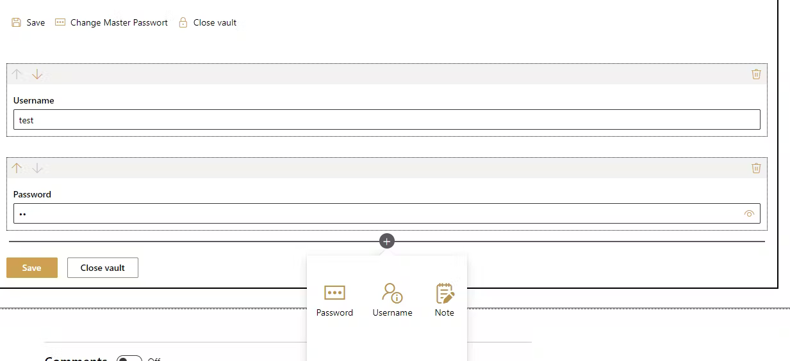
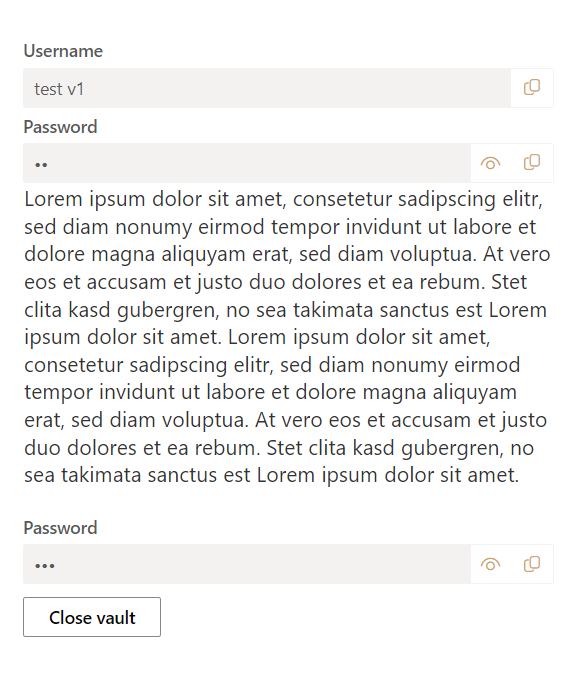
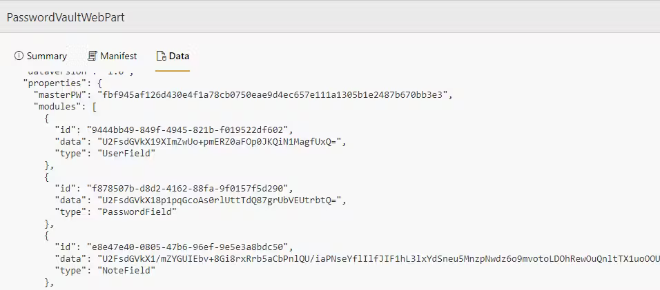

# Password vault

## Summary

This web part allows you to protect your data, such as the username, password or even just a text note (rich text). This data is protected with a master password that you can choose yourself.
The data is encrypted and stored in the properties of the web part. This means that the data is not in plain text and can only be decrypted by entering the master password. You can also use this web part in SharePoint and Microsoft Teams (as a tab)

### Edit Mode

### Display Mode

### Maintenance Mode

## Compatibility

| :warning: Important          |
|:---------------------------|
| Every SPFx version is optimally compatible with specific versions of Node.js. In order to be able to build this sample, you need to ensure that the version of Node on your workstation matches one of the versions listed in this section. This sample will not work on a different version of Node.|
|Refer to <https://aka.ms/spfx-matrix> for more information on SPFx compatibility.   |

This sample is optimally compatible with the following environment configuration:

-Incompatible-red.svg "SharePoint Server 2016 Feature Pack 2 requires SPFx 1.1")

## Applies to

* [SharePoint Framework](https://learn.microsoft.com/sharepoint/dev/spfx/sharepoint-framework-overview)
* [Microsoft 365 tenant](https://learn.microsoft.com/sharepoint/dev/spfx/set-up-your-development-environment)

> Get your own free development tenant by subscribing to [Microsoft 365 developer program](https://aka.ms/m365/devprogram)

## Contributors

* [Sergej Schwabauer](https://github.com/SPFxAppDev)

## Version history

Version|Date|Comments
-------|----|--------
1.0|October 27, 2023|Initial release

## Minimal path to awesome

* Clone this repository (or [download this solution as a .ZIP file](https://pnp.github.io/download-partial/?url=https://github.com/pnp/sp-dev-fx-webparts/tree/main/samples/react-password-vault) then unzip it)
* From your command line, change your current directory to the directory containing this sample (`react-password-vault`, located under `samples`)
* in the command line run:
  * `npm install`
  * `gulp serve` or `npm run serve` for `spfx-fast-serve`

> This sample can also be opened with [VS Code Remote Development](https://code.visualstudio.com/docs/remote/remote-overview). Visit <https://aka.ms/spfx-devcontainer> for further instructions.

## Features

This web part illustrates the following concepts on top of the SharePoint Framework:

* [Fluent UI React Controls](https://developer.microsoft.com/en-us/fluentui#/controls/web)
* [CryptoJS](https://cryptojs.gitbook.io/docs/)

The web part comes with this features

* Protect all data with a master password
* store as many usernames, passwords and notes as you want (similar "look and feel" as in SharePoint Standard, when you want to place a new web part)
* Copy username and password to clipboard
* Hide/display password in text field
* Close the safe manually or the safe will be closed automatically after a few minutes
* No possibility to "reset" the master password if the password is forgotten
* The data is NOT stored in plain text

## Video

## Help

We do not support samples, but this community is always willing to help, and we want to improve these samples. We use GitHub to track issues, which makes it easy for  community members to volunteer their time and help resolve issues.

If you're having issues building the solution, please run [spfx doctor](https://pnp.github.io/cli-microsoft365/cmd/spfx/spfx-doctor/) from within the solution folder to diagnose incompatibility issues with your environment.

You can try looking at [issues related to this sample](https://github.com/pnp/sp-dev-fx-webparts/issues?q=label%3A%22sample%3A%20react-password-vault%22) to see if anybody else is having the same issues.

You can also try looking at [discussions related to this sample](https://github.com/pnp/sp-dev-fx-webparts/discussions?discussions_q=react-password-vault) and see what the community is saying.

If you encounter any issues using this sample, [create a new issue](https://github.com/pnp/sp-dev-fx-webparts/issues/new?assignees=&labels=Needs%3A+Triage+%3Amag%3A%2Ctype%3Abug-suspected%2Csample%3A%20react-password-vault&template=bug-report.yml&sample=react-password-vault&authors=@SPFxAppDev&title=react-password-vault%20-%20).

For questions regarding this sample, [create a new question](https://github.com/pnp/sp-dev-fx-webparts/issues/new?assignees=&labels=Needs%3A+Triage+%3Amag%3A%2Ctype%3Aquestion%2Csample%3A%20react-password-vault&template=question.yml&sample=react-password-vault&authors=@SPFxAppDev&title=react-password-vault%20-%20).

Finally, if you have an idea for improvement, [make a suggestion](https://github.com/pnp/sp-dev-fx-webparts/issues/new?assignees=&labels=Needs%3A+Triage+%3Amag%3A%2Ctype%3Aenhancement%2Csample%3A%20react-password-vault&template=suggestion.yml&sample=react-password-vault&authors=@SPFxAppDev&title=react-password-vault%20-%20).

## Disclaimer

**THIS CODE IS PROVIDED *AS IS* WITHOUT WARRANTY OF ANY KIND, EITHER EXPRESS OR IMPLIED, INCLUDING ANY IMPLIED WARRANTIES OF FITNESS FOR A PARTICULAR PURPOSE, MERCHANTABILITY, OR NON-INFRINGEMENT.**

