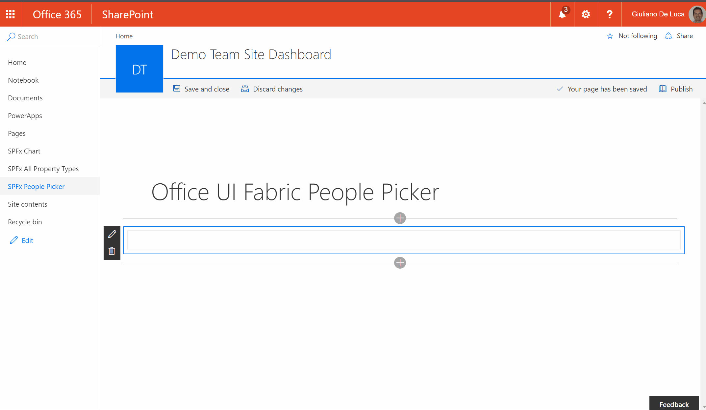

# People Picker (React)

## Summary
SharePoint Framework solution with the Office UI Fabric People Picker, the client web part across the SharePoint Rest API is able to retrieve people and groups.

## Used SharePoint Framework Version 

## Applies to

* [SharePoint Framework](https://blogs.office.com/2017/02/23/sharepoint-framework-reaches-general-availability-build-and-deploy-engaging-web-parts-today/)
* [Office 365 tenant](https://docs.microsoft.com/sharepoint/dev/spfx/set-up-your-development-environment)

## Solution

Solution|Author(s)
--------|---------
spfx-react-peoplepicker | Giuliano De Luca ([@giuleon](https://twitter.com/giuleon) , [www.delucagiuliano.com](http://www.delucagiuliano.com))

## Version history

Version|Date|Comments
-------|----|--------
1.0.0|May 21, 2017|Initial release
1.0.1|Sep 28, 2017|Updated to GA Version, New properties that allow to specify the number of items to display and which entities retrieve (User, SharePoint Groups, Distribution Lists, Security Groups).
1.0.2|Dec 06, 2017|Minor bug fixes, Add events on people picked can now be used as a standalone component (Thanks to [@MikeMyers](https://github.com/thespooler) for contributing.

## Disclaimer
**THIS CODE IS PROVIDED *AS IS* WITHOUT WARRANTY OF ANY KIND, EITHER EXPRESS OR IMPLIED, INCLUDING ANY IMPLIED WARRANTIES OF FITNESS FOR A PARTICULAR PURPOSE, MERCHANTABILITY, OR NON-INFRINGEMENT.**

---

## Minimal Path to Awesome

- Clone this repository
- in the command line run:
  - `npm install`
  - `gulp serve`

## Features
- Use [TypeScript](https://www.typescriptlang.org) to create the custom property pane control containing the taxonomy picker control.
- Use the SharePoint Search API to grab people.

#### Local Mode
A browser in local mode (localhost) will be opened.
https://localhost:4321/temp/workbench.html

#### SharePoint Mode
If you want to try on a real environment, open:
https://your-domain.sharepoint.com/_layouts/15/workbench.aspx

