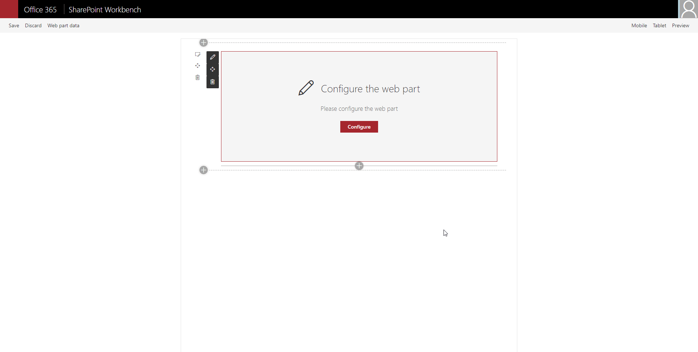

# react-personal-greeting

## Summary

The web part pulls in the current user's name and displays it on the page. The greeting text before the name is customizable through the property pane. Additionally the position of the greeting and color of the text can be adjusted through the property pane as well.

## Compatibility

-Incompatible-red.svg "SharePoint Server 2016 Feature Pack 2 requires SPFx 1.1")

## Applies to

* [SharePoint Framework](https://docs.microsoft.com/sharepoint/dev/spfx/sharepoint-framework-overview)
* [Office 365 tenant](https://docs.microsoft.com/sharepoint/dev/spfx/set-up-your-development-environment)
* [PnP SPFx Controls](https://sharepoint.github.io/sp-dev-fx-controls-react)
* [PnP SPFx Property Controls](https://sharepoint.github.io/sp-dev-fx-property-controls)

## Prerequisites

## Solution

Solution|Author(s)
--------|---------
react-personal-greeting|[Zach Roberts](https://github.com/zachroberts8668) - [SPODev](https://spodev.com)

## Version history

Version|Date|Comments
-------|----|--------
1.1|September 24, 2020| Updated SPFX version and added font-size
1.0|April 14, 2020|Initial release

## Minimal Path to Awesome

* Clone this repository
* in the command line run:
  * `npm install`
  * `gulp build`
  * `gulp bundle --ship`
  * `gulp package-solution --ship`
* add the web part to your tenant app store
* add the app to a SharePoint site and then add the web part to the page

>  This sample can also be opened with [VS Code Remote Development](https://code.visualstudio.com/docs/remote/remote-overview). Visit https://aka.ms/spfx-devcontainer for further instructions.

## Features

This Web Part illustrates the following concepts on top of the SharePoint Framework:

* Using the SPFx context to gather the current user's display name.
* Adjusting the styles of the component in the web part using the props adjusted through the property pane.
* PnP SPFx Placeholder - This component allows you to have a placeholder visible under certain conditions if your web parts requires some setup.
* PnP SPFx Color Picker - This component adds an awesome color picker to the property pane, great for adjusting colors in your web part.

## Help

We do not support samples, but we this community is always willing to help, and we want to improve these samples. We use GitHub to track issues, which makes it easy for  community members to volunteer their time and help resolve issues.

If you're having issues building the solution, please run [spfx doctor](https://pnp.github.io/cli-microsoft365/cmd/spfx/spfx-doctor/) from within the solution folder to diagnose incompatibility issues with your environment.

If you encounter any issues while using this sample, [create a new issue](https://github.com/pnp/sp-dev-fx-webparts/issues/new?assignees=&labels=Needs%3A+Triage+%3Amag%3A%2Ctype%3Abug-suspected%2Csample%3A%20react-personal-greeting&template=bug-report.yml&sample=react-personal-greeting&authors=@zachroberts8668&title=react-personal-greeting%20-%20).

For questions regarding this sample, [create a new question](https://github.com/pnp/sp-dev-fx-webparts/issues/new?assignees=&labels=Needs%3A+Triage+%3Amag%3A%2Ctype%3Aquestion%2Csample%3A%20react-personal-greeting&template=question.yml&sample=react-personal-greeting&authors=@zachroberts8668&title=react-personal-greeting%20-%20).

Finally, if you have an idea for improvement, [make a suggestion](https://github.com/pnp/sp-dev-fx-webparts/issues/new?assignees=&labels=Needs%3A+Triage+%3Amag%3A%2Ctype%3Aenhancement%2Csample%3A%20react-personal-greeting&template=question.yml&sample=react-personal-greeting&authors=@zachroberts8668&title=react-personal-greeting%20-%20).

## Disclaimer

**THIS CODE IS PROVIDED *AS IS* WITHOUT WARRANTY OF ANY KIND, EITHER EXPRESS OR IMPLIED, INCLUDING ANY IMPLIED WARRANTIES OF FITNESS FOR A PARTICULAR PURPOSE, MERCHANTABILITY, OR NON-INFRINGEMENT.**

