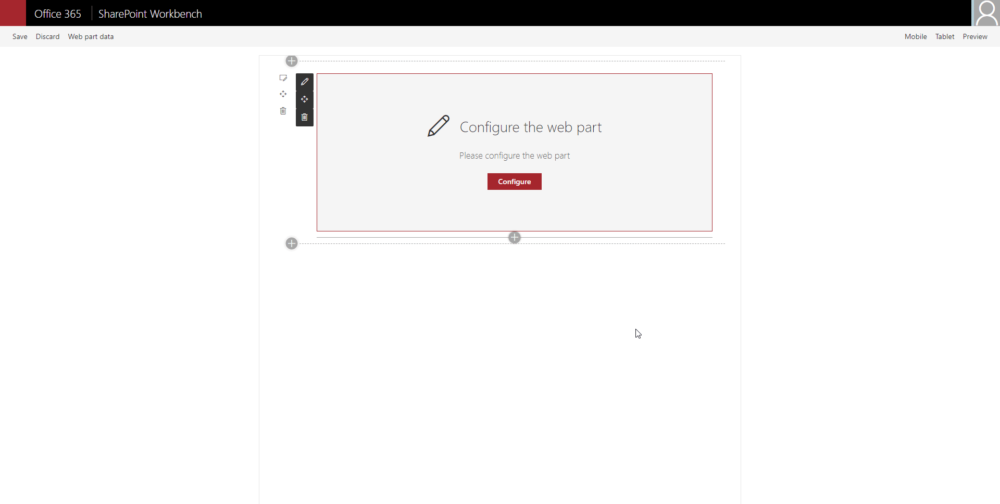

# Personal Greeting

## Summary

The web part pulls in the current user's name and displays it on the page. The greeting text before the name is customizable through the property pane. Additionally the position of the greeting and color of the text can be adjusted through the property pane as well.

## Compatibility

| :warning: Important |
|:---|
| Every SPFx version is optimally compatible with specific versions of Node.js. To build this sample, ensure that your workstation uses a supported Node.js version. |
| Refer to <https://aka.ms/spfx-matrix> for more information about SPFx compatibility. |

This sample is optimally compatible with the following environment configuration:

-Incompatible-red.svg "SharePoint Server 2016 Feature Pack 2 requires SPFx 1.1")

## Applies to

* [SharePoint Framework](https://learn.microsoft.com/sharepoint/dev/spfx/sharepoint-framework-overview)
* [Microsoft 365 tenant](https://learn.microsoft.com/sharepoint/dev/spfx/set-up-your-development-environment)

> Get your own free development tenant by subscribing to the [Microsoft 365 Developer Program](https://aka.ms/m365/devprogram).

## Contributors

* [Zach Roberts](https://github.com/zachroberts8668)
* [Ari Gunawan](https://github.com/AriGunawan)

## Version history

| Version | Date | Comments |
|---|---|---|
| 2.0 | September 13, 2026 | Upgraded to SPFx v1.23.2 |
| 1.1 | September 24, 2020 | Updated the SPFx version and added font-size configuration |
| 1.0 | April 14, 2020 | Initial release |

## Prerequisites

* Node.js `>=22.14.0 <23.0.0`
* A Microsoft 365 tenant with SharePoint Online
* Permission to deploy packages to the tenant app catalog

## Minimal path to awesome

* Clone this repository, or [download this sample as a ZIP file](https://pnp.github.io/download-partial/?url=https://github.com/pnp/sp-dev-fx-webparts/tree/main/samples/react-personal-greeting) and extract it.
* From the command line, change to the `samples/react-personal-greeting` directory.
* Run `npm install`.
* Run `npm run build`.
* Upload `sharepoint/solution/react-personal-greeting.sppkg` to the tenant app catalog.
* Add the app to a SharePoint site, then add the **Personal Greeting** web part to a page.

To use the hosted workbench, replace `{tenantDomain}` in `config/serve.json` with your SharePoint tenant domain and run `npm run start`.

> This sample can also be opened with [VS Code Remote Development](https://code.visualstudio.com/docs/remote/remote-overview). Visit <https://aka.ms/spfx-devcontainer> for further instructions.

## Features

This web part demonstrates:

* Reading the current user's display name from the SPFx page context
* Configuring greeting text, alignment, font size, and text color in the property pane
* Rendering a Fluent UI placeholder until the greeting is configured
* Integrating a Fluent UI color picker as a custom property pane field
* Building and packaging an SPFx solution with the Heft toolchain

## Help

We do not support samples, but this community is always willing to help, and we want to improve these samples. We use GitHub to track issues so community members can volunteer their time and help resolve them.

If you are having trouble building the solution, run [spfx doctor](https://pnp.github.io/cli-microsoft365/cmd/spfx/spfx-doctor/) from the solution directory to diagnose compatibility issues in your environment.

You can review [issues related to this sample](https://github.com/pnp/sp-dev-fx-webparts/issues?q=label%3A%22sample%3A%20react-personal-greeting%22) to see whether someone else has encountered the same problem.

You can also review [discussions related to this sample](https://github.com/pnp/sp-dev-fx-webparts/discussions?discussions_q=react-personal-greeting) to see what the community is saying.

If you encounter an issue using this sample, [create a new issue](https://github.com/pnp/sp-dev-fx-webparts/issues/new?assignees=&labels=Needs%3A+Triage+%3Amag%3A%2Ctype%3Abug-suspected%2Csample%3A%20react-personal-greeting&template=bug-report.yml&sample=react-personal-greeting&authors=@zachroberts8668%20@AriGunawan&title=react-personal-greeting%20-%20).

For questions about this sample, [create a new question](https://github.com/pnp/sp-dev-fx-webparts/issues/new?assignees=&labels=Needs%3A+Triage+%3Amag%3A%2Ctype%3Aquestion%2Csample%3A%20react-personal-greeting&template=question.yml&sample=react-personal-greeting&authors=@zachroberts8668%20@AriGunawan&title=react-personal-greeting%20-%20).

If you have an idea for improvement, [make a suggestion](https://github.com/pnp/sp-dev-fx-webparts/issues/new?assignees=&labels=Needs%3A+Triage+%3Amag%3A%2Ctype%3Aenhancement%2Csample%3A%20react-personal-greeting&template=suggestion.yml&sample=react-personal-greeting&authors=@zachroberts8668%20@AriGunawan&title=react-personal-greeting%20-%20).

## Disclaimer

**THIS CODE IS PROVIDED *AS IS* WITHOUT WARRANTY OF ANY KIND, EITHER EXPRESS OR IMPLIED, INCLUDING ANY IMPLIED WARRANTIES OF FITNESS FOR A PARTICULAR PURPOSE, MERCHANTABILITY, OR NON-INFRINGEMENT.**

