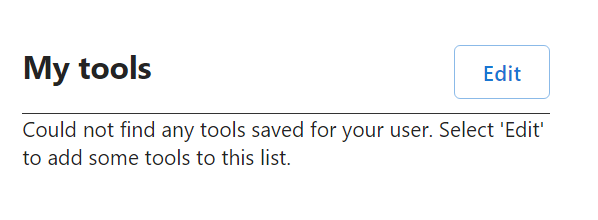
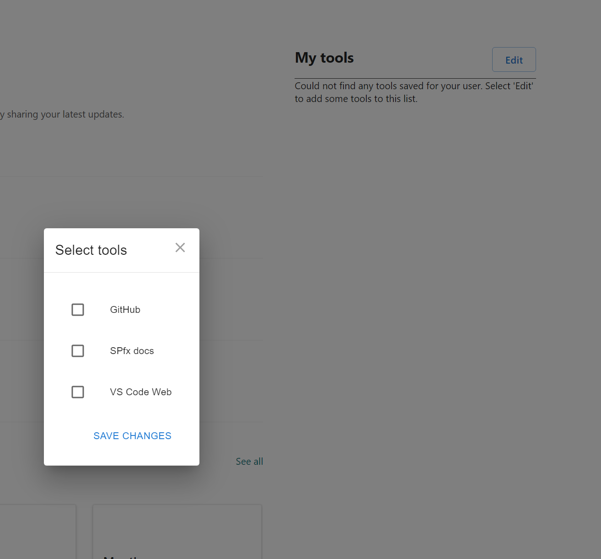
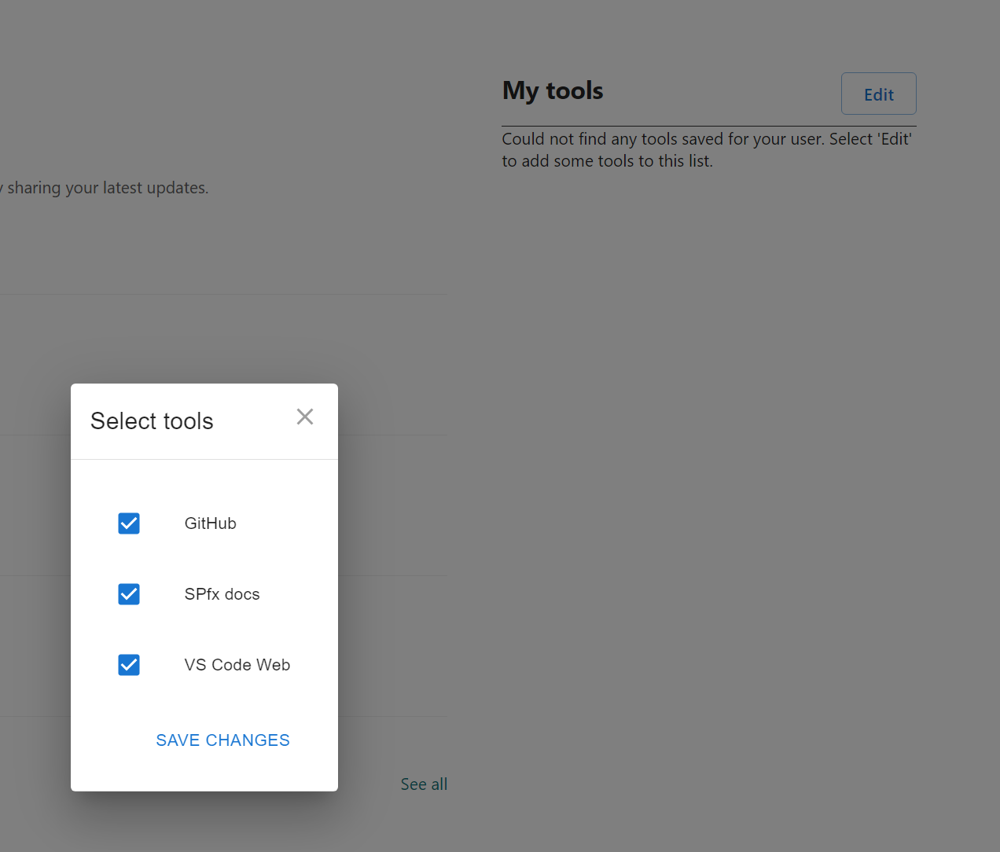
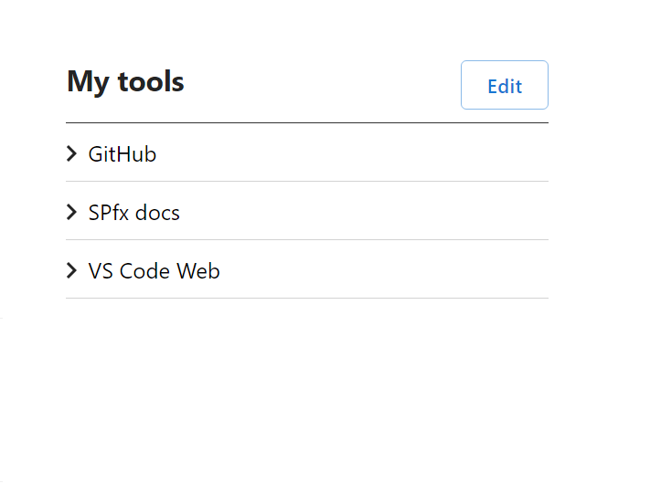
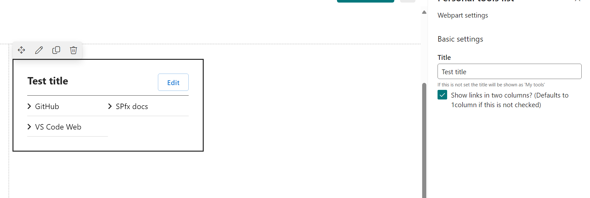
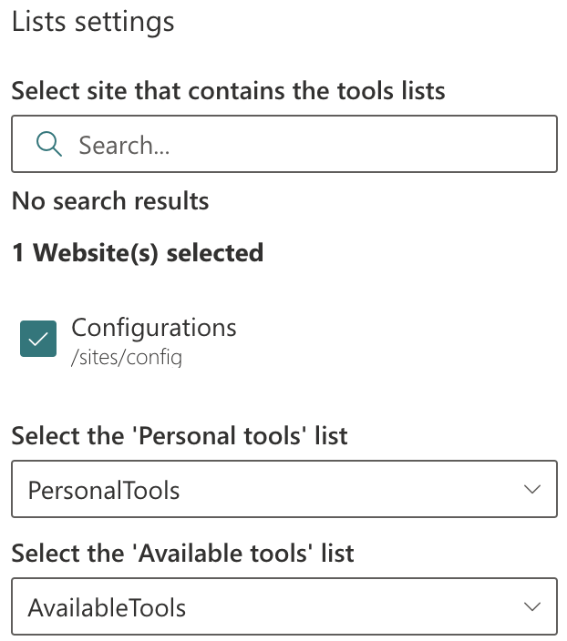
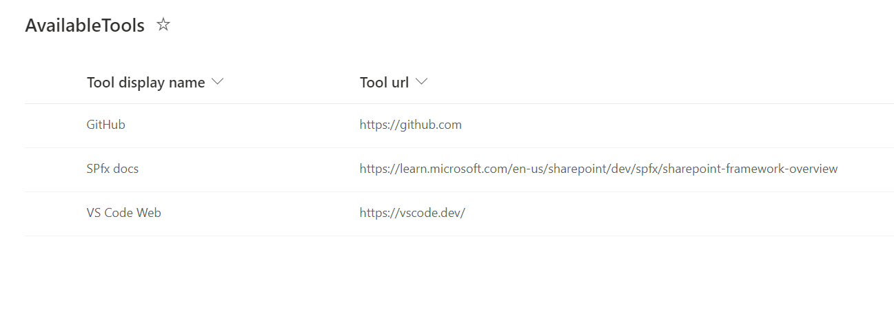
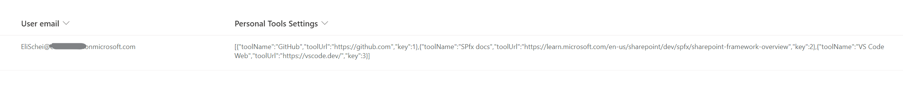

# Personal tools list / "My tools"

## Summary

This web part allows users to select tools from a predefined list and save them in their own personalized view.
This web part has the fundamental functionality - a great starting point to build upon if you need something more advanced.

<video width="600" height="" controls>
  <source src="./assets/video-demo1.mp4" type="video/mp4">
</video>


### Usage

* The user can select from this list what link(s) he/she wants to be displayed for them.


* Select tools



* The tools will be displayed like this:



### Configuration

* The web part title can be changed from the property pane, here you can also select to display the tools in two columns (defaults to 1 column if this is not selected):


* Make sure you set the site that contains the two relevant lists ("Available Tools" and "Personal Tools") and set the reference to the lists accordingly:


### In the background

The available tools are added to a list to show up in the web part

The web part saves to another list..


## Compatibility

| :warning: Important          |
|:---------------------------|
| Every SPFx version is optimally compatible with specific versions of Node.js. In order to be able to build this sample, you need to ensure that the version of Node on your workstation matches one of the versions listed in this section. This sample will not work on a different version of Node.|
|Refer to <https://aka.ms/spfx-matrix> for more information on SPFx compatibility.   |

This sample is optimally compatible with the following environment configuration:


-Incompatible-red.svg "SharePoint Server 2016 Feature Pack 2 requires SPFx 1.1")


## Applies to

* [SharePoint Framework](https://learn.microsoft.com/sharepoint/dev/spfx/sharepoint-framework-overview)
* [Microsoft 365 tenant](https://learn.microsoft.com/sharepoint/dev/spfx/set-up-your-development-environment)

> Get your own free development tenant by subscribing to [Microsoft 365 developer program](https://aka.ms/m365/devprogram)

## Contributors

* [Eli Schei](https://github.com/Eli-Schei/)
* [Tobias Maestrini](https://github.com/tmaestrini)

## Version history

Version|Date|Comments
-------|----|--------
| 1.0     | February 08, 2024 | Initial release |
| 1.1     | February 25, 2024 | Dynamic lists selection |

## Prerequisites

You need to run the script in the `env-setup` folder to create the content types and lists used in the code. If you create them manually you might need to change the code to use the correct list and field names.

For manual creation here is what you need:

* List named "AvailableTools", needs to have fields `tool_name` and `tool_url` (both text fields);
* List named "PersonalTools", needs to have fields `tool_username` (text) and `tool_usertools` (note / multi line text field)

## Minimal path to awesome

* Clone this repository
* Run the script `CreateLists.ps1` in the [`env-setup` folder](./src/webparts/myTools/env-setup/CreateLists.ps1) ([you need pnp-powershell to run this](https://pnp.github.io/powershell/))
* In your CLI navigate to the solution folder (the folder where this readme file lives)
* in the command-line run:
  * `npm install`
  * `gulp serve`

### Package and deploy web part

[Here is a blog post that takes you through every step](https://elischei.com/deploy-your-spfx-solution-using-pnp-powershell/)

#### Package

First you need to package the solution for production

```powershell
gulp build
gulp bundle --ship
gulp package-solution --ship
```

Then you can upload the `sppkg` to your appcatalog manually, or using PnP PowerShell as shown below.

```powershell
Connect-PnPOnline "appcatalogurl" -Interactive

$appCatConnection = Connect-PnPOnline $appcatalog -ReturnConnection -Interactive

Add-PnPApp -Path "./project-wp.sppkg" -Connection $appCatConnection -Publish -SkipFeatureDeployment -Overwrite
```

## Features

Admin/editor can add predefined tools (aka links) to a list, and the users will be able to select which tools they want in their own list.


## Help


We do not support samples, but this community is always willing to help, and we want to improve these samples. We use GitHub to track issues, which makes it easy for  community members to volunteer their time and help resolve issues.

If you're having issues building the solution, please run [spfx doctor](https://pnp.github.io/cli-microsoft365/cmd/spfx/spfx-doctor/) from within the solution folder to diagnose incompatibility issues with your environment.

You can try looking at [issues related to this sample](https://github.com/pnp/sp-dev-fx-webparts/issues?q=label%3A%22sample%3A%20react-personal-tools-list%22) to see if anybody else is having the same issues.

You can also try looking at [discussions related to this sample](https://github.com/pnp/sp-dev-fx-webparts/discussions?discussions_q=react-personal-tools-list) and see what the community is saying.

If you encounter any issues using this sample, [create a new issue](https://github.com/pnp/sp-dev-fx-webparts/issues/new?assignees=&labels=Needs%3A+Triage+%3Amag%3A%2Ctype%3Abug-suspected%2Csample%3A%20react-personal-tools-list&template=bug-report.yml&sample=react-personal-tools-list&authors=@Eli-Schei&title=react-personal-tools-list%20-%20).

For questions regarding this sample, [create a new question](https://github.com/pnp/sp-dev-fx-webparts/issues/new?assignees=&labels=Needs%3A+Triage+%3Amag%3A%2Ctype%3Aquestion%2Csample%3A%20react-personal-tools-list&template=question.yml&sample=react-personal-tools-list&authors=@Eli-Schei&title=react-personal-tools-list%20-%20).

Finally, if you have an idea for improvement, [make a suggestion](https://github.com/pnp/sp-dev-fx-webparts/issues/new?assignees=&labels=Needs%3A+Triage+%3Amag%3A%2Ctype%3Aenhancement%2Csample%3A%20react-personal-tools-list&template=suggestion.yml&sample=react-personal-tools-list&authors=@Eli-Schei&title=react-personal-tools-list%20-%20).

## Disclaimer

**THIS CODE IS PROVIDED *AS IS* WITHOUT WARRANTY OF ANY KIND, EITHER EXPRESS OR IMPLIED, INCLUDING ANY IMPLIED WARRANTIES OF FITNESS FOR A PARTICULAR PURPOSE, MERCHANTABILITY, OR NON-INFRINGEMENT.**


