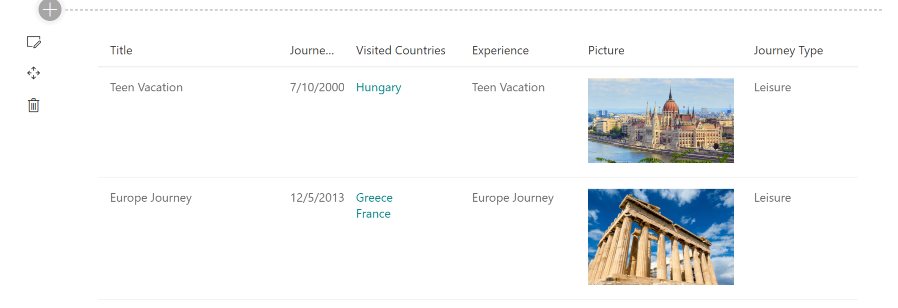
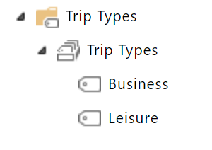

# React PnP ListView with PnP Field Controls Web Part

Sample web part to display PnP [`ListView`](https://sharepoint.github.io/sp-dev-fx-controls-react/controls/ListView/) control with column rendering using PnP [Field Controls](https://sharepoint.github.io/sp-dev-fx-controls-react/controls/fields/main/).

## Used SharePoint Framework Version 

## Applies to

* [SharePoint Framework](https://docs.microsoft.com/sharepoint/dev/spfx/sharepoint-framework-overview)
* [Office 365 developer tenant](https://docs.microsoft.com/sharepoint/dev/spfx/set-up-your-developer-tenant)

## Solution

Solution|Author(s)
--------|---------
react-pnp-controls-list-view-fields|[AJIXuMuK](https://github.com/AJIXuMuK)

## Version history

Version|Date|Comments
-------|----|--------
1.0|MArch 09, 2020|Initial release

## Disclaimer
**THIS CODE IS PROVIDED *AS IS* WITHOUT WARRANTY OF ANY KIND, EITHER EXPRESS OR IMPLIED, INCLUDING ANY IMPLIED WARRANTIES OF FITNESS FOR A PARTICULAR PURPOSE, MERCHANTABILITY, OR NON-INFRINGEMENT.**

---

## Minimal Path to Awesome

* clone this repo
* move to right folder
* in the command line run:
  * `npm install`
  * `gulp bundle --ship`
  * `gulp package-solution --ship`
* from the `sharepoint/solution` folder, deploy the `.sppkg` file to the App catalog in your tenant
* create Term Store group as shown on the screenshot below:\
  
* in the site where you want to test this solution
  * create Country list as a standard Custom list and add few items in there
  * create Journeys list with the next columns:
    * Title - Single line of text
    * JourneyDate - Date and Time
    * VisitedCountries - Lookup with multiselection. Referenced list - Country
    * Experience - Choice with next choices: Bad, Normal, Good
    * Picture - Hyperlink or Picture, display as Picture
    * JourneyType - Managed Metadata connected to the Term Set created above
  * add the app named _react-pnp-controls-list-view-fields-client-side-solution_
  * edit a page
  * add _PnP ListView_ web part to the page

## Features

This sample demonstrates how to combine different parts of PnP Reusable React controls to create rich solutions. It also partially answers the question from [Issue 493](https://github.com/SharePoint/sp-dev-fx-controls-react/issues/493) in PnP Reusable Controls repo. 

