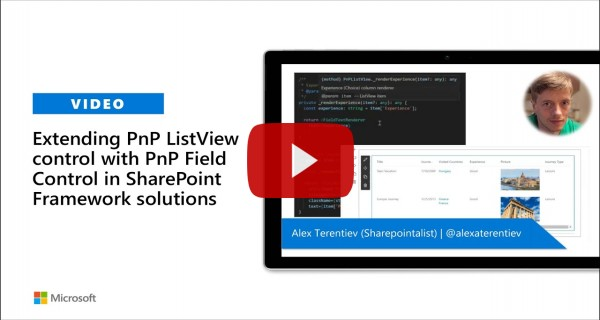

# PnP ListView with PnP Field Controls Web Part

Sample web part to display PnP [`ListView`](https://sharepoint.github.io/sp-dev-fx-controls-react/controls/ListView/) control with column rendering using PnP [Field Controls](https://sharepoint.github.io/sp-dev-fx-controls-react/controls/fields/main/).

## Compatibility

 
 

-Incompatible-red.svg "SharePoint Server 2016 Feature Pack 2 requires SPFx 1.1")

## Applies to

* [SharePoint Framework](https://docs.microsoft.com/sharepoint/dev/spfx/sharepoint-framework-overview)
* [Office 365 developer tenant](https://docs.microsoft.com/sharepoint/dev/spfx/set-up-your-developer-tenant)

## Solution

Solution|Author(s)
--------|---------
react-pnp-controls-list-view-fields|[Alex Terentiev](https://github.com/AJIXuMuK)

## Version history

Version|Date|Comments
-------|----|--------
1.0|MArch 09, 2020|Initial release

## Minimal Path to Awesome

* clone this repo
* From your command line, change your current directory to the directory containing this sample (`react-pnp-controls-list-view-fields`, located under `samples`)
* in the command line run:
  * `npm install`
  * `gulp bundle --ship`
  * `gulp package-solution --ship`
* from the `sharepoint/solution` folder, deploy the `.sppkg` file to the App catalog in your tenant
* create Term Store group as shown on the screenshot below:\
  
* in the site where you want to test this solution
  * create Country list as a standard Custom list and add few items in there
  * create Journeys list with the next columns:
    * Title - Single line of text
    * JourneyDate - Date and Time
    * VisitedCountries - Lookup with multiselection. Referenced list - Country
    * Experience - Choice with next choices: Bad, Normal, Good
    * Picture - Hyperlink or Picture, display as Picture
    * JourneyType - Managed Metadata connected to the Term Set created above
  * add the app named _react-pnp-controls-list-view-fields-client-side-solution_
  * edit a page
  * add _PnP ListView_ web part to the page

>  This sample can also be opened with [VS Code Remote Development](https://code.visualstudio.com/docs/remote/remote-overview). Visit https://aka.ms/spfx-devcontainer for further instructions.

## Features

This sample demonstrates how to combine different parts of PnP Reusable React controls to create rich solutions. It also partially answers the question from [Issue 493](https://github.com/pnp/sp-dev-fx-controls-react/issues/493) in PnP Reusable Controls repo. 

## Video

## Help

We do not support samples, but we this community is always willing to help, and we want to improve these samples. We use GitHub to track issues, which makes it easy for  community members to volunteer their time and help resolve issues.

If you're having issues building the solution, please run [spfx doctor](https://pnp.github.io/cli-microsoft365/cmd/spfx/spfx-doctor/) from within the solution folder to diagnose incompatibility issues with your environment.

You can try looking at [issues related to this sample](https://github.com/pnp/sp-dev-fx-webparts/issues?q=label%3A%22sample%3A%20react-pnp-controls-list-view-fields") to see if anybody else is having the same issues.

You can also try looking at [discussions related to this sample](https://github.com/pnp/sp-dev-fx-webparts/discussions?discussions_q=react-pnp-controls-list-view-fields) and see what the community is saying.

If you encounter any issues while using this sample, [create a new issue](https://github.com/pnp/sp-dev-fx-webparts/issues/new?assignees=&labels=Needs%3A+Triage+%3Amag%3A%2Ctype%3Abug-suspected%2Csample%3A%20react-pnp-controls-list-view-fields&template=bug-report.yml&sample=react-pnp-controls-list-view-fields&authors=@AJIXuMuK&title=react-pnp-controls-list-view-fields%20-%20).

For questions regarding this sample, [create a new question](https://github.com/pnp/sp-dev-fx-webparts/issues/new?assignees=&labels=Needs%3A+Triage+%3Amag%3A%2Ctype%3Aquestion%2Csample%3A%20react-pnp-controls-list-view-fields&template=question.yml&sample=react-pnp-controls-list-view-fields&authors=@AJIXuMuK&title=react-pnp-controls-list-view-fields%20-%20).

Finally, if you have an idea for improvement, [make a suggestion](https://github.com/pnp/sp-dev-fx-webparts/issues/new?assignees=&labels=Needs%3A+Triage+%3Amag%3A%2Ctype%3Aenhancement%2Csample%3A%20react-pnp-controls-list-view-fields&template=question.yml&sample=react-pnp-controls-list-view-fields&authors=@AJIXuMuK&title=react-pnp-controls-list-view-fields%20-%20).

## Disclaimer

**THIS CODE IS PROVIDED *AS IS* WITHOUT WARRANTY OF ANY KIND, EITHER EXPRESS OR IMPLIED, INCLUDING ANY IMPLIED WARRANTIES OF FITNESS FOR A PARTICULAR PURPOSE, MERCHANTABILITY, OR NON-INFRINGEMENT.**

