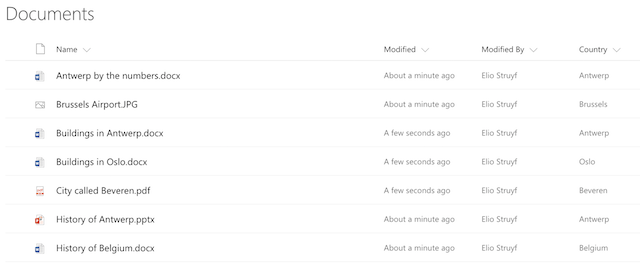

# SharePoint Framework PnP Controls Sample

## Summary

This is a sample project that contains a web part which makes use of the PnP SPFx Controls:

- [SharePoint Framework React Controls](https://www.npmjs.com/package/@pnp/spfx-controls-react)
- [SharePoint Framework Property Controls](https://www.npmjs.com/package/@pnp/spfx-property-controls)


## Compatibility


-Incompatible-red.svg "SharePoint Server 2016 Feature Pack 2 requires SPFx 1.1")


## Which PnP SPFx controls are being used in this sample?

The sample makes use of the following controls:
- `PropertyFieldListPicker`
- `PropertyFieldTermPicker`
- `Placeholder`
- `ListView` (which also uses the `FileTypeIcon` control)

## Applies to

* [SharePoint Framework](https://docs.microsoft.com/sharepoint/dev/spfx/sharepoint-framework-overview)

## Solution

Solution|Author(s)
--------|---------
pnp-controls|Elio Struyf (MVP, U2U, [@eliostruyf](https://twitter.com/eliostruyf))
pnp-controls|Swaminathan Sriram ([@SwaminathanSri3](https://twitter.com/SwaminathanSri3))

## Version history

Version|Date|Comments
-------|----|--------
1.0.1|September 20, 2017|Initial release
1.0.2|March 03, 2018|Update to 1.4.1
1.0.3|December 16, 2020|Update to 1.11.0

## Minimal Path to Awesome

To test out this web part, you need to have a library with a managed metadata field. In my case, I made use of a field called `Country`.

>  This sample can also be opened with [VS Code Remote Development](https://code.visualstudio.com/docs/remote/remote-overview). Visit https://aka.ms/spfx-devcontainer for further instructions.



Once you have such a library in place, you can copy the code and run the following commands:

```bash
npm install
gulp serve --nobrowser
```


## Help

We do not support samples, but we this community is always willing to help, and we want to improve these samples. We use GitHub to track issues, which makes it easy for  community members to volunteer their time and help resolve issues.

If you're having issues building the solution, please run [spfx doctor](https://pnp.github.io/cli-microsoft365/cmd/spfx/spfx-doctor/) from within the solution folder to diagnose incompatibility issues with your environment.

If you encounter any issues while using this sample, [create a new issue](https://github.com/pnp/sp-dev-fx-webparts/issues/new?assignees=&labels=Needs%3A+Triage+%3Amag%3A%2Ctype%3Abug-suspected%2Csample%3A%20react-pnp-controls&template=bug-report.yml&sample=react-pnp-controls&authors=@estruyf%20@Swaminathan-Sriram&title=react-pnp-controls%20-%20).

For questions regarding this sample, [create a new question](https://github.com/pnp/sp-dev-fx-webparts/issues/new?assignees=&labels=Needs%3A+Triage+%3Amag%3A%2Ctype%3Aquestion%2Csample%3A%20react-pnp-controls&template=question.yml&sample=react-pnp-controls&authors=@estruyf%20@Swaminathan-Sriram&title=react-pnp-controls%20-%20).

Finally, if you have an idea for improvement, [make a suggestion](https://github.com/pnp/sp-dev-fx-webparts/issues/new?assignees=&labels=Needs%3A+Triage+%3Amag%3A%2Ctype%3Aenhancement%2Csample%3A%20react-pnp-controls&template=question.yml&sample=react-pnp-controls&authors=@estruyf%20@Swaminathan-Sriram&title=react-pnp-controls%20-%20).


## Disclaimer

**THIS CODE IS PROVIDED *AS IS* WITHOUT WARRANTY OF ANY KIND, EITHER EXPRESS OR IMPLIED, INCLUDING ANY IMPLIED WARRANTIES OF FITNESS FOR A PARTICULAR PURPOSE, MERCHANTABILITY, OR NON-INFRINGEMENT.**


