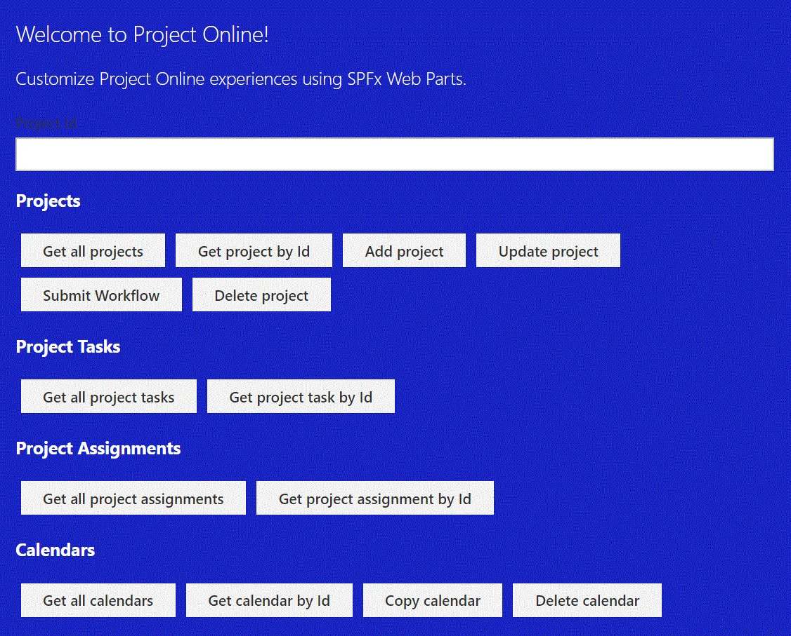

# React PnPjs Project Online

## Summary

This sample shows how to use SPFx to consume data from the Project Online REST API using a custom module for PnPjs.
The web part is currently logging the data returned from the API to the browser console as a simple proof of concept.

Custom PnPjs module: [pnpjs-project-online-package](https://www.npmjs.com/package/pnpjs-project-online-package)

## Used SharePoint Framework Version

## Applies to

- [SharePoint Framework](https://docs.microsoft.com/sharepoint/dev/spfx/sharepoint-framework-overview)
- [Office 365 tenant](https://docs.microsoft.com/sharepoint/dev/spfx/set-up-your-development-environment)
- [Project Online](<https://docs.microsoft.com/en-us/previous-versions/office/project-javascript-api/jj712612(v%3Doffice.15)>)

## Prerequisites

- Office 365 subscription with SharePoint Online and Project Online licence
- SharePoint Framework [development environment](https://docs.microsoft.com/sharepoint/dev/spfx/set-up-your-development-environment) already set up.
- Project site with sample data available.

## Solution

| Solution                   | Author(s)      |
| -------------------------- | -------------- |
| react-pnpjs-project-online | Joel Rodrigues |

## Version history

| Version | Date             | Comments        |
| ------- | ---------------- | --------------- |
| 1.0     | December 4, 2019 | Initial release |

## Disclaimer

**THIS CODE IS PROVIDED _AS IS_ WITHOUT WARRANTY OF ANY KIND, EITHER EXPRESS OR IMPLIED, INCLUDING ANY IMPLIED WARRANTIES OF FITNESS FOR A PARTICULAR PURPOSE, MERCHANTABILITY, OR NON-INFRINGEMENT.**

---

## Minimal Path to Awesome

- Clone this repository
- in the command line run:
  - `npm install`
  - `gulp serve`

## Features

This Web Part illustrates the following concepts on top of the SharePoint Framework:

-Using PnPjs with a custom package to interact with Project Online REST API

