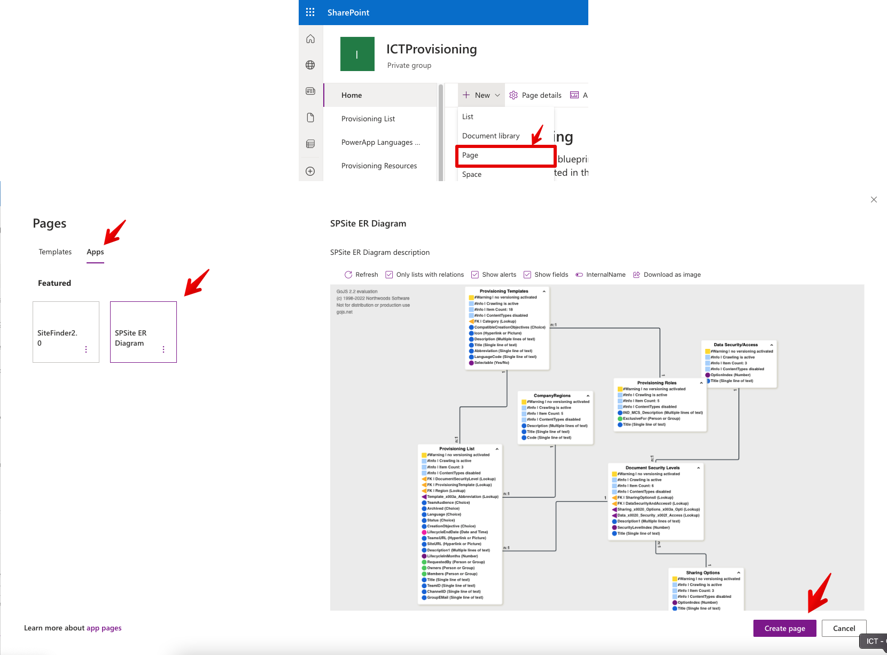
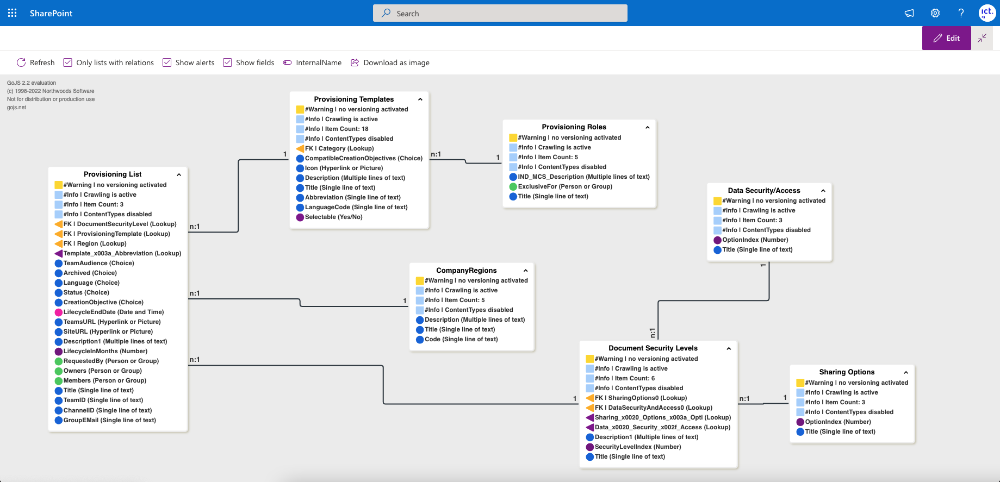

# Site ER Diagram
## Summary

This web parts loads all lists on a site and display it in a Entity Relationship Diagram (ERD).

## Compatibility

-Incompatible-red.svg "SharePoint Server 2016 Feature Pack 2 requires SPFx 1.1")

## Applies to

* [SharePoint Framework](https://docs.microsoft.com/sharepoint/dev/spfx/sharepoint-framework-overview)
* [Microsoft 365 tenant](https://docs.microsoft.com/sharepoint/dev/spfx/set-up-your-development-environment)
> Get your own free development tenant by subscribing to [Microsoft 365 developer program](http://aka.ms/o365devprogram)

## Solution
<!--
We use this section to recognize and promote your contributions. Please provide one author per line -- even if you worked together on it.

We'll only use the info you provided here. Make sure to include your full name, not just your GitHub username.

Provide a link to your GitHub profile to help others find more cool things you have done.

If you provide a link to your Twitter profile, we'll promote your contribution on social media.
-->

Solution|Author(s)
--------|---------
react-pnpjs-spsite-er-diagram | [Niklas Wilhelm](https://github.com/ICTNiklasWilhelm) ([@NiklasWilhelm4](https://twitter.com/@NiklasWilhelm4)), NetForce 365 GmbH (HubSite 365)

## Version history

Version|Date|Comments
-------|----|--------
1.0|October 07, 2022|Initial release

## Minimal path to awesome
* Clone this repository (or [download this solution as a .ZIP file](https://pnp.github.io/download-partial/?url=https://github.com/pnp/sp-dev-fx-webparts/tree/main/samples/react-pnpjs-spsite-er-diagram) then unzip it)
* From your command line, change your current directory to the directory containing this sample (`react-pnpjs-spsite-er-diagram`, located under `samples`)
* in the command line run:
  * `npm install`
  * `gulp serve`

> This sample can also be opened with [VS Code Remote Development](https://code.visualstudio.com/docs/remote/remote-overview). Visit <https://aka.ms/spfx-devcontainer> for further instructions.

## Features

This project can be used as a starting point for any visualisation of SharePoint Data. Currently it's using GoJS as dependency for the ER Diagram (in productive enviroment you would need to get a license for it). The data layer is abstract so it's possible to use a different library (like three.js) as presentation layer.

* the Data gets cached, to see changes made to the lists/lookups a "refresh" is needed
* alerts/warnings for the lists are displayed as well (Versioning/ItemCount/Threshholdlimit/..)
* easy opt/in/out of alerts and fields
* easy switch between Internal-/DisplayName
* Download current canvas as image

<!--
Note that better pictures and documentation will increase the sample usage and the value you are providing for others. Thanks for your submissions in advance! You rock ❤.
-->

<!--
RESERVED FOR REPO MAINTAINERS

We'll add the video from the community call recording here

## Video

-->

## Help

<!--
You can just search and replace this page with the following values:

Search for:
react-pnpjs-spsite-er-diagram

Replace with your sample folder name. E.g.: react-my-cool-sample

Search for:
@YOURGITHUBUSERNAME

Replace with your GitHub username, prefixed with an "@". If you have more than one author, use %20 to separate them, making sure to prefix everyone's username individually with an "@".

Example:
@hugoabernier

Or:
@hugoabernier%20@VesaJuvonen%20@PopWarner
-->

We do not support samples, but this community is always willing to help, and we want to improve these samples. We use GitHub to track issues, which makes it easy for  community members to volunteer their time and help resolve issues.

If you're having issues building the solution, please run [spfx doctor](https://pnp.github.io/cli-microsoft365/cmd/spfx/spfx-doctor/) from within the solution folder to diagnose incompatibility issues with your environment.

You can try looking at [issues related to this sample](https://github.com/pnp/sp-dev-fx-webparts/issues?q=label%3A%22sample%3A%20react-pnpjs-spsite-er-diagram%22) to see if anybody else is having the same issues.

You can also try looking at [discussions related to this sample](https://github.com/pnp/sp-dev-fx-webparts/discussions?discussions_q=react-pnpjs-spsite-er-diagram) and see what the community is saying.

If you encounter any issues using this sample, [create a new issue](https://github.com/pnp/sp-dev-fx-webparts/issues/new?assignees=&labels=Needs%3A+Triage+%3Amag%3A%2Ctype%3Abug-suspected%2Csample%3A%20react-pnpjs-spsite-er-diagram&template=bug-report.yml&sample=react-pnpjs-spsite-er-diagram&authors=@YOURGITHUBUSERNAME&title=react-pnpjs-spsite-er-diagram%20-%20).

For questions regarding this sample, [create a new question](https://github.com/pnp/sp-dev-fx-webparts/issues/new?assignees=&labels=Needs%3A+Triage+%3Amag%3A%2Ctype%3Aquestion%2Csample%3A%20react-pnpjs-spsite-er-diagram&template=question.yml&sample=react-pnpjs-spsite-er-diagram&authors=@YOURGITHUBUSERNAME&title=react-pnpjs-spsite-er-diagram%20-%20).

Finally, if you have an idea for improvement, [make a suggestion](https://github.com/pnp/sp-dev-fx-webparts/issues/new?assignees=&labels=Needs%3A+Triage+%3Amag%3A%2Ctype%3Aenhancement%2Csample%3A%20react-pnpjs-spsite-er-diagram&template=suggestion.yml&sample=react-pnpjs-spsite-er-diagram&authors=@YOURGITHUBUSERNAME&title=react-pnpjs-spsite-er-diagram%20-%20).

## Disclaimer

**THIS CODE IS PROVIDED *AS IS* WITHOUT WARRANTY OF ANY KIND, EITHER EXPRESS OR IMPLIED, INCLUDING ANY IMPLIED WARRANTIES OF FITNESS FOR A PARTICULAR PURPOSE, MERCHANTABILITY, OR NON-INFRINGEMENT.**

