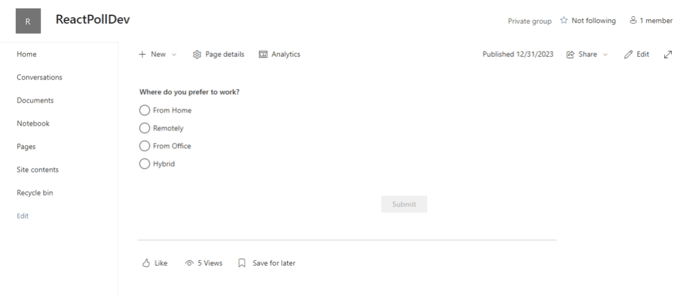
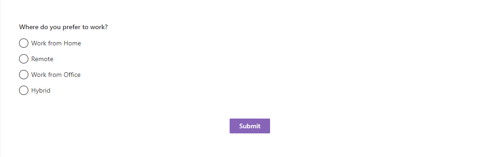
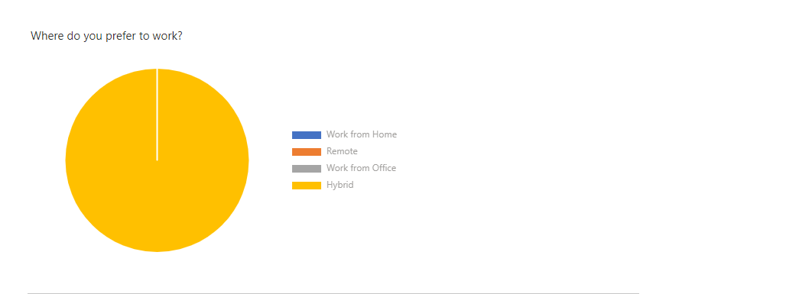
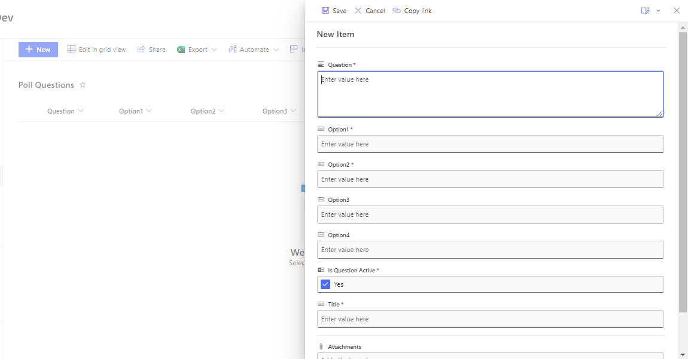
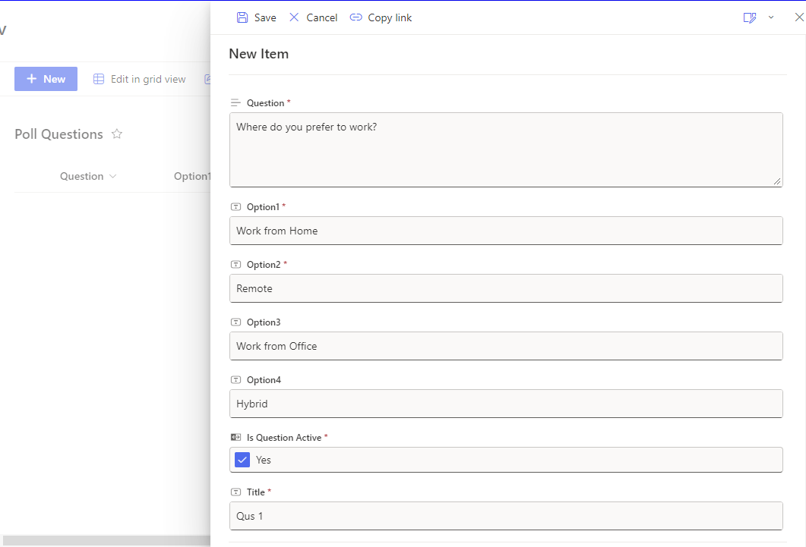

# React Poll

## Summary

This web part allow User to add New Poll Questions and their options. End users can submit his/her response to the poll. After Submission, user can see all responses count with Bar chart.

  
**Following are some of the features of this component.**

- These 2 lists will be provisioned automatically with necessary columns.

- Poll Questions : User can add New poll question and their options. Also, user can set to keep it active or not.

- Poll Answers: This list will hold all Answers give by End users with his/her email id.

- Poll response can be viewed via Bar chart.

- Easy to configure.

## Compatibility

| :warning: Important |

|:---------------------------|

| Every SPFx version is optimally compatible with specific versions of Node.js. In order to be able to build this sample, you need to ensure that the version of Node on your workstation matches one of the versions listed in this section. This sample will not work on a different version of Node.|

|Refer to <https://aka.ms/spfx-matrix> for more information on SPFx compatibility. |

This sample is optimally compatible with the following environment configuration:

-Incompatible-red.svg  "SharePoint Server 2016 Feature Pack 2 requires SPFx 1.1")

## Applies to

- [SharePoint Framework](https://learn.microsoft.com/sharepoint/dev/spfx/sharepoint-framework-overview)

- [Microsoft 365 tenant](https://learn.microsoft.com/sharepoint/dev/spfx/set-up-your-development-environment)

> Get your own free development tenant by subscribing to [Microsoft 365 developer program](https://aka.ms/m365/devprogram)

## Prerequisites

- Office 365 subscription with SharePoint Online

- SharePoint Framework [development environment](https://learn.microsoft.com/sharepoint/dev/spfx/set-up-your-development-environment) set up

## Contributors

- [Harsh Bhavsar](https://github.com/Harsh24491)

## Version history

| Version | Date | Comments |

| ------- | ---------------- | --------------- |

| 1.0 | March 16, 2024 | Initial release |

## Minimal Path to Awesome

- Clone this repository (or [download this solution as a .ZIP file](https://pnp.github.io/download-partial/?url=https://github.com/pnp/sp-dev-fx-webparts/tree/main/samples/react-poll) then unzip it)

- From your command line, change your current directory to the directory containing this sample (`react-poll`, located under `samples`)* in the command line run:

- `npm install`

- `gulp serve`

> This sample can also be opened with [VS Code Remote Development](https://code.visualstudio.com/docs/remote/remote-overview). Visit [https://aka.ms/spfx-devcontainer](https://aka.ms/spfx-devcontainer) for further instructions.

## How to Set up Poll

- This solution will provision 2 lists "Poll Questions" and "Poll Answers"

- To set up new Poll navigate to "Poll Questions" from "Site Contents"

- Add new item with these metadata.

-- Question (Mandatory) - Question for the poll

-- Option 1 (Mandatory) - 1st Option for the poll

-- Option 2 (Mandatory) - 2nd Option for the poll

-- Option 3 (Non mandatory) - 3rd Option for the poll

-- Option 4 (Non mandatory) - 4th Option for the poll

-- Is Question Active (Mandatory) - Checkbox to Keep Poll active or not

-- Title (Mandatory) - Title of Poll

- P.S. : Only 1 poll with Active will be displayed.

## Help

We do not support samples, but we this community is always willing to help, and we want to improve these samples. We use GitHub to track issues, which makes it easy for community members to volunteer their time and help resolve issues.

If you're having issues building the solution, please run [spfx doctor](https://pnp.github.io/cli-microsoft365/cmd/spfx/spfx-doctor/) from within the solution folder to diagnose incompatibility issues with your environment.

You can try looking at [issues related to this sample](https://github.com/pnp/sp-dev-fx-webparts/issues?q=label%3A%22sample%3A%20react-pages-hierarchy%22) to see if anybody else is having the same issues.

You can also try looking at [discussions related to this sample](https://github.com/pnp/sp-dev-fx-webparts/discussions?discussions_q=react-pages-hierarchy) and see what the community is saying.

If you encounter any issues while using this sample, [create a new issue](https://github.com/pnp/sp-dev-fx-webparts/issues/new?assignees=&labels=Needs%3A+Triage+%3Amag%3A%2Ctype%3Abug-suspected%2Csample%3A%20react-pages-hierarchy&template=bug-report.yml&sample=react-pages-hierarchy&authors=@bogeorge&title=react-pages-hierarchy%20-%20).

For questions regarding this sample, [create a new question](https://github.com/pnp/sp-dev-fx-webparts/issues/new?assignees=&labels=Needs%3A+Triage+%3Amag%3A%2Ctype%3Aquestion%2Csample%3A%20react-pages-hierarchy&template=question.yml&sample=react-pages-hierarchy&authors=@bogeorge&title=react-pages-hierarchy%20-%20).

Finally, if you have an idea for improvement, [make a suggestion](https://github.com/pnp/sp-dev-fx-webparts/issues/new?assignees=&labels=Needs%3A+Triage+%3Amag%3A%2Ctype%3Aenhancement%2Csample%3A%20react-pages-hierarchy&template=question.yml&sample=react-pages-hierarchy&authors=@bogeorge&title=react-pages-hierarchy%20-%20).

## Disclaimer

**THIS CODE IS PROVIDED _AS IS_ WITHOUT WARRANTY OF ANY KIND, EITHER EXPRESS OR IMPLIED, INCLUDING ANY IMPLIED WARRANTIES OF FITNESS FOR A PARTICULAR PURPOSE, MERCHANTABILITY, OR NON-INFRINGEMENT.**
