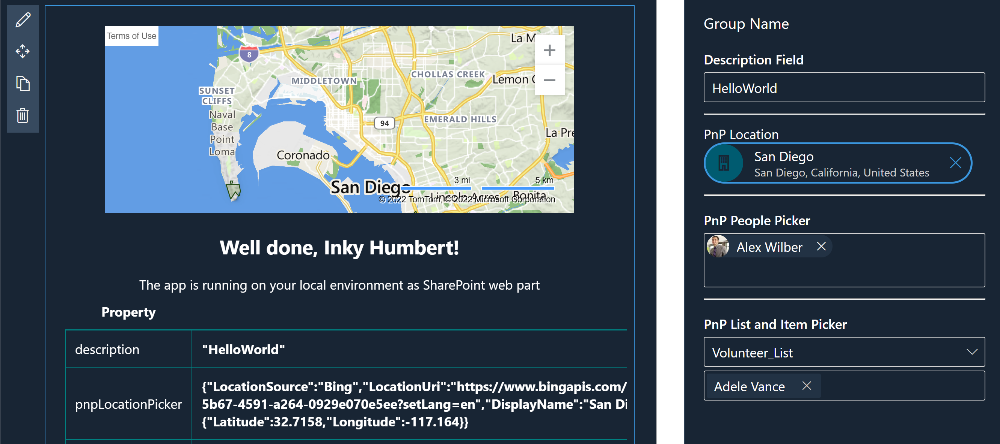

# Property Pane Portal PnP Controls

## Summary

The React-PPP-PnP-Controls sample showcases the use of the [Property Pane Portal](https://www.npmjs.com/package/property-pane-portal) to display the [PnP SPFx React controls](https://github.com/pnp/sp-dev-fx-controls-react) (version 3.7.0) in the SPFx Property Pane.

> We are NOT using the [SPFx Property Controls](https://github.com/pnp/sp-dev-fx-property-controls), that's the point of the sample.

## Compatibility

-Incompatible-red.svg "SharePoint Server 2016 Feature Pack 2 requires SPFx 1.1")

## Applies to

* [SharePoint Framework](https://docs.microsoft.com/sharepoint/dev/spfx/sharepoint-framework-overview)
* [Microsoft 365 tenant](https://docs.microsoft.com/sharepoint/dev/spfx/set-up-your-development-environment)

> Get your own free development tenant by subscribing to [Microsoft 365 developer program](http://aka.ms/o365devprogram)

## Solution

Solution|Author(s)
--------|---------
React-PPP-PnP-Controls | [Christophe Humbert](https://github.com/PathToSharePoint)

## Version history

Version|Date|Comments
-------|----|--------
0.1.0|March 20, 2022|

## Minimal Path to Awesome

* Clone this repository (or [download this solution as a .ZIP file](https://pnp.github.io/download-partial/?url=https://github.com/pnp/sp-dev-fx-webparts/tree/main/samples/react-ppp-pnp-controls) then unzip it)
* From your command line, change your current directory to the directory containing this sample (`react-ppp-pnp-controls`, located under `samples`)
* in the command line run:
  * `npm install`
  * `gulp serve`

> This sample can also be opened with [VS Code Remote Development](https://code.visualstudio.com/docs/remote/remote-overview). Visit <https://aka.ms/spfx-devcontainer> for further instructions.

## Features

This sample showcases the use of the **Property Pane Portal** NPM module. It allows us to use PnP SPFx React controls in the Property Pane, without the need to build custom property controls.

The Property Pane Portal module includes:

* The PropertyPaneHost function, which creates placeholders in the Property Pane
* The PropertyPanePortal component, which leverages React Portals to teleport React components to the Property Pane.

Implemented controls:

* Location Picker
* People Picker
* List Picker and List Item Picker (cascading selection)

## Known Issues

There are a couple minor issues with the Location Picker of the SPFx React Controls library. [I am working with the authors](https://github.com/pnp/sp-dev-fx-controls-react/issues/1125) to get them addressed in the next release. In the meantime, be aware that:

* the control will overflow its container width if the address is too long
* the control doesn't work on the root site

## References

* [Getting started with SharePoint Framework](https://docs.microsoft.com/en-us/sharepoint/dev/spfx/set-up-your-developer-tenant)
* [Building for Microsoft teams](https://docs.microsoft.com/en-us/sharepoint/dev/spfx/build-for-teams-overview)
* [Use Microsoft Graph in your solution](https://docs.microsoft.com/en-us/sharepoint/dev/spfx/web-parts/get-started/using-microsoft-graph-apis)
* [Publish SharePoint Framework applications to the Marketplace](https://docs.microsoft.com/en-us/sharepoint/dev/spfx/publish-to-marketplace-overview)
* [Microsoft 365 Patterns and Practices](https://aka.ms/m365pnp) - Guidance, tooling, samples and open-source controls for your Microsoft 365 development

## Help

We do not support samples, but this community is always willing to help, and we want to improve these samples. We use GitHub to track issues, which makes it easy for  community members to volunteer their time and help resolve issues.

If you're having issues building the solution, please run [spfx doctor](https://pnp.github.io/cli-microsoft365/cmd/spfx/spfx-doctor/) from within the solution folder to diagnose incompatibility issues with your environment.

You can try looking at [issues related to this sample](https://github.com/pnp/sp-dev-fx-webparts/issues?q=label%3A%22sample%3A%20react-ppp-pnp-controls%22) to see if anybody else is having the same issues.

You can also try looking at [discussions related to this sample](https://github.com/pnp/sp-dev-fx-webparts/discussions?discussions_q=react-ppp-pnp-controls) and see what the community is saying.

If you encounter any issues while using this sample, [create a new issue](https://github.com/pnp/sp-dev-fx-webparts/issues/new?assignees=&labels=Needs%3A+Triage+%3Amag%3A%2Ctype%3Abug-suspected%2Csample%3A%20react-ppp-pnp-controls&template=bug-report.yml&sample=react-ppp-pnp-controls&authors=@PathToSharePoint&title=react-ppp-pnp-controls%20-%20).

For questions regarding this sample, [create a new question](https://github.com/pnp/sp-dev-fx-webparts/issues/new?assignees=&labels=Needs%3A+Triage+%3Amag%3A%2Ctype%3Aquestion%2Csample%3A%20react-ppp-pnp-controls&template=question.yml&sample=react-ppp-pnp-controls&authors=@PathToSharePoint&title=react-ppp-pnp-controls%20-%20).

Finally, if you have an idea for improvement, [make a suggestion](https://github.com/pnp/sp-dev-fx-webparts/issues/new?assignees=&labels=Needs%3A+Triage+%3Amag%3A%2Ctype%3Aenhancement%2Csample%3A%20react-ppp-pnp-controls&template=suggestion.yml&sample=react-ppp-pnp-controls&authors=@PathToSharePoint&title=react-ppp-pnp-controls%20-%20).

## Disclaimer

**THIS CODE IS PROVIDED *AS IS* WITHOUT WARRANTY OF ANY KIND, EITHER EXPRESS OR IMPLIED, INCLUDING ANY IMPLIED WARRANTIES OF FITNESS FOR A PARTICULAR PURPOSE, MERCHANTABILITY, OR NON-INFRINGEMENT.**

