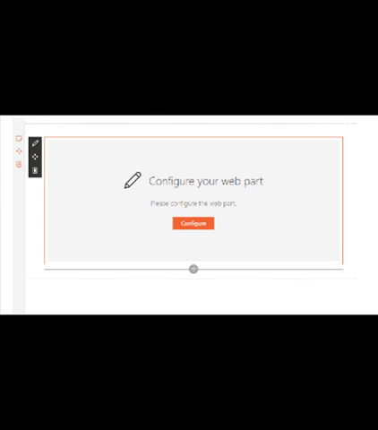

# React Project Online

## Summary
This sample shows how to use SPFx to consume data from the Project Online REST API. The code uses Placeholder and ListView [reusable controls](https://github.com/SharePoint/sp-dev-fx-controls-react) to create a better experience to the end user.
The web part is intended to be used on a project site within PWA site collection, as the web url used for the rest calls is being taken from the web part context object. To use this web part outside of the PWA site collection, just add a new property to the web part to allow the PWA site collection url to be configured (or when provisioning through a provisioning mechanist).
The web part is currently returning project tasks as a simple proof of concept.

## Used SharePoint Framework Version 

## Applies to

* [SharePoint Framework](https://docs.microsoft.com/sharepoint/dev/spfx/sharepoint-framework-overview)
* [Office 365 tenant](https://docs.microsoft.com/sharepoint/dev/spfx/set-up-your-development-environment)
* [Project Online](https://docs.microsoft.com/de-at/office/dev/add-ins/project/)

## Prerequisites
 
- Office 365 subscription with SharePoint Online and Project Online license
- SharePoint Framework [development environment](https://docs.microsoft.com/sharepoint/dev/spfx/set-up-your-development-environment) already set up.
-Project site with some tasks available.

## Solution

Solution|Author(s)
--------|---------
react-project-online|Joel Rodrigues

## Version history

Version|Date|Comments
-------|----|--------
1.4|April 12, 2020|Updated to SPFx 1.10.0
1.3|October 03, 2018|Updated to SPFx 1.6.0
1.2|March 16, 2018|Updated to SPFx 1.4.1
1.1|January 22, 2018|Updated to SPFx 1.4.0
1.0|October 29, 2017|Initial release

## Disclaimer
**THIS CODE IS PROVIDED *AS IS* WITHOUT WARRANTY OF ANY KIND, EITHER EXPRESS OR IMPLIED, INCLUDING ANY IMPLIED WARRANTIES OF FITNESS FOR A PARTICULAR PURPOSE, MERCHANTABILITY, OR NON-INFRINGEMENT.**

---

## Minimal Path to Awesome

- Clone this repository
- in the command line run:
  - `npm install`
  - `gulp serve`

## Features
This Web Part illustrates the following concepts on top of the SharePoint Framework:

-Using the SharePoint rest API for querying web properties.
-Using the Project Online rest API for retrieving project tasks.

