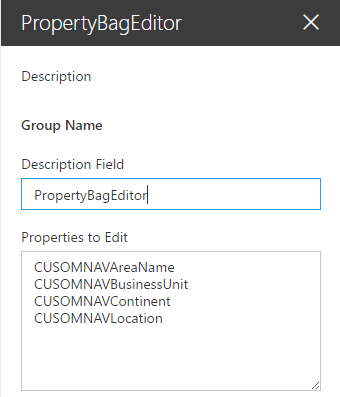
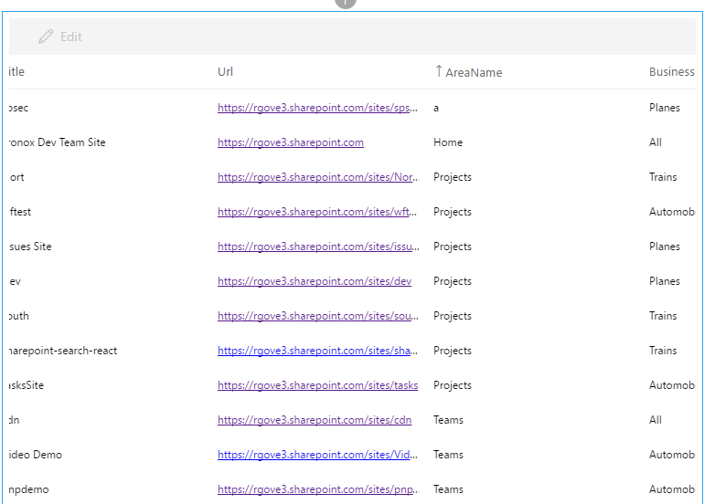
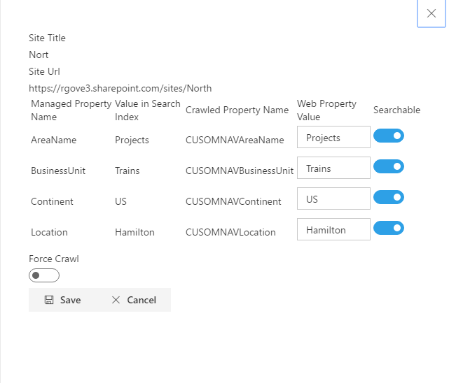

## react-property-bag-editor

This project consists of four webparts that can be used to manage the Property Bags for SharePoint sites and display navigational components from those Properties.

PropertyBagEditor.

This webpart allows an administrator to edit selected items in a site&#39;s Property Bag. A sample display is shown below:


Selecting a Property and clicking the Edit button will bring up the Edit Panel:


Here you can change the value of the property and specify if the property should be included in the search Index. 

The Properties that can be edited are specified in the webpart&#39;s Property Panel:



The Properties set in the Property Pane of this webpart are crawled properties, and should be mapped to managed properties so that can be used by the other webparts in this project. 

The Site whose properties are to be edited can be passed in via a query parameter. While this webpart can be added to any page, it would be most useful if added to a page in an infrastructure site collection tenant, and then linked to from all other sites Site Settings page.

The following script shows how to add such a link to all sites &#39;Site Settings&#39; page using PNP Powershell. It will add a menu item named &#39;Edit Site Metadata &#39; to the  Site Settings of each Team Site that links to the PropertBagEdcitor.aspx page on the tenants cdn site.

$adminSiteUrl=&quot;https://tenant-admin.sharepoint.com&quot;

$customActionDescription=&quot;CUSTOM_\ ___Navigation__ \__Metadata&quot;

$pageUrl=&quot;https://tenant.sharepoint.com/sites/cdn/SitePages/PropertBagEdcitor.aspx?siteUrl={0}&quot;

$credentials=get-credential

Connect-SPOnline -Url $adminSiteUrl -Credentials $credentials

$ctx = Get-SPOContext

$sites = Get-SPOTenantSite -Detailed

foreach($site in $sites){

    if ($site.Template -eq &quot;STS#0&quot;) {

        Connect-SPOnline –Url $site.Url –Credentials $credentials

        $existing = Get-SPOCustomAction -Scope &quot;Site&quot; | ? { $\_.Description -eq $customActionDescription }

        if ($existing) {

             $existing.DeleteObject();

             Execute-SPOQuery;

             Write-Host &quot;Deleteting existing action from&quot;$site.Url

        }

        Write-Host &quot;adding action to&quot; $site.Url

        Add-SPOCustomAction -Description $customActionDescription -Location &quot;Microsoft.SharePoint.SiteSettings&quot; -name &quot;Edit Site Metadata&quot;-Title &quot;Edit Site Metadata&quot;  -Group &quot;SiteAdministration&quot; -Sequence 10100 -Url ( [string]::Format($pageUrl,$site.Url)) -Scope &quot;Site&quot;

        Execute-SPOQuery

        }

}

PropertyBagDisplay

The propertyBagDisplay webpart can be used by an administrator to view and edit selected properties across sites in the tenant:



In the Property Pane, an administrator must specify both the Crawled Property Name and the Managed Property name (separated by a pipe character) of the properties to be included in the webpart:


The administrator can also include a list of site templates to narrow down the list of sites to be included in the webpart. When specifying site templates to include you can include just the Site Template Name (STS) and all sites within that template name will be included, or you can specify the Site Template Name and ID, separated by a &#39;#&quot; character (STS#1) to have only sites with that template name and ID included.

The webpart displays the site template, Title and Url, plus the selected Managed Properties for all sites in the tenant with the selected site template. The Managed Properties are only displayed if they have been set as searchable, and a full crawl has been run.  After selecting a Site, a user can click the edit button to edit the Crawled properties (i.e. the raw property bag values) for the selected site:



On the edit panel one can specify a new value for each property as well as whether that property is to be included in the search index. Additionally one can specify that a full crawl of the site should be run once the properties are saved.

PropertyBagFilteredSiteList

This webpart displays a list of all sites that meet the criteria specified in the property pane by the administrator. Additionally, it lets the user narrow down the list of sites displayed by applying metadata filters that are set up by the administrator.

PropertyBagGlobalNav

This Webpart builds a navigation menu based on the Managed Properties set up in the PropertyPane

### Building the code

```bash
git clone the repo
npm i
npm i -g gulp
gulp
```

This package produces the following:

* lib/* commonjs components - this allows this package to be reused from other packages.
* dist/* - a single bundle containing the components used for uploading to a cdn pointing a registered Sharepoint webpart library to.
* example/* a test page that hosts all components in this package.

### Build options

gulp clean - TODO
gulp test - TODO
gulp watch - TODO
gulp build - TODO
gulp deploy - TODO
