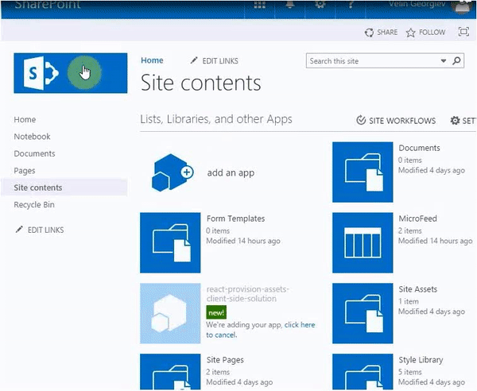

# Provision SharePoint Assets with the SPFx solution package #

## Summary

This sample shows how we can provision Document Library, Custom List, Web and List PropertyBag properties, Site Columns, Content Types, Images, Site Page with the SFPx Client side web part and even prepopulated list and library items along with the SPFx solution package. All of the components can be deployed at once with the SPFx web part when the app is added to a SharePoint site. It also contains custom list and document library xml schemas.

## Compatibility

 

-Compatible-green.svg)

## Applies to

* [SharePoint Framework](https://docs.microsoft.com/sharepoint/dev/spfx/sharepoint-framework-overview)
* [Office 365 developer tenant](https://docs.microsoft.com/sharepoint/dev/spfx/set-up-your-developer-tenant)
 
  ** The SPFx web part will work in local workbench, but not the assets. They can be provisioned only when the app is deployed since they are SharePoint specific.

## Prerequisites

- Office 365 subscription with SharePoint Online.
- SharePoint Framework [development environment](https://docs.microsoft.com/sharepoint/dev/spfx/set-up-your-development-environment) already set up.
- Tenant admin access to the Office 365 subscription and [App Catalog](https://support.office.com/en-ie/article/Use-the-App-Catalog-to-make-custom-business-apps-available-for-your-SharePoint-Online-environment-0b6ab336-8b83-423f-a06b-bcc52861cba0) already setup.

## Solution

Solution|Author(s)
--------|---------
react-provision-assets | Velin Georgiev ([@VelinGeorgiev](https://twitter.com/velingeorgiev))

## Version history

Version|Date|Comments
-------|----|--------
0.0.1|June 17, 2017 | Initial commit

## Minimal Path to Awesome

- Clone this repository.
- Open the command line, navigate to the web part folder and execute:
    - `npm i`
    - `gulp build --ship`
    - `gulp prepare-solution` This custom gulp task copies the file `e89b5ad5-9ab5-4730-a66b-e1f68994598c.json` from the folder `sharepoint\assets-temp\` to `temp\deploy` in order to prepare the package.
    - `gulp package-solution`
    - [Deploy the package](https://docs.microsoft.com/sharepoint/dev/spfx/enterprise-guidance#management-capabilities-of--sharepoint-framework-solutions) to the app catalog
    - [Add the app](https://support.office.com/en-ie/article/Add-an-app-to-a-site-ef9c0dbd-7fe1-4715-a1b0-fe3bc81317cb?ui=en-US&rs=en-IE&ad=IE) to a site

>  This sample can also be opened with [VS Code Remote Development](https://code.visualstudio.com/docs/remote/remote-overview). Visit https://aka.ms/spfx-devcontainer for further instructions.

## Features

This Web Part illustrates the following concepts on top of the SharePoint Framework:

- SPFx provisioning based on the following Elements.xml nodes:
    - Custom List Instance with custom list schema.
    - Document Library Instance with custom list schema.
    - Content Types.
    - Fields.
    - Module with Images.
    - Module with Site Page.
    - PropertyBag properties.
    - Pre-populated List Data Rows in the Elements.xml.
    - Onet.xml specific tokens.

## Disclaimer

**THIS CODE IS PROVIDED *AS IS* WITHOUT WARRANTY OF ANY KIND, EITHER EXPRESS OR IMPLIED, INCLUDING ANY IMPLIED WARRANTIES OF FITNESS FOR A PARTICULAR PURPOSE, MERCHANTABILITY, OR NON-INFRINGEMENT.**

