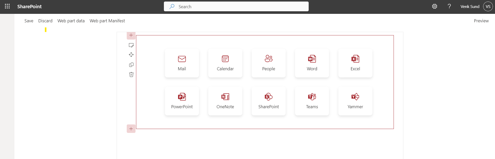
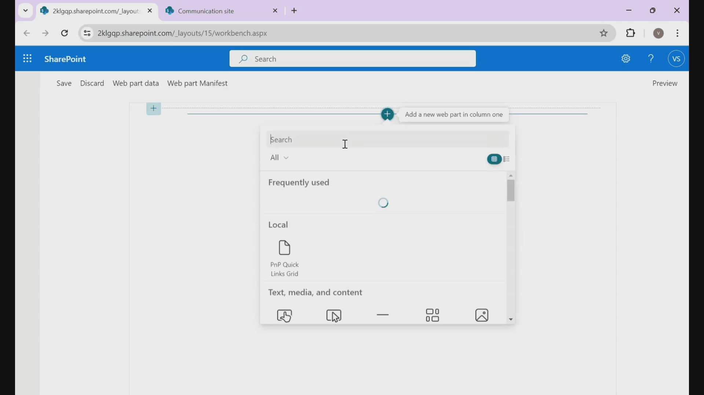
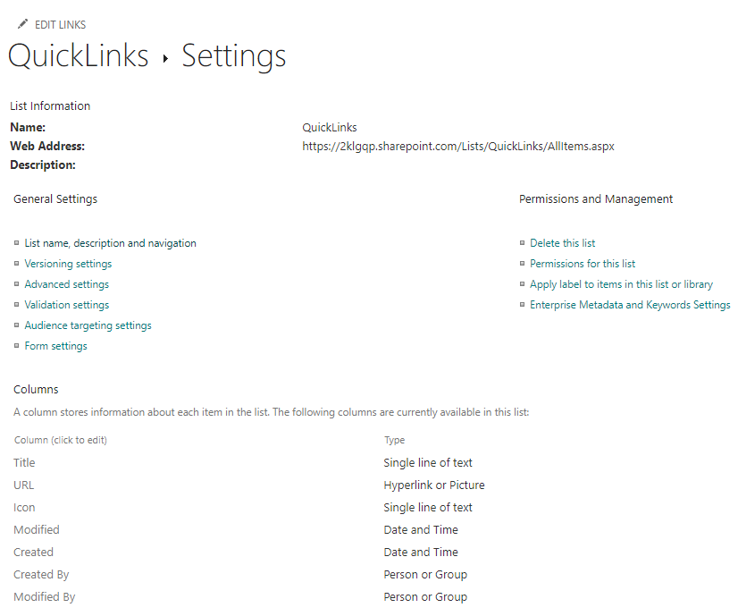
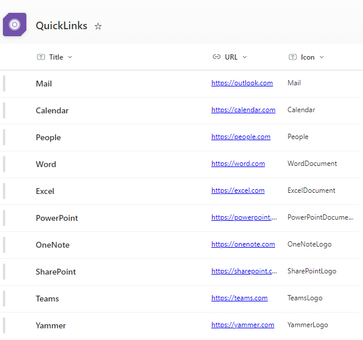

# Quick Links Grid

## Summary

This project is a SharePoint Framework (SPFx) web part that displays a set of quick links fetched from a SharePoint list. The quick links are displayed with icons and titles in a responsive grid layout.

## Compatibility

| :warning: Important          |
|:---------------------------|
| Every SPFx version is optimally compatible with specific versions of Node.js. In order to be able to build this sample, you need to ensure that the version of Node on your workstation matches one of the versions listed in this section. This sample will not work on a different version of Node.|
|Refer to <https://aka.ms/spfx-matrix> for more information on SPFx compatibility.   |

This sample is optimally compatible with the following environment configuration:

-Incompatible-red.svg "SharePoint Server 2016 Feature Pack 2 requires SPFx 1.1")

## Applies to

- [SharePoint Framework](https://aka.ms/spfx)
- [Microsoft 365 tenant](https://docs.microsoft.com/en-us/sharepoint/dev/spfx/set-up-your-developer-tenant)

> Get your own free development tenant by subscribing to [Microsoft 365 developer program](http://aka.ms/o365devprogram)

## Contributors

- [Venkadesh Sundaramurthy](https://github.com/VenkadeshSundaramurthy)

## Version history

| Version | Date            | Comments        |
| ------- | --------------- | --------------- |
| 1.0     | August 11, 2024 | Initial release |

## Prerequisites

- Node.js (v19.00.4)
- SharePoint Online environment
- A SharePoint list containing the quick links. This list is configured with columns
  - **Title** - Single line of text
  - **URL** - Hyperlink or Picture
  - **Icon** - Single line of text // Fluent Icon names can be referred from (https://developer.microsoft.com/en-us/fluentui#/styles/web/icons)
  
  

  ### Sample Data

  

## Minimal path to awesome

- Clone this repository (or [download this solution as a .ZIP file](https://pnp.github.io/download-partial/?url=https://github.com/pnp/sp-dev-fx-webparts/tree/main/samples/react-quick-links-grid) then unzip it)
- From your command line, change your current directory to the directory containing this sample (`react-quick-links-grid`, located under `samples`)
- in the command line run:
  - `npm install`
  - `gulp serve`

> This sample can also be opened with [VS Code Remote Development](https://code.visualstudio.com/docs/remote/remote-overview). Visit <https://aka.ms/spfx-devcontainer> for further instructions.

### Configuration

Before running the WebPart, you need to configure the property pane to point to the correct SharePoint list and fields.

#### Property Pane Fields

- **List Title:** The title of the SharePoint list to fetch data from.
- **Title Field:** The internal name of the Title field in the SharePoint list.
- **URL Field:** The internal name of the URL field in the SharePoint list.
- **Icon Field:** The internal name of the Icon field in the SharePoint list.

### Usage

Run the web part locally:

gulp serve
Open the SharePoint Workbench to add the web part and configure the property pane fields.

## Features

- **Dynamic Data Fetching**: Retrieves quick links dynamically from a SharePoint list, allowing for easy updates without modifying code.
- **Customizable List Fields**: Configurable property pane options for specifying the list title and internal names of the fields for title, URL, and icon.
- **Responsive Design**: Adapts to different screen sizes with a responsive grid layout, ensuring a consistent look on various devices.
- **Modern UI**: Displays quick links in a modern card layout with rounded corners and a hover effect for improved user experience.
- **Theming Support**: Uses SharePoint theme colors for a consistent look with the rest of the SharePoint site, including theme-based colors for icons and text.
- **Error Handling**: Includes error handling for data fetching to manage issues with retrieving list items gracefully.

### Project Structure

The project includes the following key files:

- **PnPQuickLinksGridWebPart.ts:** Defines the main web part class and handles rendering and property pane configuration.
- **QuickLinksGrid.tsx:** Defines the React component that fetches and displays the quick links.
- **PnPQuickLinksGridWebPart.module.scss:** Contains the CSS styles for the QuickLinks component.

## Help

We do not support samples, but this community is always willing to help, and we want to improve these samples. We use GitHub to track issues, which makes it easy for  community members to volunteer their time and help resolve issues.

If you're having issues building the solution, please run [spfx doctor](https://pnp.github.io/cli-microsoft365/cmd/spfx/spfx-doctor/) from within the solution folder to diagnose incompatibility issues with your environment.

You can try looking at [issues related to this sample](https://github.com/pnp/sp-dev-fx-webparts/issues?q=label%3A%22sample%3A%20react-quick-links-grid%22) to see if anybody else is having the same issues.

You can also try looking at [discussions related to this sample](https://github.com/pnp/sp-dev-fx-webparts/discussions?discussions_q=react-quick-links-grid) and see what the community is saying.

If you encounter any issues using this sample, [create a new issue](https://github.com/pnp/sp-dev-fx-webparts/issues/new?assignees=&labels=Needs%3A+Triage+%3Amag%3A%2Ctype%3Abug-suspected%2Csample%3A%20react-quick-links-grid&template=bug-report.yml&sample=react-quick-links-grid&authors=@VenkadeshSundaramurthy&title=react-quick-links-grid%20-%20).

For questions regarding this sample, [create a new question](https://github.com/pnp/sp-dev-fx-webparts/issues/new?assignees=&labels=Needs%3A+Triage+%3Amag%3A%2Ctype%3Aquestion%2Csample%3A%20react-quick-links-grid&template=question.yml&sample=react-quick-links-grid&authors=@VenkadeshSundaramurthy&title=react-quick-links-grid%20-%20).

Finally, if you have an idea for improvement, [make a suggestion](https://github.com/pnp/sp-dev-fx-webparts/issues/new?assignees=&labels=Needs%3A+Triage+%3Amag%3A%2Ctype%3Aenhancement%2Csample%3A%20react-quick-links-grid&template=suggestion.yml&sample=react-quick-links-grid&authors=@VenkadeshSundaramurthy&title=react-quick-links-grid%20-%20).

## Disclaimer

**THIS CODE IS PROVIDED *AS IS* WITHOUT WARRANTY OF ANY KIND, EITHER EXPRESS OR IMPLIED, INCLUDING ANY IMPLIED WARRANTIES OF FITNESS FOR A PARTICULAR PURPOSE, MERCHANTABILITY, OR NON-INFRINGEMENT.**

