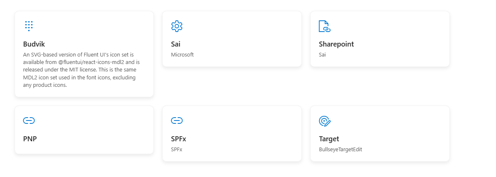
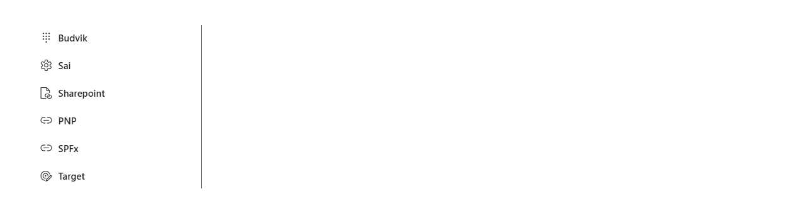
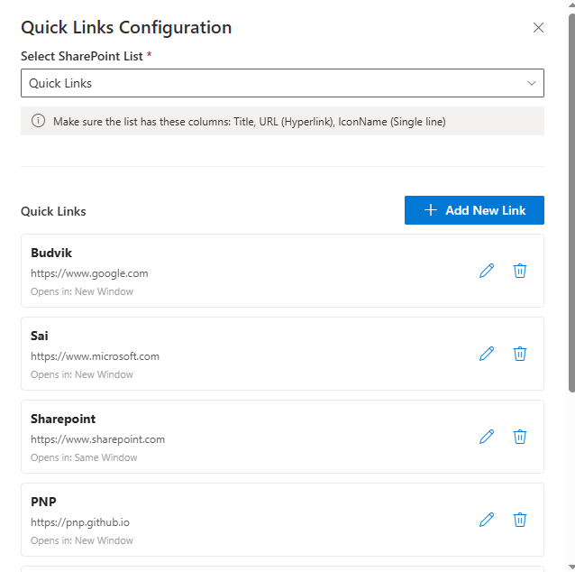
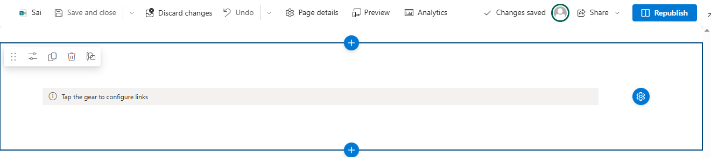

# Quick Links Pro

## Summary

A modern SharePoint Framework (SPFx) web part that provides dynamic quick-access links with inline editing capabilities. Content authors can manage links directly from the page using a configuration panel, eliminating the need to navigate to list settings or the property pane.


## Used SharePoint Framework Version


## Applies to

- [SharePoint Framework](https://aka.ms/spfx)
- [Microsoft 365 tenant](https://docs.microsoft.com/en-us/sharepoint/dev/spfx/set-up-your-developer-tenant)

> Get your own free development tenant by subscribing to [Microsoft 365 developer program](http://aka.ms/o365devprogram)

## Prerequisites

- SharePoint Online environment
- Site collection with permissions to create lists
- A SharePoint list with the following columns:
  - **Title** (Single line text) - Required
  - **URL** (Hyperlink) - Required  
  - **IconName** (Single line text) - Optional
  - **Description** (Multiple lines text) - Optional
  - **SortOrder** (Number) - Optional
  - **OpenInNewWindow** (Yes/No) - Optional

## Contributors

- [Sai Siva Ram Bandaru](https://github.com/saiiiiiii)

## Version history

| Version | Date             | Comments        |
| ------- | ---------------- | --------------- |
| 1.0     | October 30, 2025 | Initial release |

## Minimal Path to Awesome

- Clone this repository
- Ensure that you are at the solution folder
- In the command-line run:
  - `npm install`
  - `gulp serve`

> Include any additional steps as needed.

### Create the SharePoint List

Before using the web part, create a SharePoint list with the required structure:

#### Using PnP PowerShell

```powershell
# Connect to your site
Connect-PnPOnline -Url "https://yourtenant.sharepoint.com/sites/yoursite" -Interactive

# Create the list
New-PnPList -Title "Quick Links" -Template GenericList

# Add custom columns
Add-PnPField -List "Quick Links" -DisplayName "IconName" -InternalName "IconName" -Type Text -AddToDefaultView
Add-PnPField -List "Quick Links" -DisplayName "SortOrder" -InternalName "SortOrder" -Type Number -AddToDefaultView
Add-PnPField -List "Quick Links" -DisplayName "OpenInNewWindow" -InternalName "OpenInNewWindow" -Type Boolean -AddToDefaultView
Add-PnPField -List "Quick Links" -DisplayName "Description" -InternalName "Description" -Type Note

```

#### Manual Steps

1. Navigate to your SharePoint site
2. Create a new list called "Quick Links"
3. Add the following columns:
   - **IconName** (Single line of text)
   - **SortOrder** (Number)
   - **OpenInNewWindow** (Yes/No)
   - **Description** (Multiple lines of text)
4. Add your quick links to the list

## Features

This web part illustrates the following concepts:

### Core Features

- **Edit Mode Detection**: Automatically shows/hides configuration controls based on page edit mode
- **Inline Configuration**: Configure links directly from the page without navigating to list settings
- **Dynamic List Selection**: Choose any SharePoint list at runtime from a dropdown
- **Multiple Display Styles**: Cards, Buttons, or List layout
- **CRUD Operations**: Add, edit, and delete links through a user-friendly panel
- **Link Target Control**: Choose to open links in new window or same window
- **Icon Support**: Use any Fluent UI icon for visual representation
- **Sorting**: Control display order with sort order field
- **Responsive Design**: Adapts to different screen sizes

### Technical Highlights

- **PnP JS Integration**: Modern SharePoint REST API interactions using @pnp/sp
- **React Hooks**: Functional components with useState and useEffect
- **Fluent UI Components**: Consistent Microsoft 365 design language
- **TypeScript**: Fully typed for better development experience
- **SCSS Modules**: Scoped styling with CSS modules
- **Accessibility**: Keyboard navigation and screen reader support

### PnP JS Usage

The solution demonstrates:

- Setting up PnP JS with SPFx context
- Reading from SharePoint lists with filtering and sorting
- Creating, updating, and deleting list items
- Working with hyperlink columns
- Field validation and structure checking

### Fluent UI Implementation

Uses these Fluent UI React components:

- Panel (for configuration)
- TextField, Dropdown, Toggle (for forms)
- IconButton (for edit controls)
- MessageBar (for user feedback)
- Spinner (for loading states)
- Stack (for layout)

## Configuration

### Web Part Properties

| Property | Type | Default | Description |
|----------|------|---------|-------------|
| selectedListId | string | "" | GUID of the selected SharePoint list |
| selectedListTitle | string | "" | Display name of the selected list |
| displayStyle | choice | "cards" | Display style: cards, buttons, or list |

### Display Styles

#### Cards

Grid layout with icon, title, and description. Best for visual navigation with detailed information.

#### Buttons

Compact horizontal layout. Best for space-constrained scenarios or many links.

#### List

Vertical stacked layout. Best for ordered navigation (e.g., Development > QA > Production).

## Usage

### Adding the Web Part

1. Edit a SharePoint page
2. Add the "Quick Links Pro" web part
3. Click the ⚙️ gear icon (visible in edit mode only)
4. Select a SharePoint list from the dropdown
5. Add or manage your links
6. Save configuration
7. Publish the page

### Managing Links

In edit mode, click the gear icon to:

- **Add New Link**: Click "Add New Link" button
- **Edit Link**: Click edit icon next to any link
- **Delete Link**: Click delete icon (confirms before deletion)
- **Change Display Style**: Use web part property pane

### Link Fields

When adding/editing a link:

- **Title** (required): Display name of the link
- **URL** (required): Destination URL
- **Icon Name** (optional): Fluent UI icon name (e.g., "Globe", "Document")
- **Description** (optional): Tooltip/card description
- **Sort Order** (optional): Display order (lower numbers first)
- **Open in New Window** (toggle): Link target behavior

## Screenshots

### Cards Display Style



### Buttons Display Style


### List Display Style



### Configuration Panel



### Edit Mode with Gear Icon



## References

- [Getting started with SharePoint Framework](https://docs.microsoft.com/en-us/sharepoint/dev/spfx/set-up-your-developer-tenant)
- [Building for Microsoft teams](https://docs.microsoft.com/en-us/sharepoint/dev/spfx/build-for-teams-overview)
- [Use Microsoft Graph in your solution](https://docs.microsoft.com/en-us/sharepoint/dev/spfx/web-parts/get-started/using-microsoft-graph-apis)
- [Publish SharePoint Framework applications to the Marketplace](https://docs.microsoft.com/en-us/sharepoint/dev/spfx/publish-to-marketplace-overview)
- [Microsoft 365 Patterns and Practices](https://aka.ms/m365pnp)
- [PnP JS Documentation](https://pnp.github.io/pnpjs/)
- [Fluent UI React](https://developer.microsoft.com/en-us/fluentui#/controls/web)

## Help

We do not support samples, but this community is always willing to help, and we want to improve these samples. We use GitHub to track issues, which makes it easy for  community members to volunteer their time and help resolve issues.

If you're having issues building the solution, please run [spfx doctor](https://pnp.github.io/cli-microsoft365/cmd/spfx/spfx-doctor/) from within the solution folder to diagnose incompatibility issues with your environment.

You can try looking at [issues related to this sample](https://github.com/pnp/sp-dev-fx-webparts/issues?q=label%3A%22sample%3A%20quick-links-pro%22) to see if anybody else is having the same issues.

You can also try looking at [discussions related to this sample](https://github.com/pnp/sp-dev-fx-webparts/discussions?discussions_q=quick-links-pro) and see what the community is saying.

If you encounter any issues while using this sample, [create a new issue](https://github.com/pnp/sp-dev-fx-webparts/issues/new?assignees=&labels=Needs%3A+Triage+%3Amag%3A%2Ctype%3Abug-suspected%2Csample%3A%20quick-links-pro&template=bug-report.yml&sample=quick-links-pro&authors=@yourusername&title=quick-links-pro%20-%20).

For questions regarding this sample, [create a new question](https://github.com/pnp/sp-dev-fx-webparts/issues/new?assignees=&labels=Needs%3A+Triage+%3Amag%3A%2Ctype%3Aquestion%2Csample%3A%20quick-links-pro&template=question.yml&sample=quick-links-pro&authors=@yourusername&title=quick-links-pro%20-%20).

Finally, if you have an idea for improvement, [make a suggestion](https://github.com/pnp/sp-dev-fx-webparts/issues/new?assignees=&labels=Needs%3A+Triage+%3Amag%3A%2Ctype%3Aenhancement%2Csample%3A%20quick-links-pro&template=suggestion.yml&sample=quick-links-pro&authors=@yourusername&title=quick-links-pro%20-%20).

## Disclaimer

**THIS CODE IS PROVIDED *AS IS* WITHOUT WARRANTY OF ANY KIND, EITHER EXPRESS OR IMPLIED, INCLUDING ANY IMPLIED WARRANTIES OF FITNESS FOR A PARTICULAR PURPOSE, MERCHANTABILITY, OR NON-INFRINGEMENT.**


