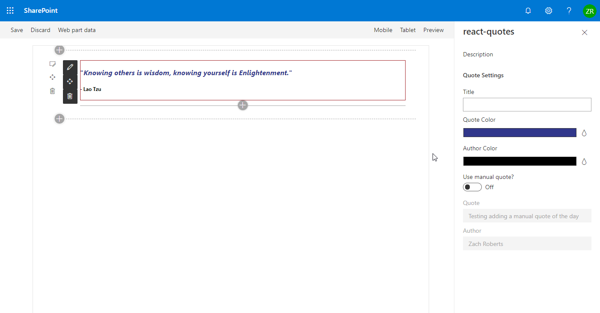

# Quote of the Day

## Summary

This web part displays a quote of the day by querying a third-party api or can display a quote entered manually into the web part property pane.

## Compatibility

-Incompatible-red.svg "SharePoint Server 2016 Feature Pack 2 requires SPFx 1.1")

## Applies to

* [SharePoint Framework](https://docs.microsoft.com/sharepoint/dev/spfx/sharepoint-framework-overview)

## Solution

Solution|Author(s)
--------|---------
react-quotes | [Zach Roberts](https://github.com/zachroberts8668)
react-quotes | [Yves Habersaat](https://github.com/yhabersaat)

## Version history

Version|Date|Comments
-------|----|--------
1.1| December 31, 2021| Upgraded for SPFx v1.13.1
1.0| November 11, 2019| Initial Release

## Minimal Path to Awesome

- Clone this repository (or [download this solution as a .ZIP file](https://pnp.github.io/download-partial/?url=https://github.com/pnp/sp-dev-fx-webparts/tree/main/samples/react-quotes) then unzip it)
* in the command line run:
  * `npm install`
  * `gulp serve`
* In the browser that opens add the web part to your page.
* After the web part has loaded it will load the quote automatically or you can edit the webparts properties to display a manual quote.

>  This sample can also be opened with [VS Code Remote Development](https://code.visualstudio.com/docs/remote/remote-overview). Visit https://aka.ms/spfx-devcontainer for more information.

## Features

This web part loads a random quote from a third-party api (https://favqs.com/api). Additionally a quote can be entered manually and the text color of the quote and author can be adjusted through the web part properties.

## Help

We do not support samples, but this community is always willing to help, and we want to improve these samples. We use GitHub to track issues, which makes it easy for  community members to volunteer their time and help resolve issues.

If you're having issues building the solution, please run [spfx doctor](https://pnp.github.io/cli-microsoft365/cmd/spfx/spfx-doctor/) from within the solution folder to diagnose incompatibility issues with your environment.

You can try looking at [issues related to this sample](https://github.com/pnp/sp-dev-fx-webparts/issues?q=label%3A%22sample%3A%20react-quotes%22) to see if anybody else is having the same issues.

You can also try looking at [discussions related to this sample](https://github.com/pnp/sp-dev-fx-webparts/discussions?discussions_q=react-quotes) and see what the community is saying.

If you encounter any issues while using this sample, [create a new issue](https://github.com/pnp/sp-dev-fx-webparts/issues/new?assignees=&labels=Needs%3A+Triage+%3Amag%3A%2Ctype%3Abug-suspected%2Csample%3A%20react-quotes&template=bug-report.yml&sample=react-quotes&authors=@zachroberts8668 @yhabersaat&title=react-quotes%20-%20).

For questions regarding this sample, [create a new question](https://github.com/pnp/sp-dev-fx-webparts/issues/new?assignees=&labels=Needs%3A+Triage+%3Amag%3A%2Ctype%3Aquestion%2Csample%3A%20react-quotes&template=question.yml&sample=react-quotes&authors=@zachroberts8668 @yhabersaat&title=react-quotes%20-%20).

Finally, if you have an idea for improvement, [make a suggestion](https://github.com/pnp/sp-dev-fx-webparts/issues/new?assignees=&labels=Needs%3A+Triage+%3Amag%3A%2Ctype%3Aenhancement%2Csample%3A%20react-quotes&template=suggestion.yml&sample=react-quotes&authors=@zachroberts8668 @yhabersaat&title=react-quotes%20-%20).

## Disclaimer

**THIS CODE IS PROVIDED *AS IS* WITHOUT WARRANTY OF ANY KIND, EITHER EXPRESS OR IMPLIED, INCLUDING ANY IMPLIED WARRANTIES OF FITNESS FOR A PARTICULAR PURPOSE, MERCHANTABILITY, OR NON-INFRINGEMENT.**

