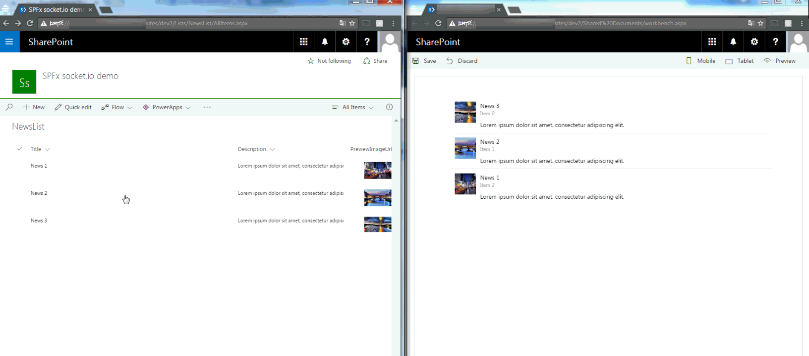
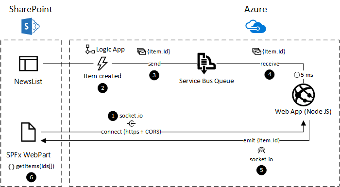
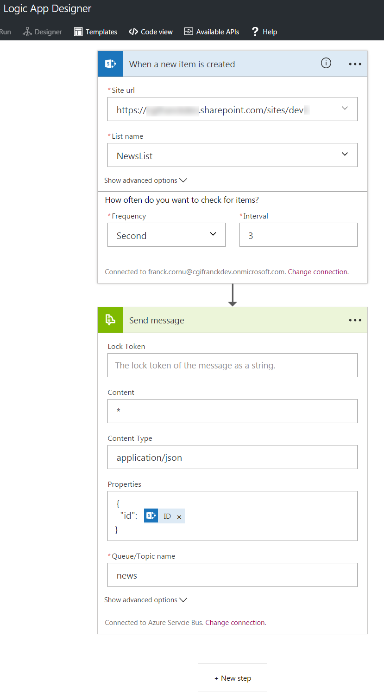
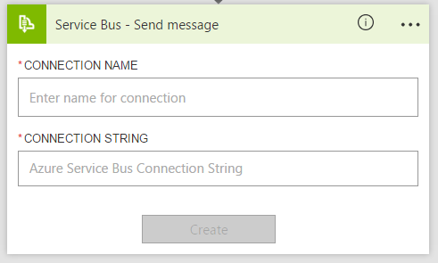
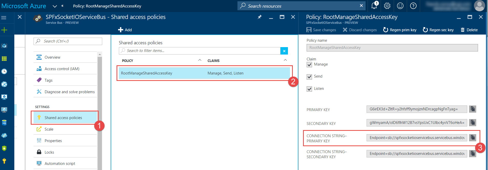
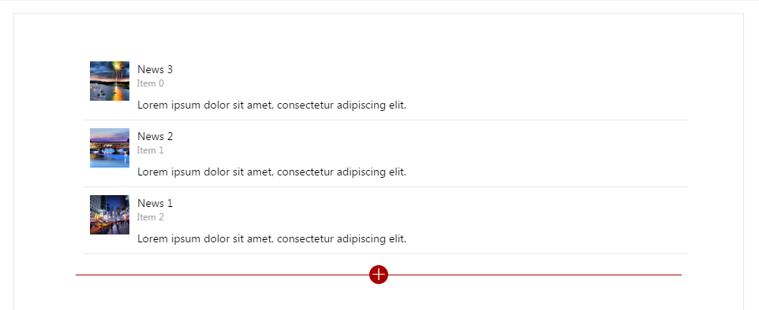

# Real Time News Feed using Azure Logic Apps, Node.js and socket.io #

## Summary

This sample shows you how to implement real time web parts using the SPFx, Azure Logic Apps, Node.js and [socket.io](http://socket.io/).


  


### Solution Architecture ###

Here is the solution overview:


  


1. The SPFx Web Part first connects to the Azure web application via socket.io and subscribes to events (the web application have to be in https and allow cross domain calls (CORS)).
2. An Azure logic app is used to catch new item creation events in the SharePoint list.
3. When an item is added, the flow sends its id to an Azure service bus queue using JSON format.
4. A Node.js Azure web application listens to the queue and check for new messages every 5 ms.
5. When a new message is available, the web application emits the data to all subscribers via socket.io.
6. The SPFx Web Part notifies user there are new items available. Items are effectively retrieved using REST according to received ids when the user clicks on the notification.

## Used SharePoint Framework Version


## Applies to

* [SharePoint Framework Developer Preview](https://docs.microsoft.com/sharepoint/dev/spfx/sharepoint-framework-overview)
* [Office 365 developer tenant](https://docs.microsoft.com/sharepoint/dev/spfx/set-up-your-developer-tenant)

## Prerequisites

Before starting, you'll need to install some prerequisites:

- Install the [Azure PowerShell SDK](https://azure.microsoft.com/en-us/documentation/articles/powershell-install-configure/). Make sure you've installed the AzureRM module as well.
  Run the `Add-AzureAccount` cmdlet and optionaly select the correct Azure subscription to work with by running the `Select-AzureSubscription` cmdlet.
- Install the latest release of [PnP PowerShell cmdlets 'SharePointPnPPowerShellOnline'](https://github.com/OfficeDev/PnP-PowerShell/releases) or a version compatible with the 201605 PnP schema version.
- Install [Node.js](https://nodejs.org/en/) on your machine.
- Install [Git for Windows](https://git-scm.com/download/win).
- Get the [latest version](https://docs.microsoft.com/sharepoint/dev/spfx/set-up-your-development-environment) of the SharePoint Framework yeoman generator (in this case **SPFx Drop 5**) and make sure TypeScript 2.0 is available on your machine (`npm install -g typescript@latest`).
- Create a site collection with the developer template.
- Go to the ".\client" folder and install all dependencies listed in the package.json file by running the `npm install` cmd.

## Solution

Solution|Author(s)
--------|---------
react-real-time | [Franck Cornu](https://github.com/FranckyC) (MVP, [@franckcornu](https://twitter.com/FranckCornu))

## Version history

Version|Date|Comments
-------|----|--------
1.0|October 25, 2016 | Initial commit
1.1|November 4, 2016 | Replaced Microsoft Flow by Azure Logic Apps

## Minimal Path to Awesome

1. Download the source code as ZIP from GitHub and extract it to your destination folder
2. On a remote machine (basically, where PnP & Azure cmdlets are installed), start new PowerShell session as an **administrator** an call the `Deploy-Solution.ps1` script with your parameters like this:

    ```csharp
    $UserName = "username@<your_tenant>.onmicrosoft.com"
    $Password = "<your_password>"
    $SiteUrl = "https://<your_tenant>.sharepoint.com/sites/<your_developer_site_collection>"

    Set-Location "<extracted_solution_root_folder>\samples\react-socket-io"

    $Script = ".\Deploy-Solution.ps1"
    & $Script -SiteUrl $SiteUrl -UserName $UserName -Password $Password

    ```

    It will configure the targeted SharePoint site and create the Azure resource group for the server part using an Azure Resource Manager template (JSON file).

    **IMPORTANT NOTES**

    It is recommended to deploy this solution on a test Azure subscription because by default, the script will override the local git deployment credentials configured for your subscription (for the web application provisioning).
    If you want to set you own parameters, update the `Deploy-Solution.ps1` script and replace tokens with your desired configuration.
    Notice that some values have to be unique within the whole Azure platform (for instance the web application name, the deployment user name, etc.), that's why we use a random guid each time.


    ```ps

    # -----------------------------------------------------
    # Azure Configuration
    # -----------------------------------------------------

    Write-Host -ForegroundColor Magenta "Login to Azure..."
    Login-AzureRmAccount

    $GitPublishingUserName = "tempdeployuser" + [Guid]::NewGuid();
    $GitPublishingUserPassword = "socketio123!"
    $LogicAppName = "LogicApp" + [Guid]::NewGuid();
    $AzureSBNamespace = "ServiceBus" + [Guid]::NewGuid();
    $AzureWebAppName = "WebApp" + [Guid]::NewGuid()
    $AppServicePlanName = "ServicePlan" + [Guid]::NewGuid()
    $TemplateFilePath = ".\azure-deploy.json"
    $AzureResourceGroupLocation = "East US2"
    $AzureResourceGroupName = "SPFxSocketIODemo"
    $AzureRmResourceGroupDeploymentName = $AzureResourceGroupName
    $ServerCodeFolderLocation = ".\server"

    ```
3. When prompted, enter your Azure credentials
4. Wait for the installation to finish. It can take several minutes to complete due to the npm packages installation on the Azure web application.
5. Go to the ".\client" folder and run the `gulp serve` cmd to launch the SharePoint Workbench on localhost. Open the network panel in developer console and make sure the Azure web application can be reached.


   You can let the `gulp serve` cmd running.

6. Because you have to configure your SharePoint connection with your own credentials, you need to create the worflow manually in the Azure logic app.
 Go to your Azure portal, select the "*SPFxSocketIODemo*" resource group, and open the Logic App designer. From a blank template, add the following action.

- **[Condition]** *"SharePoint - When a new item is created"*. Select 3 seconds interval.
- **[Action]** *"Service Bus - Send Message"*

    

   **TIP**

   The first time you will add the "Service bus - Send Message" action, you will asked to enter the service bus connection string:
   
    

   To get it, go to your Azure portal and select the "*SPFxSocketIODemo*" resource group and click on the service bus resource.
   From here your will be able to get the primary connection string:
   
    

7. Go back to your list and add initial items in the list.
8. In your SharePoint site, [upload the workbench.aspx page](https://docs.microsoft.com/sharepoint/dev/spfx/set-up-your-developer-tenant) in the *Documents* library and make sure the `gulp serve` cmd is running. Then, add the *"RealTimeNewsFeed"* Web Part in your page. You should see newly created items.

    

9. Go back to your list and create some others items. Because of the flow is asynchronous, you should see new items appear after few seconds (between 5 and 30 seconds) on the opened Workbench page.

    


## Features

This Web Part illustrates the following concepts on top of the SharePoint Framework:

- Using web sockets through the socket.io library to implement real time communications between SharePoint Web Parts and an Azure back end server.
- Using PnP JS library (1.0.5) to get items from a list.
- Using Office UI Fabric React components to build a beautiful design in minutes.

## Help

We do not support samples, but this community is always willing to help, and we want to improve these samples. We use GitHub to track issues, which makes it easy for  community members to volunteer their time and help resolve issues.

If you're having issues building the solution, please run [spfx doctor](https://pnp.github.io/cli-microsoft365/cmd/spfx/spfx-doctor/) from within the solution folder to diagnose incompatibility issues with your environment.

You can try looking at [issues related to this sample](https://github.com/pnp/sp-dev-fx-webparts/issues?q=label%3A%22sample%3A%20react-real-time%22) to see if anybody else is having the same issues.

You can also try looking at [discussions related to this sample](https://github.com/pnp/sp-dev-fx-webparts/discussions?discussions_q=react-real-time) and see what the community is saying.

If you encounter any issues while using this sample, [create a new issue](https://github.com/pnp/sp-dev-fx-webparts/issues/new?assignees=&labels=Needs%3A+Triage+%3Amag%3A%2Ctype%3Abug-suspected%2Csample%3A%20react-real-time&template=bug-report.yml&sample=react-real-time&authors=@FranckyC&title=react-real-time%20-%20).

For questions regarding this sample, [create a new question](https://github.com/pnp/sp-dev-fx-webparts/issues/new?assignees=&labels=Needs%3A+Triage+%3Amag%3A%2Ctype%3Aquestion%2Csample%3A%20react-real-time&template=question.yml&sample=react-real-time&authors=@FranckyC&title=react-real-time%20-%20).

Finally, if you have an idea for improvement, [make a suggestion](https://github.com/pnp/sp-dev-fx-webparts/issues/new?assignees=&labels=Needs%3A+Triage+%3Amag%3A%2Ctype%3Aenhancement%2Csample%3A%20react-real-time&template=suggestion.yml&sample=react-real-time&authors=@FranckyC&title=react-real-time%20-%20).


## Disclaimer

**THIS CODE IS PROVIDED *AS IS* WITHOUT WARRANTY OF ANY KIND, EITHER EXPRESS OR IMPLIED, INCLUDING ANY IMPLIED WARRANTIES OF FITNESS FOR A PARTICULAR PURPOSE, MERCHANTABILITY, OR NON-INFRINGEMENT.**


