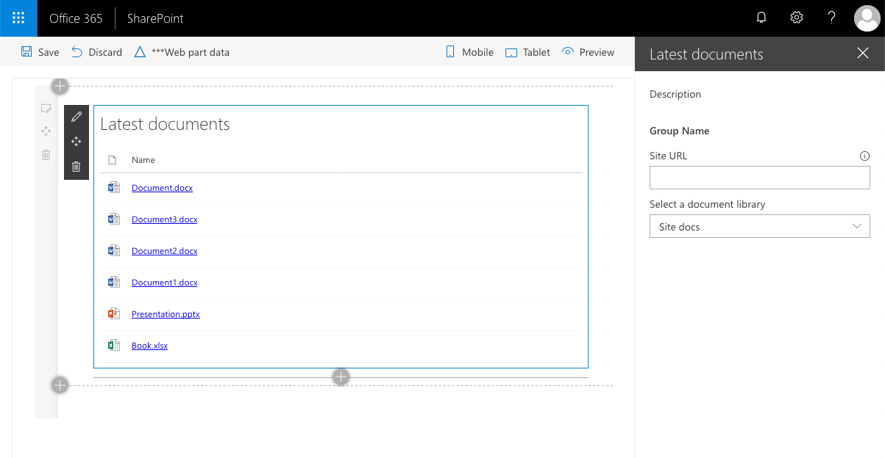

# List subscription

Sample web part illustrating using the SharePoint Framework List subscription capability, which allows you to get notified of changes to documents in a SharePoint Document Library and refresh the displayed data.

## Used SharePoint Framework Version 

## Applies to

* [SharePoint Framework](https://docs.microsoft.com/sharepoint/dev/spfx/sharepoint-framework-overview)
* [Office 365 developer tenant](https://docs.microsoft.com/sharepoint/dev/spfx/set-up-your-developer-tenant)

## Solution

Solution|Author(s)
--------|---------
react-realtime-documents|Waldek Mastykarz (MVP, Rencore, @waldekm)

## Version history

Version|Date|Comments
-------|----|--------
1.0|November 9, 2018|Initial release

## Disclaimer
**THIS CODE IS PROVIDED *AS IS* WITHOUT WARRANTY OF ANY KIND, EITHER EXPRESS OR IMPLIED, INCLUDING ANY IMPLIED WARRANTIES OF FITNESS FOR A PARTICULAR PURPOSE, MERCHANTABILITY, OR NON-INFRINGEMENT.**

---

## Minimal Path to Awesome

* clone this repo
* change the working directory to the cloned repository
* in the command line execute:
  * `npm install`
  * `gulp bundle --ship`
  * `gulp package-solution --ship`
* from the _sharepoint/solution_ folder, deploy the .sppkg file to the App catalog in your tenant
* in the site where you want to test this solution
  * ensure that you have a document library
  * add the web part to the page
  * in the web part properties, select the document library and apply the configuration
  * in the document library, add or update an existing document > web part should automatically update the list of documents

## Features

This sample contains a SharePoint Framework client-side web part that illustrates the List subscription capability:

* subscribing to changes in SharePoint Document Libraries from a SharePoint Framework web part
* using [PnPjs](https://pnp.github.io/pnpjs/) to communicate with the SharePoint REST API
* using [PnP Reusable property pane controls](https://sharepoint.github.io/sp-dev-fx-property-controls/) for easily managing web part properties
* using [PnP Reusable React controls](https://sharepoint.github.io/sp-dev-fx-controls-react/) for building rich web experiences

