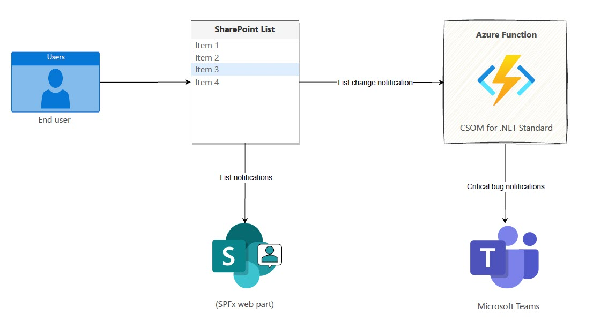
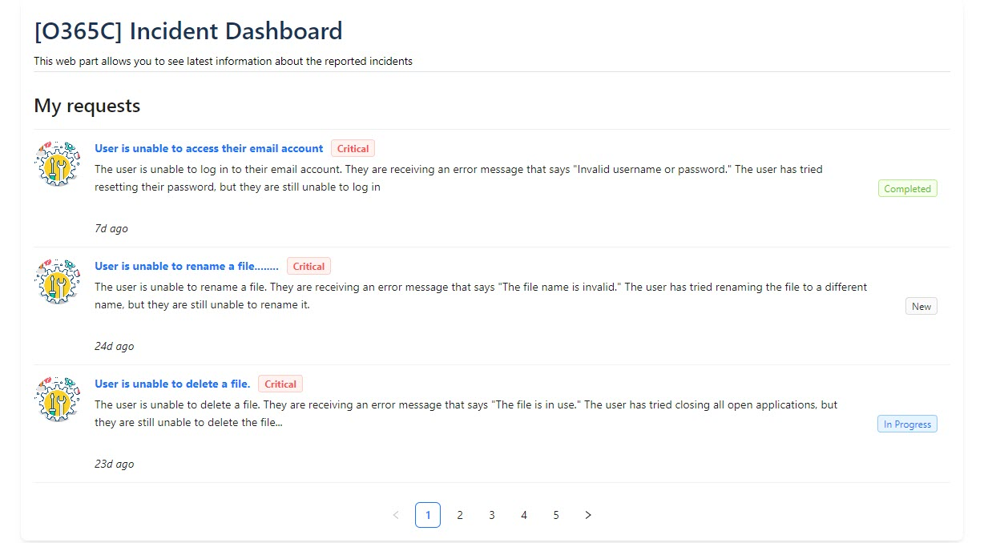
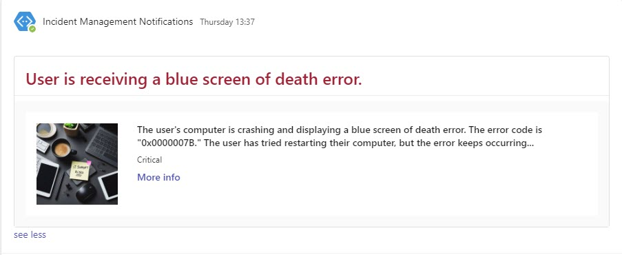

# List notifications + Microsoft Teams Integrations

## Summary

1. This sample web part illustrating using the SharePoint Framework List subscription capability, which allows you to get notified of changes to custom list [Tickets] refresh the displayed data.

2. Azure Function is being used as notification URL for list webhook subscription. If any critical ticket is added or updated then a notification will be sent to the Microsoft Teams

## Solution Architecture



## Demo





## Compatibility

| :warning: Important                                                                                                                                                                                                                                                                           |
| :-------------------------------------------------------------------------------------------------------------------------------------------------------------------------------------------------------------------------------------------------------------------------------------------- |
| Every SPFx version is only compatible with specific version(s) of Node.js. In order to be able to build this sample, please ensure that the version of Node on your workstation matches one of the versions listed in this section. This sample will not work on a different version of Node. |
| Refer to <https://aka.ms/spfx-matrix> for more information on SPFx compatibility.                                                                                                                                                                                                             |


-Incompatible-red.svg> "SharePoint Server 2016 Feature Pack 2 requires SPFx 1.1")


## Applies to

- [SharePoint Framework](https://aka.ms/spfx)
- [Microsoft 365 tenant](https://learn.microsoft.com/sharepoint/dev/spfx/set-up-your-developer-tenant)

> Get your own free development tenant by subscribing to [Microsoft 365 developer program](https://aka.ms/m365/devprogram)

## Prerequisites

To implement this scenario, you will need to configure the following components:

### 1. Create Ticket list

- Run the following PnP PowerShell command to add new list call Tickets. You can find the **pnp-list-template.xml** under assets folder

```PowerShell
Connect-PnPOnline -Url {SiteURL} -Interactive
Invoke-PnPSiteTemplate -Path $listTemplatePath

```

### 2. Register Azure AD app for SharePoint Online Authentication using Certificate approach

- Run the following command to Create an Azure AD app and upload the certificate to Azure AD app as well as to your local machine

```PowerShell

$app = Register-PnPAzureADApp -ApplicationName "SP.List.Webhook" -Tenant contoso.onmicrosoft.com -OutPath c:\temp -CertificatePassword (ConvertTo-SecureString -String "password" -AsPlainText -Force) -Scopes "Sites.FullControl.All" -Store CurrentUser -Interactive
```

- Keep note of the EncodedBased64String value of the certificate

### 3. Create Azure Storage Account

- Follow the below link to Create Azure Storage Account.

  Create a Azure storage account [Click here for more detail](https://learn.microsoft.com/en-us/azure/storage/common/storage-account-create?tabs=azure-portal).

### 4. Create Microsoft Teams incoming webhook

1. Open the Teams channel where you want to add the webhook.
2. Click the ••• menu in the top-right corner and select Connectors.
3. Search for Incoming Webhook and select Add.
4. Click Configure and enter a name and description for your webhook.
5. Click Add to Team.
6. Copy the webhook URL. Keep it save the URL. we need this in later stages

### 5. Deploy the Azure function via Visual Studio 2022

To deploy an Azure Function from Visual Studio 2022, follow these steps:

1. Open the Azure Function project (**from backend folder**) in Visual Studio 2022.
2. Select Publish from the Build menu.
3. Select Azure Functions as the publish target.
4. Click Publish.

> Visual Studio will package the function code and deploy it to Azure. Once the deployment is complete, you will be able to access the function from the Azure portal.

### 6. Add following Azure Function Configuration Settings

```JSON
[

  {
    "name": "AzureWebJobsStorage",
    "value": "Azure storage connection string",
  },
  {
    "name": "CertificateBase64Encoded",
    "value": "Certificate base64 encoded value",
  },
  {
    "name": "ClientId",
    "value": "xxxxxx-xxxxx-4b47-b143-db04e3b5586f",
  },
  {
    "name": "TenantBaseUrl",
    "value": "https://tenant.sharepoint.com",
  },
  {
    "name": "TenantId",
    "value": "xxxx-xxxxx-xxx-8304-0f0f2f840b5d",
  },
  {
    "name": "WebhookUrl",
    "value": "Micrsoft Teams webhook URL"
  }

]
```

### 7. Adds a new Webhook subscription

Run the following command to add the list webhook subscription

```PowerShell
$AzureFunctionUrl = "https://spwebhook.azurewebsites.net/api/SPWebhookReceiver?clientId=blobs_extension"
Add-PnPWebhookSubscription -List "Tickets" -NotificationUrl $AzureFunctionUrl
```

## Contributors

- [Ejaz Hussain](https://github.com/ejazhussain)

## Version history

| Version | Date             | Comments        |
| ------- | ---------------- | --------------- |
| 1.0.0   | October 29, 2023 | Initial release |

## Minimal Path to Awesome

1. Complete the above listed Prerequisites
2. Clone this repository
3. From your command line, change your current directory to the directory containing this sample (`react-realtime-incidentdashboard`, located under `samples`)
4. In the command line run:

```cmd
  `npm install`
  `gulp bundle`
  `gulp package-solution`
```

5. Deploy the package to your app catalog

6. In the command-line run:

```cmd
  gulp serve --nobrowser
```

7. Open the hosted workbench on a SharePoint site - i.e. https://_tenant_.sharepoint.com/site/_sitename_/_layouts/workbench.aspx

- Add the [O365C] Incident Dashboard web part to the page.
- In the web part properties, configure the following properties under Settings group
  1. Add Site URL
  2. Select a list. [only custom lists are allowed]

## Features

1. Increased productivity: List webhook can help to increase productivity by automating the process of sending notifications to Microsoft Teams Channel when the bug is critical.

2. Reduced downtime: The web part can help to reduce downtime by ensuring that team members are aware of critical tickets as soon as they are added or updated.

## Help


We do not support samples, but this community is always willing to help, and we want to improve these samples. We use GitHub to track issues, which makes it easy for  community members to volunteer their time and help resolve issues.

If you're having issues building the solution, please run [spfx doctor](https://pnp.github.io/cli-microsoft365/cmd/spfx/spfx-doctor/) from within the solution folder to diagnose incompatibility issues with your environment.

You can try looking at [issues related to this sample](https://github.com/pnp/sp-dev-fx-webparts/issues?q=label%3A%22sample%3A%20react-realtime-incidentdashboard%22) to see if anybody else is having the same issues.

You can also try looking at [discussions related to this sample](https://github.com/pnp/sp-dev-fx-webparts/discussions?discussions_q=react-realtime-incidentdashboard) and see what the community is saying.

If you encounter any issues using this sample, [create a new issue](https://github.com/pnp/sp-dev-fx-webparts/issues/new?assignees=&labels=Needs%3A+Triage+%3Amag%3A%2Ctype%3Abug-suspected%2Csample%3A%20react-realtime-incidentdashboard&template=bug-report.yml&sample=react-realtime-incidentdashboard&authors=@ejazhussain&title=react-realtime-incidentdashboard%20-%20).

For questions regarding this sample, [create a new question](https://github.com/pnp/sp-dev-fx-webparts/issues/new?assignees=&labels=Needs%3A+Triage+%3Amag%3A%2Ctype%3Aquestion%2Csample%3A%20react-realtime-incidentdashboard&template=question.yml&sample=react-realtime-incidentdashboard&authors=@ejazhussain&title=react-realtime-incidentdashboard%20-%20).

Finally, if you have an idea for improvement, [make a suggestion](https://github.com/pnp/sp-dev-fx-webparts/issues/new?assignees=&labels=Needs%3A+Triage+%3Amag%3A%2Ctype%3Aenhancement%2Csample%3A%20react-realtime-incidentdashboard&template=suggestion.yml&sample=react-realtime-incidentdashboard&authors=@ejazhussain&title=react-realtime-incidentdashboard%20-%20).

## Disclaimer

**THIS CODE IS PROVIDED _AS IS_ WITHOUT WARRANTY OF ANY KIND, EITHER EXPRESS OR IMPLIED, INCLUDING ANY IMPLIED WARRANTIES OF FITNESS FOR A PARTICULAR PURPOSE, MERCHANTABILITY, OR NON-INFRINGEMENT.**


