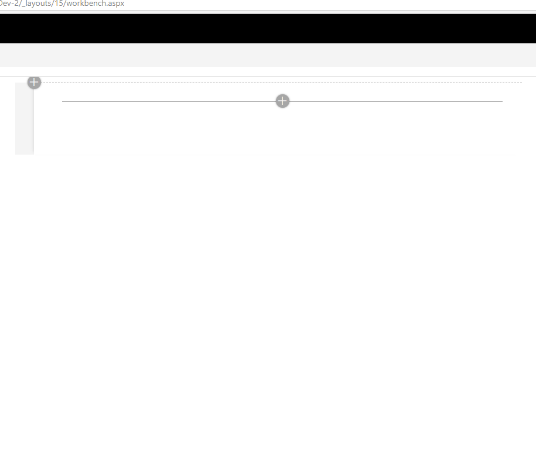

# SPFx webpart using Redux-Form library and React

## Summary
Sample webpart to demonstrate the use of [Redux-Form](https://github.com/erikras/redux-form) library with SPFx, React and Typescript. Demonstrates how to easily build a dynamic grid using redux-form.

## Used SharePoint Framework Version 

## Applies to

* [SharePoint Framework](https://docs.microsoft.com/sharepoint/dev/spfx/sharepoint-framework-overview)
* [Office 365 tenant](https://docs.microsoft.com/sharepoint/dev/spfx/set-up-your-development-environment)

## Prerequisites
 
- Basic knowledge of react-redux concepts - reducer,actions and dispatch.
- PnP PowerShell - to setup Fields and Lists to work with the webpart.

## Solution

Solution|Author(s)
--------|---------
react-reduxform | Vipul Kelkar  @vipulkelkar

## Version history

Version|Date|Comments
-------|----|--------
1.0|May 02, 2018|Initial release

## Disclaimer
**THIS CODE IS PROVIDED *AS IS* WITHOUT WARRANTY OF ANY KIND, EITHER EXPRESS OR IMPLIED, INCLUDING ANY IMPLIED WARRANTIES OF FITNESS FOR A PARTICULAR PURPOSE, MERCHANTABILITY, OR NON-INFRINGEMENT.**

---

## Minimal Path to Awesome

- The webpart requires two custom lists in the SharePoint site. The folder "SetupScript" contains a PnP PowerShell script that will setup the custom fields, content type and the required lists.

- Change the site URL in the PowerShell script and execute with proper credentials to setup the lists.

- Clone this repository
- in the command line run:
  - `npm install`
  - `gulp serve`

- Navigate to - <Your SP site>/_layouts/workbench.aspx and add the "ReduxFormWebpart"

## Features

- This is a data entry webpart to create a "Purchase Request". Each purchase request can have several items that can be ordered within it.

- The webpart interacts with two SharePoint lists - "PurchaseRequest" and "PurchaseRequestItems".

- The purchase request is created in the "PurchaseRequest" list. The purchase items are stored in separate "PurchaseRequestItems" list along with the ListItem ID of the corrosponding PurchaseRequest item.

Redux-Form : 

- Webpart makes use of [Redux-Form](https://github.com/erikras/redux-form) library which makes it easy to maintain the state of form fields without explicitly requiring  to maintain the state everytime data in a form field is added/updated/deleted. 
Refer to the [Getting started](https://redux-form.com/6.4.3/docs/gettingstarted.md/) guide for the basics of redux-form

- The sample demonstrates how to integrate redux-form in SPFx webpart and develop a dynamic grid component using [FieldArray](https://redux-form.com/6.4.3/docs/api/fieldarray.md/) component of redux-form.

- The sample also uses custom renderers for form fields along with required field and number validations.

