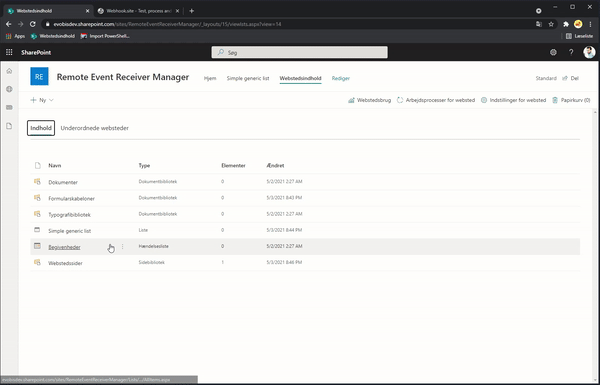
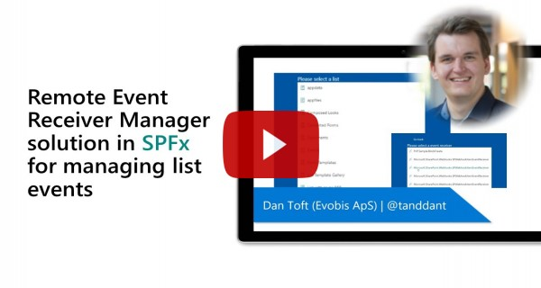

# Remote Event Receiver Manager

## Summary

A very simple web part that lets you add and delete remote event receivers to lists, the need came about due to remote event receivers not functioning properly when added with app only authentication and PnP.Powershell now only using that.

## Compatibility

 
 
 
 

## Applies to

* [SharePoint Framework](https://docs.microsoft.com/sharepoint/dev/spfx/sharepoint-framework-overview)
* [Office 365 tenant](https://docs.microsoft.com/sharepoint/dev/spfx/set-up-your-development-environment)

## Prerequisites
 
None

## Solution

Solution|Author(s)
--------|---------
react remote event receiver manager | [Dan Toft](https://github.com/Tanddant) ([@tanddant](https://twitter.com/tanddant))

## Version history

Version|Date|Comments
-------|----|--------
1.0.0|May 3, 2021|Initial release
1.1.0|June 9, 2021|Added support for synchronous and asynchronous event receivers

## Minimal Path to Awesome - please follow all the steps.

- Clone this repository
- in the command line run:
  - `npm install`
  - `gulp build`
  - `gulp bundle --ship`
  - `gulp package-solution --ship`
  - Add and deploy package to AppCatalog

## Features

- See, add, and delete remote event receivers from a list

## Video

## Help

We do not support samples, but we this community is always willing to help, and we want to improve these samples. We use GitHub to track issues, which makes it easy for  community members to volunteer their time and help resolve issues.

If you're having issues building the solution, please run [spfx doctor](https://pnp.github.io/cli-microsoft365/cmd/spfx/spfx-doctor/) from within the solution folder to diagnose incompatibility issues with your environment.

You can try looking at [issues related to this sample](https://github.com/pnp/sp-dev-fx-webparts/issues?q=label%3A%22sample%3A%20react-remote-event-receiver-manager") to see if anybody else is having the same issues.

You can also try looking at [discussions related to this sample](https://github.com/pnp/sp-dev-fx-webparts/discussions?discussions_q=react-remote-event-receiver-manager) and see what the community is saying.

If you encounter any issues while using this sample, [create a new issue](https://github.com/pnp/sp-dev-fx-webparts/issues/new?assignees=&labels=Needs%3A+Triage+%3Amag%3A%2Ctype%3Abug-suspected%2Csample%3A%20react-remote-event-receiver-manager&template=bug-report.yml&sample=react-remote-event-receiver-manager&authors=@Tanddant&title=react-remote-event-receiver-manager%20-%20).

For questions regarding this sample, [create a new question](https://github.com/pnp/sp-dev-fx-webparts/issues/new?assignees=&labels=Needs%3A+Triage+%3Amag%3A%2Ctype%3Aquestion%2Csample%3A%20react-remote-event-receiver-manager&template=question.yml&sample=react-remote-event-receiver-manager&authors=@Tanddant&title=react-remote-event-receiver-manager%20-%20).

Finally, if you have an idea for improvement, [make a suggestion](https://github.com/pnp/sp-dev-fx-webparts/issues/new?assignees=&labels=Needs%3A+Triage+%3Amag%3A%2Ctype%3Aenhancement%2Csample%3A%20react-remote-event-receiver-manager&template=question.yml&sample=react-remote-event-receiver-manager&authors=@Tanddant&title=react-remote-event-receiver-manager%20-%20).

## Disclaimer

**THIS CODE IS PROVIDED *AS IS* WITHOUT WARRANTY OF ANY KIND, EITHER EXPRESS OR IMPLIED, INCLUDING ANY IMPLIED WARRANTIES OF FITNESS FOR A PARTICULAR PURPOSE, MERCHANTABILITY, OR NON-INFRINGEMENT.**

