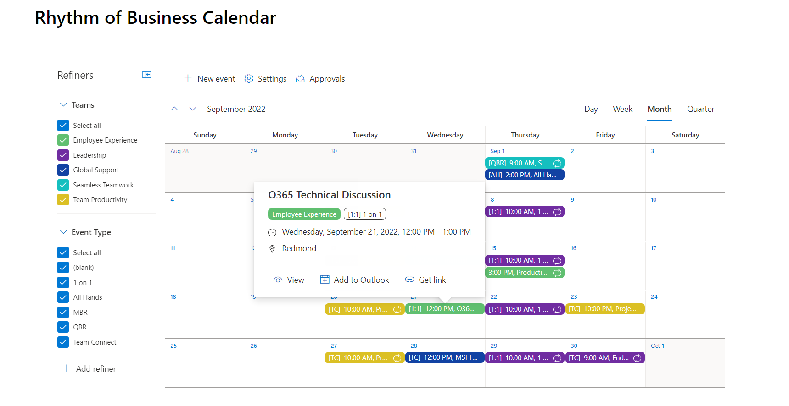
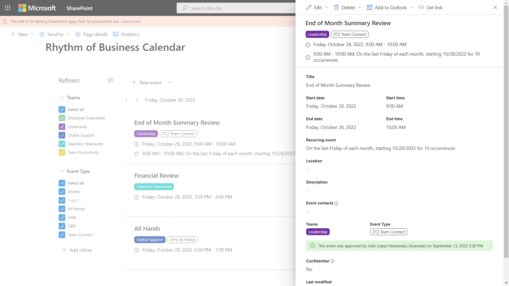
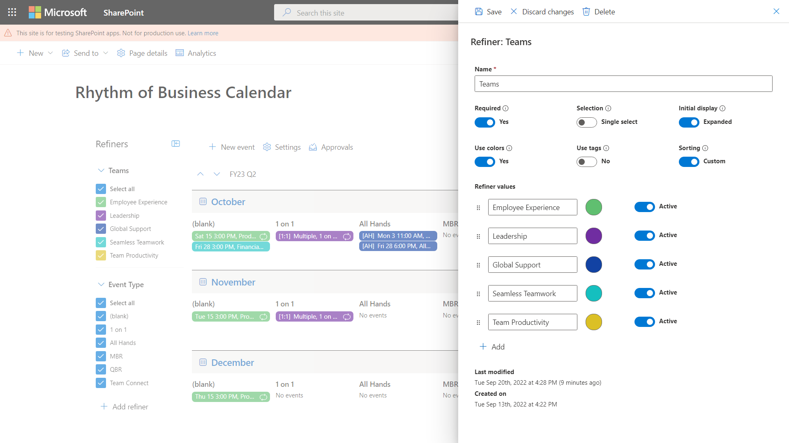

# Rhythm of Business Calendar

## Summary

This sample is the source code for the Rhythm of Business Calendar app and is intended to demonstrate patterns and practices for building enterprise apps on the SharePoint platform.

<!-- TODO: link to the app once published
This sample is the source code for the Rhythm of Business Calendar app published in [AppSource](https://appsource.microsoft.com/en-us/marketplace/apps?product=sharepoint) and is intended to demonstrate patterns and practices for building enterprise apps on the SharePoint platform.
 -->

Rhythm of Business (RoB) Calendar keeps you on top of your business goals by managing all team and organizational events seamlessly. Simplify and expedite the coordination and planning process for your team and subgroups with the help of color-coded events, approval workflow, refiners and confidential events.  Ideal for Chiefs of Staff, Executive Assistants, or anyone who manages a team calendar, you can empower your teams by enabling better insights on your business goals and team events.

Month view  

View event details  

Edit refiner  

## Compatibility

| :warning: Important          |
|:---------------------------|
| Every SPFx version is only compatible with specific version(s) of Node.js. In order to be able to build this sample, please ensure that the version of Node on your workstation matches one of the versions listed in this section. This sample will not work on a different version of Node.|
|Refer to <https://aka.ms/spfx-matrix> for more information on SPFx compatibility.   |

-Incompatible-red.svg "SharePoint Server 2016 Feature Pack 2 requires SPFx 1.1")

## Applies to

* [SharePoint Framework](https://docs.microsoft.com/sharepoint/dev/spfx/sharepoint-framework-overview)
* [Microsoft 365 tenant](https://docs.microsoft.com/sharepoint/dev/spfx/set-up-your-development-environment)

> Get your own free development tenant by subscribing to [Microsoft 365 developer program](http://aka.ms/m365devprogram)

## Contributors

* [Dan Turley](https://github.com/d-turley)

## Version history

Version|Date|Comments
-------|----|--------
1.0|September 26, 2022|Initial release

## Minimal path to awesome

* Clone this repository (or [download this solution as a .ZIP file](https://pnp.github.io/download-partial/?url=https://github.com/pnp/sp-dev-fx-webparts/tree/main/samples/react-rhythm-of-business-calendar) then unzip it)
* From your command line, change your current directory to the directory containing this sample (`react-rhythm-of-business-calendar`, located under `samples`)
* in the command line run:
  * `npm install`
  * `gulp serve --nobrowser`

<!--
TODO: add support for containers
>> This sample can also be opened with [VS Code Remote Development](https://code.visualstudio.com/docs/remote/remote-overview). Visit <https://aka.ms/spfx-devcontainer> for further instructions.
-->

## Features

This sample is a complete app that demonstrates the "SPFx Solution Accelerator" framework, along with patterns and practices for building enterprise-class apps on SharePoint.  Inspired by Domain Driven Design and Onion Architecture, this accelerator has evolved since SPFx v1.0, and we want to share it with the world!

At a high-level, the accelerator includes the following features:
* Prescribed [solution structure](./documentation/solution-structure.md) separates web parts, components, model, services, and schema (data) layers
* Robust [entity domain model](./documentation/entities.md) with relationships, validation, change tracking, and text search
* Robust [schema provisioning](./documentation/schema.md) and versioning; use SharePoint lists as a simple relational database
* [Services](./documentation/services.md) for interacting with SharePoint, timezones, domain isolation, and users and groups, plus patterns for building custom services for app-specific logic
* [Component library](./documentation/components.md) with customizable wizard, panel/dialog for quickly building view/edit screens, validation, and more
* [Live Update](./documentation/live-update.md) feature ensures users are always working with the latest data without manaually reloading the page
* Built on the latest SPFx with TypeScript, React, and Fluent UI, plus PnPjs, Moment.js, Lodash, and Jest

A deep dive into the various features of the accelerator can be found in the [documentation](./documentation/README.md) folder.

<!--
RESERVED FOR REPO MAINTAINERS

We'll add the video from the community call recording here

## Video

-->

## Help

We do not support samples, but this community is always willing to help, and we want to improve these samples. We use GitHub to track issues, which makes it easy for community members to volunteer their time and help resolve issues.

If you're having issues building the solution, please run [spfx doctor](https://pnp.github.io/cli-microsoft365/cmd/spfx/spfx-doctor/) from within the solution folder to diagnose incompatibility issues with your environment.

You can try looking at [issues related to this sample](https://github.com/pnp/sp-dev-fx-webparts/issues?q=label%3A%22sample%3A%20react-rhythm-of-business-calendar%22) to see if anybody else is having the same issues.

You can also try looking at [discussions related to this sample](https://github.com/pnp/sp-dev-fx-webparts/discussions?discussions_q=react-rhythm-of-business-calendar) and see what the community is saying.

If you encounter any issues using this sample, [create a new issue](https://github.com/pnp/sp-dev-fx-webparts/issues/new?assignees=&labels=Needs%3A+Triage+%3Amag%3A%2Ctype%3Abug-suspected%2Csample%3A%20react-rhythm-of-business-calendar&template=bug-report.yml&sample=react-rhythm-of-business-calendar&authors=@d-turley&title=react-rhythm-of-business-calendar%20-%20).

For questions regarding this sample, [create a new question](https://github.com/pnp/sp-dev-fx-webparts/issues/new?assignees=&labels=Needs%3A+Triage+%3Amag%3A%2Ctype%3Aquestion%2Csample%3A%20react-rhythm-of-business-calendar&template=question.yml&sample=react-rhythm-of-business-calendar&authors=@d-turley&title=react-rhythm-of-business-calendar%20-%20).

Finally, if you have an idea for improvement, [make a suggestion](https://github.com/pnp/sp-dev-fx-webparts/issues/new?assignees=&labels=Needs%3A+Triage+%3Amag%3A%2Ctype%3Aenhancement%2Csample%3A%20react-rhythm-of-business-calendar&template=suggestion.yml&sample=react-rhythm-of-business-calendar&authors=@d-turley&title=react-rhythm-of-business-calendar%20-%20).

## Disclaimer

**THIS CODE IS PROVIDED *AS IS* WITHOUT WARRANTY OF ANY KIND, EITHER EXPRESS OR IMPLIED, INCLUDING ANY IMPLIED WARRANTIES OF FITNESS FOR A PARTICULAR PURPOSE, MERCHANTABILITY, OR NON-INFRINGEMENT.**

