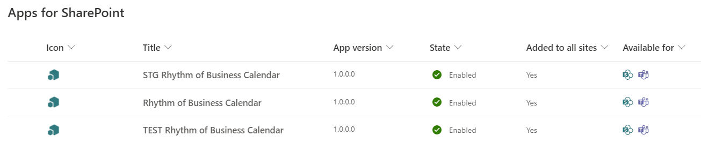
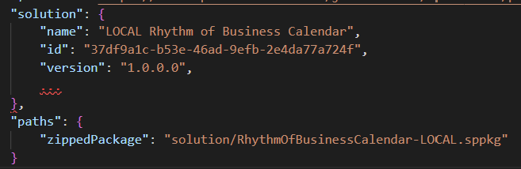
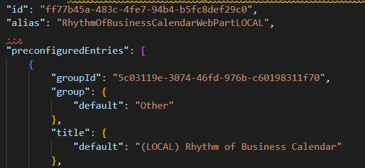

# Build Tools
We have extended the SPFx gulp tasks to support the concept of environments and to simplify the commands for building and deploying solutions.

A prerequisite for using these commands is to install the PnP PowerShell module on your machine.

From an elevated PowerShell prompt, run the following:  
`Install-Module -Name PnP.PowerShell`

The code for all of the gulp tasks can all be found in the [\build\gulpfile.ts](../build/gulpfile.ts) file.

## Commands
The package command does a clean, build, bundle, and package-solution for a specific environment all in one comand.  The standard .sppkg package file is generated, as well as a .zip file with the project's source code suitable for submitting to another party for review of the app's code.

Run the package command for the production environment:  
`gulp package --ship --env prod`

The deploy command does everything the package command does (clean build, bundle, and package-solution), plus it will deploy the solution to the app catalog specified by the environment.

Run the deploy command for the dev environment:  
`gulp deploy --ship --env dev`

It uses commands from PnP PowerShell to upload and deploy the solution.

## Environments

The project root contains a file named [environments.json](../environments.json) where you can define all of your environments for developing, testing, and deploying your app.

Here is an example of how to declare the dev environment:
```
"dev": {
    "deploySiteUrl": "https://contoso.sharepoint.com/sites/RhythmOfBusinessCalendar_DEV",
    "deployScope": "Site",
    "skipFeatureDeployment": false,
    "environmentSymbol": "Environments.DEV",
    "package": {
        "name": "DEV Rhythm of Business Calendar",
        "id": "54b89a4f-15c4-4007-942f-d1d9e8fc6871",
        "filename": "RhythmOfBusinessCalendar-DEV.sppkg"
    },
    "webparts": [
        {
            "manifest": "RhythmOfBusinessCalendarWebPart.manifest.json",
            "id": "8454e333-242f-45af-bd58-bd823010822a",
            "alias": "RhythmOfBusinessCalendarWebPartDEV",
            "title": "(DEV) Rhythm of Business Calendar"
        }
    ]
}
```

* Environment name - the environment name can be anything you want. In addition to local/dev/test/prod, we often create environments specific to each developer on the team, using their alias for the environment name.
    * **deploySiteUrl** - this is the site that contains app catalog.  It can be a site collection app catalog or tenant app catalog.
    * **deployScope** - either "Site" or "Tenant" - indicates whether the deploySiteUrl is  site collection app catalog or tenant app catalog
    * **skipFeatureDeployment** - if the solution supports skipping feature deployment (skipFeatureDeployment flag in package-solution.json), setting this parameter to true will cause the -SkipFeatureDeployment flag to the be specified when running the Add-PnPApp command during deployment
    * **environmentSymbol** - this value is used to temporarily set any variable named `Environment` in any file(s) named Defaults.ts throughout the solution when using the package or deploy commands.  Defaults.ts files are described below.
    * package - specifies values that will be temporarily replaced in the solution-package.json file when using the package or deploy commands
        * **name** - the display name of the app.  Our pattern is to prepend the ALL CAPS name of the environment  to the production name ('**DEV** Rhythm of Business Calendar').
        * **id** - a distinct GUID for the package for this environment.  [https://www.guidgenerator.com/](https://www.guidgenerator.com/) is a useful tool for generating GUIDs.
        * **filename** - the filename to use when generating the sppkg for this environment.  Our pattern is to append the ALL CAPS name of the environment to the production name ('RhythmOfBusinessCalendar-**DEV**.sppkg').
    * webparts - this is an array of all web parts in the solution and specifies values that will be temporarily replaced in the web part manifest file when using the package or deploy commands
        * **manifest** - this value is used to identify the web part manifest file to modify during the package or deploy command.  The name should be the actual filename of the web part manifest and should be not be altered with the environment name.
        * **id** - a distinct GUID for the web part for this environment.  [https://www.guidgenerator.com/](https://www.guidgenerator.com/) is a useful tool for generating GUIDs.
        * **alias** - the alias of the web part for this environment.  Our pattern is to append the ALL CAPS name of the environment to the production alias ('RhythmOfBusinessCalendarWebPart**DEV**').
        * **title** - the display name of the web part for this environment.  Our pattern is to prepend the ALL CAPS name of the environment to the production title ('**(DEV)** Rhythm of Business Calendar').

If the package or deploy commands ever fail (for example, due to a build error), and the package-solution.json, web part manifest, and Defaults.ts files have not reverted to the local environment values, run this command to revert those files:  
`gulp modify-env-config --env local`

## Defaults.ts files
Defaults files are useful for applying static configuration in code on a per-environment basis.  For example, if the team must share a single site for development and each developer has their own environment, the Defaults file can define a prefix to use when provisioning lists for the app, so that each developer can run the app on the same site entirely independent of each other.

A good example is the [Defaults.ts](../src/schema/Defaults.ts) in the schema folder.  It defines the list titles for the app and specifies prefixes to use for each environment.

These files may be located anywhere in the code under the /src folder and may contain any code you like, however one line of code must declare a const value named 'Environment':  
`const Environment = Environments.LOCAL;`  
This variable is assigned the value from the environmentSymbol parameter from the environments.json file of the environment specified on the command line when running the package or deploy commands.

## Development process
The typical development lifecycle is as follows:
1. Write some code
1. Run the code using the workbench page of a dev site in your tenant (gulp serve --nobrowser).  This uses the LOCAL environment configuration.
1. Once the code is working, deploy the app using the DEV environment (gulp deploy --ship --env dev), and add the web part to a site page.  This version uses the DEV environment configuration.  It does not use gulp serve to serve the script files.
1. Once the feature is ready for testing, deploy the app using the TEST environment (gulp deploy --ship --env test).
1. From here, the app can be deployed using the STAGE environment for final confirmation before deploying to production
1. To deploy to production, the package command can be used to generate the SPPKG and a ZIP of the source code for review and deployment by the tenant admins, or if you are the tenant admin you can configure the PROD environment to deploy directly to your tenant app catalog.


Tenant app catalog with TEST/STAGE/PROD packages all uploaded side-by-side  


CI/CD can also be utilized to execute the gulp commands and automatically build and deploy the app to different environments.

This feature of the SPFx Solution Accelerator evolved to avoid conflicts with packages and web part names and IDs when multiple developers need to share a site or a tenant and the team is following the traditional dev/test/stage/prod development lifecycle.

The ability to alter list names and such has become less of a concern over the years, as dev/test sites and even entire tenants are easy to create for development purposes, however the feature still has some use cases.

## Setting up a new project
When setting up a new project, one of the first things to do is to change the names and GUIDs in the solution files and the environments.json file.  The values in the package-solution.json and each web part manifest should match the values specified for the local environment in the environments.json file.

```
"local": {
    "environmentSymbol": "Environments.LOCAL",
    "package": {
        "name": "LOCAL Rhythm of Business Calendar",
        "id": "37df9a1c-b53e-46ad-9efb-2e4da77a724f",
        "filename": "RhythmOfBusinessCalendar-LOCAL.sppkg"
    },
    "webparts": [
        {
            "manifest": "RhythmOfBusinessCalendarWebPart.manifest.json",
            "id": "ff77b45a-483c-4fe7-94b4-b5fc8def29c0",
            "alias": "RhythmOfBusinessCalendarWebPartLOCAL",
            "title": "(LOCAL) Rhythm of Business Calendar"
        }
    ]
}
```

package-solution.json  


RhythmOfBusinessCalendarWebPart.manifest.json  

