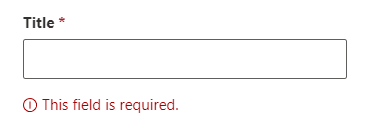
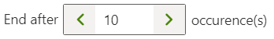

# Components
The SPFx Solution Accelerator includes a few components we've found useful over the years for building enterprise apps. They integrate with the services and domain model aspects of the accelerator, for requirements ranging from implementing asynchronous data patterns and view-edit-save-or-discard flows, to building responsive and localized apps.

All components should be WCAG 2.1 compliant.

## Validation
The `Validation` component implements a simple and consistent pattern for displaying validation messages to the user. Simply wrap the input control in a Validation component and pass the relevant validation rules from the entity, and the validation component will display the error message under the input control when the input value is invalid.

Suppose we have the following validation rules configured for our entity:
```
import { ValidationRule, RequiredValidationRule } from 'common';

...

export class Category extends ListItemEntity<IState> {
    public static readonly TitleValidations = [
        new RequiredValidationRule<Category>(e => e.title),
    ];

    ...

    protected validationRules(): ValidationRule<Category>[] {
        return [
            ...Category.TitleValidations,
        ];
    }
}
```

Then we build an editor UI with a text field where the user can change the title of the entity:
```
    const category: Category = ...;

    <Validation entity={category} rules={Category.TitleValidations}>
        <TextField label="Title" required value={...} onChange={...} />
    </Validation>
```

If the user fails to provide a value for the title field, the validation failure message will display below the component:


Refer to [Entities - Validation](./entities.md#validation) for more details on defining and configuring validation rules.

## Responsive Grid
The `ResponsiveGrid` component is a thin wrapper around the Fluent UI responsive grid layout.  It supports push, pull, and hidden features as well.

Here's a quick example:
```
import { ResponsiveGrid, GridRow, GridCol } from 'common/components';
...

<ResponsiveGrid>
    <GridRow>
        <GridCol sm={12] lg={4}>
            // content
        </GridCol>
        <GridCol sm={12] lg={4}>
            // content
        </GridCol>
        <GridCol hiddenMdDown lg={4}>
            // content
        </GridCol>
    </GridRow>
</ResponsiveGrid>
```

The above example is equivalent to the following markup:
```
<div class="ms-grid">
    <div class="ms-grid-row">
        <div class="ms-grid-col ms-sm12 ms-lg4">
            // content
        </div>
        <div class="ms-grid-col ms-sm12 ms-lg4">
            // content
        </div>
        <div class="ms-grid-col ms-sm12 ms-lg4 ms-hiddenMdDown">
            // content
        </div>
    </div>
</div>
```

The `sm` prop can be ommitted if desired to shorten the code further.  It will default to 12 columns if not specified.

## User Picker
The `UserPicker` component is a wrapper around the Fluent UI People Picker component that integrates with the [Directory service](./services.md#directory-service) to supply people and group search results (does not require Graph permissions).  It accepts and returns the selected users using our unified `User` class, which is used across components, services, and entity models.

 ```
    import { User } from 'common';
    import { UserPicker } from 'common/components';

    ...

    const contacts: User[] = ...;
    const onContactsChanged = (newContacts: User[]) => { ... }; 
    
    <UserPicker label="Contacts" users={contacts} onChanged={onContactsChanged} />
 ```

There are additional configuration options for UserPicker:
Property|Type|Description
---|---|---
display|UserPickerDisplayOption|Normal, List, or Compact, corresponds to the Fluent UI People Picker flavors
restrictPrincipalType|PnPjs PrincipalType|Allow picking only users, only groups, or both users and groups
restrictToGroupMembers|SharePointGroup|Allow picking only users that are a member of the specified SharePoint group. (Use the Directory service to get the group)

## Wizard
The `Wizard` component supports a multi-screen paged experience that may include a start screen, as many intermediate pages as needed to inform the user or collect user input, and a final success screen, with the ability to run any asynchronous operations before getting to the success screen.  It is especially useful as a first-run experience if the user is required to enter some configuration settings or the schema needs to be provisioned before the app can be used.

Check out the [Configuration Wizard](../src/components/setup/ConfigurationWizard.tsx) first-run experience implemented for the Rhythm of Business Calendar app.

## Asynchronous Data
Any asynchronous data has various states that are tracked by the `AsyncData` class, such as loading, loaded, saving, and error.  The `AsyncDataComponent` is the corresponding UI component that provides the boundary between the asynchronous operations and the actual data that child components can render.  It does not provide any UI except to display a spinner when data is loading or saving, and to display an error message if the async operation unexpectedly fails.

```
const { refinersAsync } = useRefinersService(); // refinersAsync is an AsyncData<readonly Refiner[]>

...

<AsyncDataComponent dataAsync={refinersAsync}>
    {(refiners: readonly Refiner[]) => 
        <ListOfRefiners refiners={refiners} />
    }
</AsyncDataComponent>
```

Usually, we retrieve async data objects from a service, which we can then pass directly to the `AsyncDataComponent`.  When it renders, it will either display a spinner if the async data is in a loading/saving state, an error message if the async operation unexpectedly failed, or it will execute and display the results of the child render function.

## Panels and Dialogs
A handful of specialized panel and dialog components are available depending on the scenario, but all are intented to support basic view-edit-save-or-discard flows to significantly reduce error-prone plumbing code.

Component|Data Type|UI|Comments
---|---|---|---
DataPanelBase|any object|Panel|A panel that displays and/or edits any kind of custom data
DataDialogBase|any object|Dialog|A dialog that displays and/or edits any kind of custom data
DataComponentBase|any object|(none)|A component that displays and/or edits any kind of custom data
EntityPanelBase|Entity|Panel|A panel that displays and/or edits an Entity
EntityDialogBase|Entity|Dialog|A dialog that displays and/or edits an Entity
EntityComponentBase|Entity|(none)|A component that displays and/or edits an Entity

The panel components enhance the Fluent UI Panel component, and the dialog components enhance the Fluent UI Dialog component.  The 'component' components provide no specific UI and can be used to embed a view-edit-save-or-discard flow into a screen.

Panels can be customized to have a simple or complex header with an optional toolbar, close button, simple title text or a complex overview of the data.

All of these components have three modes: view, edit, and readonly.  When a panel/dialog is opened passing in an entity or some custom data object, you specify the mode by which function you call to open the panel/dialog, and if it is opened in readonly mode then it will not allow the UI to switch to edit mode.  Each mode has corresponding functions that you will override to render UI elements for the toolbar, header, content, and footer.  All functions are optional, and there are various fallbacks so that not every function must be overriden if the content is the same across all modes.  For example, if the header UI will be the same in both view and edit modes, then only the `renderDisplayHeader` function needs to be implemented -- it will be automatically called to render the header UI for both view and edit modes (as well as the readonly mode if you intend to use that mode).

These components also have support for running validation rules before saving, as well as a built-in confirmation dialog that is displayed if the user is trying to close the dialog/panel but they have made changes to the data.

The entity version of these components adds additional automatic functionality specific for working with an Entity object.  The validation logic directly calls the `valid()` function on the entity, but can be overriden if needed.  When entering edit mode with an entity, the `snapshot()` function is automatically called on the entity, when changes are successfully persisted the `immortalize()` function is automatically called, and when dismissing the panel/dialog the `revert()` function is automatically called.  Also when in edit mode, before the dialog/panel will dismiss, the `hasChanges()` function is called on the entity to determine if the user has made any changes while the dialog/panel was open in edit mode. See [Entity - Change tracking](./entities.md#change-tracking).

When the user wants to save their changes, and after the component has determined the changes are valid, the `persistChangesCore()` async function is called, which you should override to perform any persistance logic, such as calling a service to persist the entity to a SharePoint list.  A spinner is automatically displayed over top of the contents of the panel/dialog while the persistChangesCore function is executing.  If an unexpected error occurs, the panel/dialog also has built-in functionality for catching and displaying an error message bar to the user.

Examples of panels and dialogs can be referrenced in the Rhythm of Business Calendar app:
* [RefinerPanel](../src/components/refiners/RefinerPanel.tsx)
* [SettingsPanel](../src/components/settings/SettingsPanel.tsx)
* [ApproversPanel](../src/components/approvals/ApproversPanel.tsx)
* [EventPanel](../src/components/events/EventPanel.tsx)
* [ApprovalDialog](../src/components/approvals/ApprovalDialog.tsx)

## Localize
The `Localize` component enables scenarios where you want to use input controls in the middle of a sentance where the inputs can change location within the text depending on the language.  It works by specifying tokens in the localized text string that the component then replaces with input controls that you specify for each token.  Tokens placed in {} brackets.

As an example, suppose there is a localized string named **EndAfterNOccurences** defined as follows with one token named **count**:  
`EndAfterNOccurences: "End after {count} occurence(s)"`

And we want the UI to look like the following:


We can use the Localize component like this, rendering our custom `NumberTextField` component in place of the {count} token in the string:
```
<Localize
    phrase={strings.EndAfterNOccurences}
    components={{
        count: <NumberTextField {...text field props} />
    }}
/>
```

## SharePoint App
The `SharePointApp` component handles basic plumbing that all apps will need.  It handles initializing the services manager, displaying a customizable shimmer while services are initialized, setting up support for theming, initializing PnPjs for SharePoint and Graph, and ensuring the Fluent UI icons and styles are available.

Here's an example:

 ```
const AppServiceDescriptors = [
    ...
    DirectoryServiceDescriptor,
    SharePointServiceDescriptor,
    LiveUpdateServiceDescriptor,
    ConfigurationServiceDescriptor,
    ...
];

...

class RhythmOfBusinessCalendarApp extends Component<IProps> {

    ...

    public render(): ReactElement<IProps> {
        const { webpart } = this.props;

        return (
            <SharePointApp
                appName="RhythmOfBusinessCalendar"
                companyName="Contoso"
                spfxComponent={webpart}
                serviceDescriptors={AppServiceDescriptors}
                shimmerElements={<MyCustomLoadingShimmer />}
            >
                // root UI component(s) for this app rendered here
            </SharePointApp>
        );
    }
}
 ```

 Take a look at the [/src/apps/RhythmOfBusinessCalendarApp.tsx](../src/apps/RhythmOfBusinessCalendarApp.tsx) file for the full code to setup an app component your app.

 This helps to greatly simplify and reduce the amount of code that is normally added to the SPFx web part file.  You can see the difference for yourself here in [RhythmOfBusinessCalendarWebPart.tsx](../src/webparts/rhythmOfBusinessCalendar/RhythmOfBusinessCalendarWebPart.tsx).

 ## Other Components
 More components can be found in the [/src/common/components](../src/common/components/) folder.