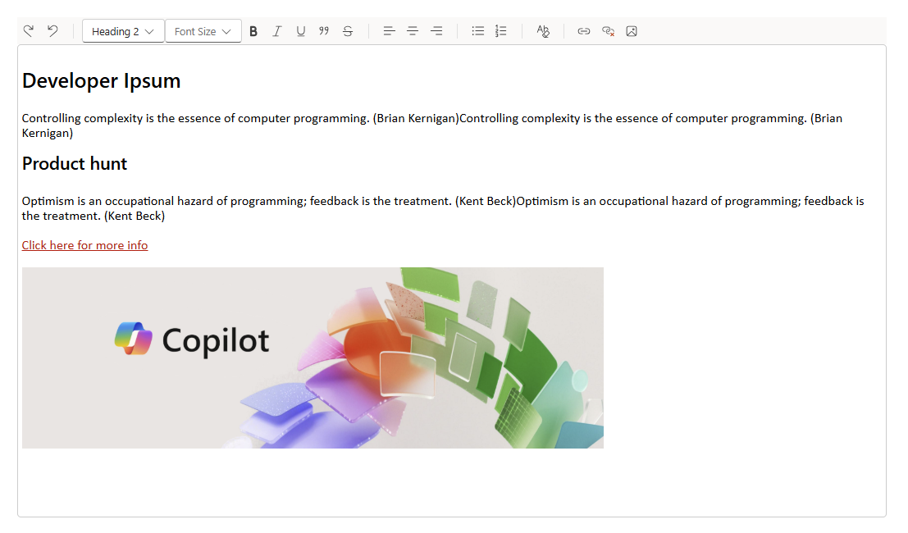

# Rich Text Editor - Fluent UI

## Summary

A robust rich text editor utilizing the latest Fluent React components to seamlessly align with SharePoint Online Modern UI standards. Full control over UI and backend code, making integration with external systems like SharePoint lists a breeze. Inspiration is drawn from the out-of-the-box Text web part.




## Compatibility

| :warning: Important          |
|:---------------------------|
| Every SPFx version is optimally compatible with specific versions of Node.js. In order to be able to build this sample, you need to ensure that the version of Node on your workstation matches one of the versions listed in this section. This sample will not work on a different version of Node.|
|Refer to <https://aka.ms/spfx-matrix> for more information on SPFx compatibility.   |

This sample is optimally compatible with the following environment configuration:


-Incompatible-red.svg "SharePoint Server 2016 Feature Pack 2 requires SPFx 1.1")


## Applies to

- [SharePoint Framework](https://aka.ms/spfx)
- [Microsoft 365 tenant](https://docs.microsoft.com/en-us/sharepoint/dev/spfx/set-up-your-developer-tenant)

> Get your own free development tenant by subscribing to [Microsoft 365 developer program](http://aka.ms/o365devprogram)


## Contributors

- [Ejaz Hussain](https://github.com/ejazhussain)

## Version history

| Version | Date             | Comments        |
| ------- | ---------------- | --------------- |
| 1.0     | February  11, 2025 | Initial release |


## Minimal Path to Awesome

Follow these steps to get started with the Rich Text Editor:

1. **Clone the repository (or [download this solution as a .ZIP file](https://pnp.github.io/download-partial/?url=https://github.com/pnp/sp-dev-fx-webparts/tree/main/samples/react-richtext-editor) then unzip it)**
    ```sh
    git clone https://github.com/pnp/sp-dev-fx-webparts.git
    ```

2. *** From your command line, change your current directory to the directory containing this sample (`react-richtext-editor`, located under `samples`)**
    ```sh
    cd sp-dev-fx-webparts/samples/react-richtext-editor
    ```

3. **In the command line run the following command to install the packages**
    ```sh
    npm install
    ```

4. **Build the project**
    ```sh
    gulp build --ship
    ```

5. **Bundle the project**
    ```sh
    gulp bundle --ship
    ```

6. **Package the solution**
    ```sh
    gulp package-solution --ship
    ```

7. **Deploy the package to the app catalog**

8. **Add the web part `[O365C] RichText Editor`  to the page**


## Features

- **Fluent UI Integration**: Utilizes the latest Fluent React components to align with SharePoint Online Modern UI standards.
- **Full Control**: Provides full control over UI and backend code, making integration with external systems like SharePoint lists easy.
- **Inspiration from Text Web Part**: Draws inspiration from the out-of-the-box Text web part.
- **Customizable**: Allows customization to fit specific organizational needs and branding.
- **Secure**: Ensures secure communication and data handling within the SharePoint environment.
- **User-Friendly**: Easy to deploy and use, enhancing the overall employee experience.

## Help


We do not support samples, but this community is always willing to help, and we want to improve these samples. We use GitHub to track issues, which makes it easy for  community members to volunteer their time and help resolve issues.

If you're having issues building the solution, please run [spfx doctor](https://pnp.github.io/cli-microsoft365/cmd/spfx/spfx-doctor/) from within the solution folder to diagnose incompatibility issues with your environment.

You can try looking at [issues related to this sample](https://github.com/pnp/sp-dev-fx-webparts/issues?q=label%3A%22sample%3A%20react-richtext-editor%22) to see if anybody else is having the same issues.

You can also try looking at [discussions related to this sample](https://github.com/pnp/sp-dev-fx-webparts/discussions?discussions_q=react-richtext-editor) and see what the community is saying.

If you encounter any issues using this sample, [create a new issue](https://github.com/pnp/sp-dev-fx-webparts/issues/new?assignees=&labels=Needs%3A+Triage+%3Amag%3A%2Ctype%3Abug-suspected%2Csample%3A%20react-richtext-editor&template=bug-report.yml&sample=react-richtext-editor&authors=@ejazhussain&title=react-richtext-editor%20-%20).

For questions regarding this sample, [create a new question](https://github.com/pnp/sp-dev-fx-webparts/issues/new?assignees=&labels=Needs%3A+Triage+%3Amag%3A%2Ctype%3Aquestion%2Csample%3A%20react-richtext-editor&template=question.yml&sample=react-richtext-editor&authors=@ejazhussain&title=react-richtext-editor%20-%20).

Finally, if you have an idea for improvement, [make a suggestion](https://github.com/pnp/sp-dev-fx-webparts/issues/new?assignees=&labels=Needs%3A+Triage+%3Amag%3A%2Ctype%3Aenhancement%2Csample%3A%20react-richtext-editor&template=suggestion.yml&sample=react-richtext-editor&authors=@ejazhussain&title=react-richtext-editor%20-%20).


## Disclaimer

**THIS CODE IS PROVIDED *AS IS* WITHOUT WARRANTY OF ANY KIND, EITHER EXPRESS OR IMPLIED, INCLUDING ANY IMPLIED WARRANTIES OF FITNESS FOR A PARTICULAR PURPOSE, MERCHANTABILITY, OR NON-INFRINGEMENT.**

