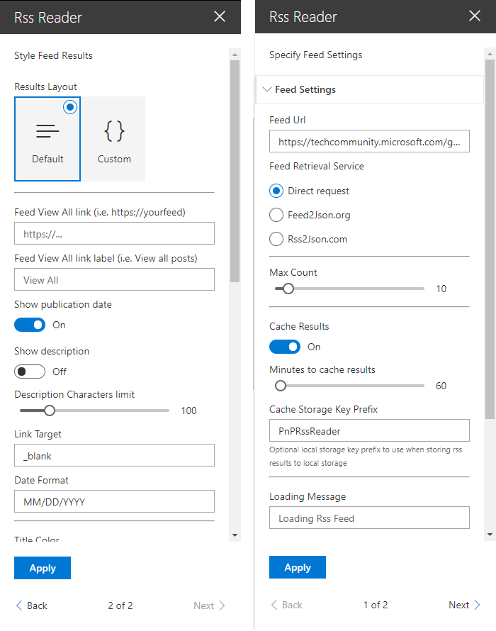

## SharePoint Framework RSS Reader

## Summary

A RSS Reader original based on work completed by Olivier Carpentier's from:  https://github.com/OlivierCC/spfx-40-fantastics/tree/master/src/webparts/rssReader
Root project: https://github.com/OlivierCC/spfx-40-fantastics

React RSS Reader utilizes SharePoint Framework v1.7.0 with no dependency on jQuery or a RSS Feed library. This project does utilize https://sharepoint.github.io/sp-dev-fx-property-controls/, and Moment React for date manipulation. Handlebar template option derived from React Search Refiners: https://github.com/SharePoint/sp-dev-fx-webparts/tree/master/samples/react-search-refiners.

Main features include:

- Three different Rss Feed retrieval services, direct, https://feed2json.org, https://rss2json.com
- Optionally store rss feed results to local storage for quick reload with configurable timeout window
- Optional CORS proxy service for cross origin feeds
- Optional View All link in header to point to custom feed source
- Embedded feed rendering with optional parameters
-- Feed result layout options including optional display of item publish date and description
-- Demostration of color picker property for color control of certain aspects of webpart
- Custom feed rendering using local or remote handlebar template

  

This sample includes the following service(s):

## Used SharePoint Framework Version 

## Applies to

* [SharePoint Framework](https://docs.microsoft.com/sharepoint/dev/spfx/sharepoint-framework-overview)
* [Office 365 tenant](https://docs.microsoft.com/sharepoint/dev/spfx/set-up-your-development-environment)

## Solution

Solution|Author(s)
--------|---------
react-rss-reader | Eric Overfield -[@ericoverfield](http://www.twitter.com/ericoverfield)

## Version history

Version|Date|Comments
-------|----|--------
1.0 | Jan 21, 2019 | Initial release

## Disclaimer
**THIS CODE IS PROVIDED *AS IS* WITHOUT WARRANTY OF ANY KIND, EITHER EXPRESS OR IMPLIED, INCLUDING ANY IMPLIED WARRANTIES OF FITNESS FOR A PARTICULAR PURPOSE, MERCHANTABILITY, OR NON-INFRINGEMENT.**

---

## Minimal Path to Awesome

- Clone this repository

### SPFx 
- In the command line run:
  - `npm install`
  - `gulp serve`

## Web Parts Configuration

### Rss Reader Web Part

#### Rss Reader Settings

Setting | Description 
-------|----
Feed Url | The url of the Rss Feed for readers. Normally will url will return XML
Feed Retrieval Service | The service to use to retrieve the feed. **Direct** = Make a direct call from the webpart to the feed. Note, may have issues with CORS depending on the feed owner. **Feed2Json** = Retrieve a JSON version of feed via feed2json.org. Note, not for production, and may have issues with CORS. For production use, host your own feed2json service. Learn more at https://github.com/appsattic/feed2json.org. **Rss2Json** = CORS safe method to retieve a feed response. Note, subject to limitations with paid options available.
Feed Service Url | If using Feed2Json, the url of the feed2json service. Host your own service, learn more at https://github.com/appsattic/feed2json.org
Feed Service Api Key | If using rss2json, an optional Api key for paid services
Max Count | The maximum results to return, default: 10
Cache Results | Locally store results in browser local storage, default: no
Mins to Cache Results | If storing results in browser, number of minutes to store. Valid 1 to 1440 (one day), default: 60
Storage Key Prefix | An optional local storage key prefix to use when storing results
Loading Message | An optional custom message to display while the rss feed is being loaded
Use a CORS proxy | Use a CORS proxy to assist with feed retrieval, default: no
CORS Proxy Url | The url of a CORS proxy if allowed. {0} will be replaced with Feed Url, i.e. https://cors-anywhere.herokuapp.com/{0}
Disable CORS | Set request header mode to "no-cors", thus not requesting CORS response from service. Will disable CORS request, default: no

#### Styling Options

|Setting | Description|
|-------|----|
|External Template Url | The url of an external handlebar template to use in place of the handlebar template editor for custom layouts|
|Results Layout | The layout to use to display feed, Default (list) or Custom|
|Template Editor | A handlebar editor for custom layouts|
|View All Link | An optional link to view the entire feed, often a link to the rss source blog itself, default: none|
|View All Link Label | An optional label for the View All Link|

**Default layout options**
|Setting | Description|
-------|----
Show Publication Date | Display the publication date
Show Description | Display the content or description of each feed listing
Description Character Limit | The maximum number of description characters to display
Link Target | The "target" of a listing link, default: _blank
Date Format | The Moment based format format of the listing date, i.e. DD/MM/YYYY (European), default: MM/DD/YYYY
Title Color | Color override for a listing title
Background Color | Color override for the webpart background

## Features
This Web Part illustrates the following concepts on top of the SharePoint Framework:

- Use HttpClient to retrieve data from an outside data source using different services
- Utilize local storage
- Demonstrate different method to address CORS / CORB issues
- Handlebar based rendering with inline editor or remote template retrieval
- Use the React container component approach inspiring by the [react-todo-basic sample](https://github.com/SharePoint/sp-dev-fx-webparts/tree/master/samples/react-todo-basic).

