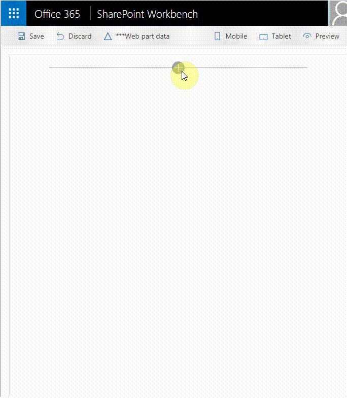

# SPFx ReactiveX (RxJs) Event Emitter Sample #

## Summary

This sample shows how we can use the [ReactiveX (RxJs)](http://reactivex.io/) library with the SharePoint Framework to communicate between web parts through broadcasting events utilizing the [Publish–subscribe pattern](https://en.wikipedia.org/wiki/Publish–subscribe_pattern). It enables a web part or component to emit event (broadcast message) and that event is received by other web parts or components that have been subscribed to receive it. Please note this is custom implementation of the [Publish–subscribe pattern](https://en.wikipedia.org/wiki/Publish–subscribe_pattern) by using the [ReactiveX (RxJs)](http://reactivex.io/) library. The SPFx will nativelly support this in future without the need of custom implementation through new SPFx api called Event Aggregator, but it is still in Alpha.

## Compatibility

 
 

-Incompatible-red.svg "SharePoint Server 2016 Feature Pack 2 requires SPFx 1.1")

## Applies to

* [SharePoint Framework](https://docs.microsoft.com/sharepoint/dev/spfx/sharepoint-framework-overview)
* [Office 365 developer tenant](https://docs.microsoft.com/sharepoint/dev/spfx/set-up-your-developer-tenant)

## Prerequisites

- Office 365 subscription with SharePoint Online.
- SharePoint Framework [development environment](https://docs.microsoft.com/sharepoint/dev/spfx/set-up-your-development-environment) already set up.

## Solution

Solution|Author(s)
--------|---------
react-rxjs-event-emitter | [Velin Georgiev](https://github.com/VelinGeorgiev) ( [@VelinGeorgiev](https://twitter.com/velingeorgiev) )

## Version history

Version|Date|Comments
-------|----|--------
0.0.1|August 22, 2017 | Initial commit
0.0.2|April 20, 2018 | Updated to SPFx v1.4.1
0.0.3|December 10, 2018 | Updated to SPFx v1.7.0

## Minimal Path to Awesome

- Clone this repository.
- Open the command line, navigate to the web part folder and execute:
    - `npm i`
    - `gulp serve`

>  This sample can also be opened with [VS Code Remote Development](https://code.visualstudio.com/docs/remote/remote-overview). Visit https://aka.ms/spfx-devcontainer for further instructions.

## Features

This Web Part illustrates the following concepts on top of the SharePoint Framework:

- Using React for building SharePoint Framework client-side web parts.
- Using Office UI Fabric React styles for building user experience consistent with SharePoint and Office.
- The use the ReactiveX (RxJs) Event Emitter to broadcast messages (events).
- The use the ReactiveX (RxJs) Event Emitter to subscribe and receive broadcasted messages (events).

## Making the RxJsEventEmitter external SPFx library.

The RxJsEventEmitter library can be turned into external library so it can be used by multiple SPFx solutions.
There is a very good [blog post](https://blog.mastykarz.nl/dll-code-sharepoint-framework/) by @waldekmastykarz how this can be done.

## Help

We do not support samples, but this community is always willing to help, and we want to improve these samples. We use GitHub to track issues, which makes it easy for  community members to volunteer their time and help resolve issues.

If you're having issues building the solution, please run [spfx doctor](https://pnp.github.io/cli-microsoft365/cmd/spfx/spfx-doctor/) from within the solution folder to diagnose incompatibility issues with your environment.

You can try looking at [issues related to this sample](https://github.com/pnp/sp-dev-fx-webparts/issues?q=label%3A%22sample%3A%20react-rxjs-event-emitter") to see if anybody else is having the same issues.

You can also try looking at [discussions related to this sample](https://github.com/pnp/sp-dev-fx-webparts/discussions?discussions_q=react-rxjs-event-emitter) and see what the community is saying.

If you encounter any issues while using this sample, [create a new issue](https://github.com/pnp/sp-dev-fx-webparts/issues/new?assignees=&labels=Needs%3A+Triage+%3Amag%3A%2Ctype%3Abug-suspected%2Csample%3A%20react-rxjs-event-emitter&template=bug-report.yml&sample=react-rxjs-event-emitter&authors=@VelinGeorgiev&title=react-rxjs-event-emitter%20-%20).

For questions regarding this sample, [create a new question](https://github.com/pnp/sp-dev-fx-webparts/issues/new?assignees=&labels=Needs%3A+Triage+%3Amag%3A%2Ctype%3Aquestion%2Csample%3A%20react-rxjs-event-emitter&template=question.yml&sample=react-rxjs-event-emitter&authors=@VelinGeorgiev&title=react-rxjs-event-emitter%20-%20).

Finally, if you have an idea for improvement, [make a suggestion](https://github.com/pnp/sp-dev-fx-webparts/issues/new?assignees=&labels=Needs%3A+Triage+%3Amag%3A%2Ctype%3Aenhancement%2Csample%3A%20react-rxjs-event-emitter&template=question.yml&sample=react-rxjs-event-emitter&authors=@VelinGeorgiev&title=react-rxjs-event-emitter%20-%20).

## Disclaimer

**THIS CODE IS PROVIDED *AS IS* WITHOUT WARRANTY OF ANY KIND, EITHER EXPRESS OR IMPLIED, INCLUDING ANY IMPLIED WARRANTIES OF FITNESS FOR A PARTICULAR PURPOSE, MERCHANTABILITY, OR NON-INFRINGEMENT.**

