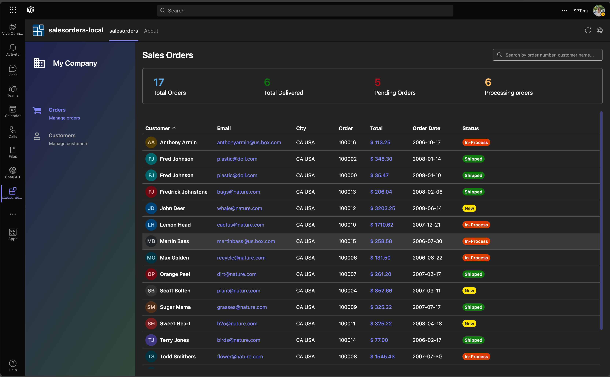
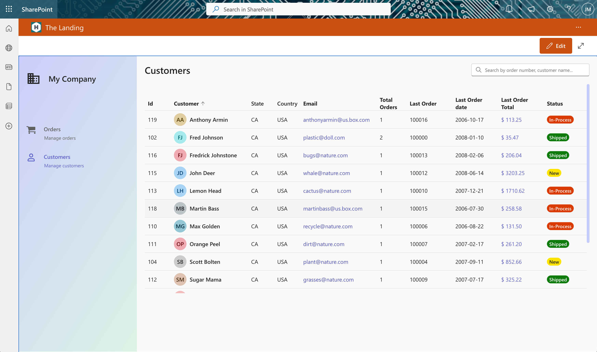

# Sales Orders Web Part

## Summary

 This Sample show how to use Microsoft Graph Connector that use DB2 Database and display Sales Orders in a list.

## Compatibility

| :warning: Important          |
|:---------------------------|
| Every SPFx version is only compatible with specific version(s) of Node.js. In order to be able to build this sample, please ensure that the version of Node on your workstation matches one of the versions listed in this section. This sample will not work on a different version of Node.|
|Refer to <https://aka.ms/spfx-matrix> for more information on SPFx compatibility.   |

## Applies to

* [SharePoint Framework](https://learn.microsoft.com/sharepoint/dev/spfx/sharepoint-framework-overview)
* [Microsoft 365 tenant](https://learn.microsoft.com/sharepoint/dev/spfx/set-up-your-development-environment)

## Prerequisites

> This Sample required the Microsoft Graph Connector [nodejs-javascript-IBMDB2](https://github.com/pnp/graph-connectors-samples/tree/main/samples/nodejs-javascript-IBMDB2) to be installed in your tenant.  Please see  for more information. [graph-connectors-samples](https://github.com/pnp/graph-connectors-samples)

> * Please approve the required Microsoft Graph Permissions required (ExternalItem.Read.All).

## Contributors

* [João Mendes](https://github.com/joaojmendes)

## Version history

Version|Date|Comments
-------|----|--------
1.0.0|November 6, 2023|Initial release

## Minimal Path to Awesome

The project was created with Visual Studio Teams Toolkit.  
This Application was developed  and is optimized to use as FullPage Application  

* Clone this repository
* Navigate to `src` folder
* in the command line run:
  * `npm install`
  * `gulp build`
  * `gulp bundle --ship`
  * `gulp package-solution --ship`
  * Add and Deploy Package to AppCatalog

## References

* [Getting started with SharePoint Framework](https://docs.microsoft.com/en-us/sharepoint/dev/spfx/set-up-your-developer-tenant)
* [Building for Microsoft teams](https://docs.microsoft.com/en-us/sharepoint/dev/spfx/build-for-teams-overview)
* [Use Microsoft Graph in your solution](https://docs.microsoft.com/en-us/sharepoint/dev/spfx/web-parts/get-started/using-microsoft-graph-apis)
* [Publish SharePoint Framework applications to the Marketplace](https://docs.microsoft.com/en-us/sharepoint/dev/spfx/publish-to-marketplace-overview)
* [Microsoft 365 Patterns and Practices](https://aka.ms/m365pnp) - Guidance, tooling, samples and open-source controls for your Microsoft 365 development

## Help

We do not support samples, but this community is always willing to help, and we want to improve these samples. We use GitHub to track issues, which makes it easy for  community members to volunteer their time and help resolve issues.

If you're having issues building the solution, please run [spfx doctor](https://pnp.github.io/cli-microsoft365/cmd/spfx/spfx-doctor/) from within the solution folder to diagnose incompatibility issues with your environment.

You can try looking at [issues related to this sample](https://github.com/pnp/sp-dev-fx-webparts/issues?q=label%3A%22sample%3A%20react-sales-orders%22) to see if anybody else is having the same issues.

You can also try looking at [discussions related to this sample](https://github.com/pnp/sp-dev-fx-webparts/discussions?discussions_q=react-sales-orders) and see what the community is saying.

If you encounter any issues using this sample, [create a new issue](https://github.com/pnp/sp-dev-fx-webparts/issues/new?assignees=&labels=Needs%3A+Triage+%3Amag%3A%2Ctype%3Abug-suspected%2Csample%3A%20react-sales-orders&template=bug-report.yml&sample=react-sales-orders&authors=@joaojmendes&title=react-sales-orders%20-%20).

For questions regarding this sample, [create a new question](https://github.com/pnp/sp-dev-fx-webparts/issues/new?assignees=&labels=Needs%3A+Triage+%3Amag%3A%2Ctype%3Aquestion%2Csample%3A%20react-sales-orders&template=question.yml&sample=react-sales-orders&authors=@joaojmendes&title=react-sales-orders%20-%20).

Finally, if you have an idea for improvement, [make a suggestion](https://github.com/pnp/sp-dev-fx-webparts/issues/new?assignees=&labels=Needs%3A+Triage+%3Amag%3A%2Ctype%3Aenhancement%2Csample%3A%20react-sales-orders&template=suggestion.yml&sample=react-sales-orders&authors=@joaojmendes&title=react-sales-orders%20-%20).

## Disclaimer

**THIS CODE IS PROVIDED *AS IS* WITHOUT WARRANTY OF ANY KIND, EITHER EXPRESS OR IMPLIED, INCLUDING ANY IMPLIED WARRANTIES OF FITNESS FOR A PARTICULAR PURPOSE, MERCHANTABILITY, OR NON-INFRINGEMENT.**

