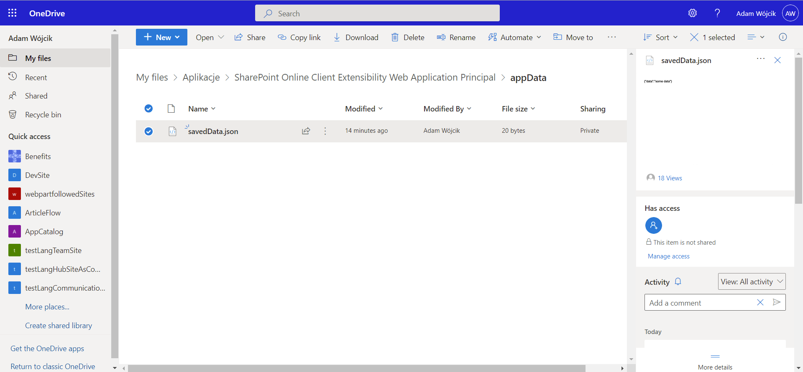
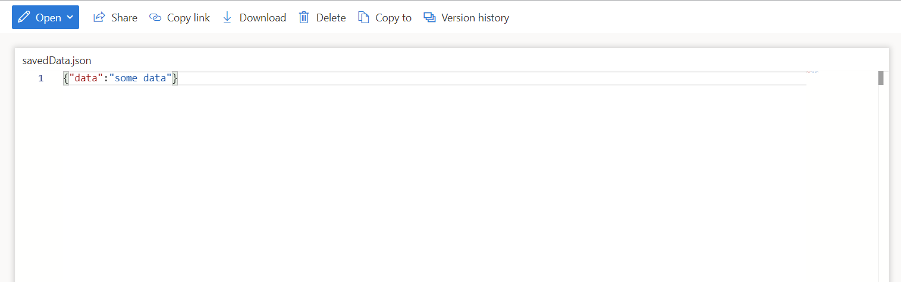

# Save to User Application Personal Folder in OneDrive

## Summary

This solution shows how to manage data stored in user application's personal folder in OneDrive which is one of many good methods to store application data/configuration which may be easily used in apps added to SharePoint page or Teams. The solution is built of two compontents. SPFx library which provides the functionality to manage data saved to OneDrive application personal folder and SPFx webpart component which is a very simple solution that uses the library and gets or saves data.

when adding solution to appcatalog make it available to all sites

data saved on onedrive in application personal folder

webpart added to sharepoint page

webpart added to teams

## Compatibility

 

-Incompatible-red.svg "SharePoint Server 2016 Feature Pack 2 requires SPFx 1.1")

-yellow.svg "Requires permissions to be granted before this solution can work on the hosted workbench")

## Applies to

- [SharePoint Framework](https://aka.ms/SPFx)
- [Microsoft 365 tenant](https://docs.microsoft.com/en-us/sharepoint/dev/SPFx/set-up-your-developer-tenant)

## Solution

Solution|Author(s)
--------|---------
react-save-to-onedrive-app-personal-folder | [Adam Wójcik](https://github.com/Adam-it)

## Version history

Version|Date|Comments
-------|----|--------
1.0|February 21, 2022|Initial release

## How to debug (local testing)

please follow those instructions being in the root folder (react-save-to-onedrive-app-personal-folder):
- go to library folder `cd library`
- bundle and build the solution running `gulp bundle --ship` and then `gulp build`
- run the command `npm link`
- go to the webpart folder `cd ../webpart`
- run the command `npm link manage-data`
- modify the 'config/serve.json' file and specify the `initialPage` with your local workbench
- test the webpart locally running `gulp serve`

## Minimal Path to Awesome

- Clone this repository (or [download this solution as a .ZIP file](https://pnp.github.io/download-partial/?url=https://github.com/pnp/sp-dev-fx-webparts/tree/main/samples/react-save-to-onedrive-app-personal-folder) then unzip it)
- Ensure that you are at the solution folder
- go to `library` folder
- in the command-line run:
  - `npm install`
  - `gulp bundle --ship`
  - `gulp package-solution --ship`
  - Add to AppCatalog and deploy (check option to make this solution available to all sites)
  - Approve the MS Graph API permissions in SharePoint Admin page
- go to `webpart` folder
- in the command-line run:
  - `npm install`
  - `gulp serve`
  - `gulp bundle --ship`
  - `gulp package-solution --ship`
  - Add to AppCatalog and deploy

>  This sample can also be opened with [VS Code Remote Development](https://code.visualstudio.com/docs/remote/remote-overview). Visit https://aka.ms/SPFx-devcontainer for further instructions.

## Features

Description of the extension that expands upon high-level summary above.

This extension illustrates the following concepts:

- how to use SPFx library code in webpart
- how to use Microsoft Graph API to use special approot on user OneDrive
- how to save/update data in a `json` file special approot folder on user OneDrive as a place to keep data a use in SharePoint or Teams

## References

- [Getting started with SharePoint Framework](https://docs.microsoft.com/en-us/sharepoint/dev/SPFx/set-up-your-developer-tenant)
- [Building for Microsoft teams](https://docs.microsoft.com/en-us/sharepoint/dev/SPFx/build-for-teams-overview)
- [Use Microsoft Graph in your solution](https://docs.microsoft.com/en-us/sharepoint/dev/SPFx/web-parts/get-started/using-microsoft-graph-apis)
- [Publish SharePoint Framework applications to the Marketplace](https://docs.microsoft.com/en-us/sharepoint/dev/SPFx/publish-to-marketplace-overview)
- [Microsoft 365 Patterns and Practices](https://aka.ms/m365pnp) - Guidance, tooling, samples and open-source controls for your Microsoft 365 development

## Help

We do not support samples, but this community is always willing to help, and we want to improve these samples. We use GitHub to track issues, which makes it easy for  community members to volunteer their time and help resolve issues.

If you're having issues building the solution, please run [SPFx doctor](https://pnp.github.io/cli-microsoft365/cmd/SPFx/SPFx-doctor/) from within the solution folder to diagnose incompatibility issues with your environment.

You can try looking at [issues related to this sample](https://github.com/pnp/sp-dev-fx-webparts/issues?q=label%3A%22sample%3A%20react-save-to-onedrive-app-personal-folder%22) to see if anybody else is having the same issues.

You can also try looking at [discussions related to this sample](https://github.com/pnp/sp-dev-fx-webparts/discussions?discussions_q=react-save-to-onedrive-app-personal-folder) and see what the community is saying.

If you encounter any issues while using this sample, [create a new issue](https://github.com/pnp/sp-dev-fx-webparts/issues/new?assignees=&labels=Needs%3A+Triage+%3Amag%3A%2Ctype%3Abug-suspected%2Csample%3A%20react-save-to-onedrive-app-personal-folder&template=bug-report.yml&sample=react-save-to-onedrive-app-personal-folder&authors=@Adam-it&title=react-save-to-onedrive-app-personal-folder%20-%20).

For questions regarding this sample, [create a new question](https://github.com/pnp/sp-dev-fx-webparts/issues/new?assignees=&labels=Needs%3A+Triage+%3Amag%3A%2Ctype%3Aquestion%2Csample%3A%20react-save-to-onedrive-app-personal-folder&template=question.yml&sample=react-save-to-onedrive-app-personal-folder&authors=@Adam-it&title=react-save-to-onedrive-app-personal-folder%20-%20).

Finally, if you have an idea for improvement, [make a suggestion](https://github.com/pnp/sp-dev-fx-webparts/issues/new?assignees=&labels=Needs%3A+Triage+%3Amag%3A%2Ctype%3Aenhancement%2Csample%3A%20react-save-to-onedrive-app-personal-folder&template=suggestion.yml&sample=react-save-to-onedrive-app-personal-folder&authors=@Adam-it&title=react-save-to-onedrive-app-personal-folder%20-%20).

## Disclaimer

**THIS CODE IS PROVIDED *AS IS* WITHOUT WARRANTY OF ANY KIND, EITHER EXPRESS OR IMPLIED, INCLUDING ANY IMPLIED WARRANTIES OF FITNESS FOR A PARTICULAR PURPOSE, MERCHANTABILITY, OR NON-INFRINGEMENT.**

