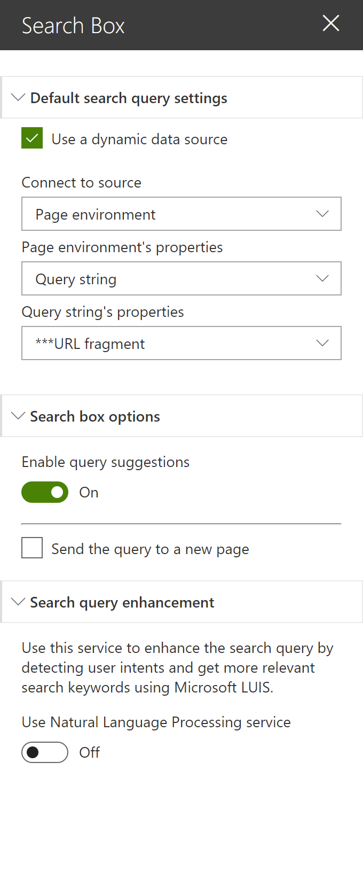
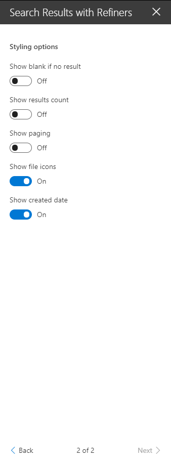
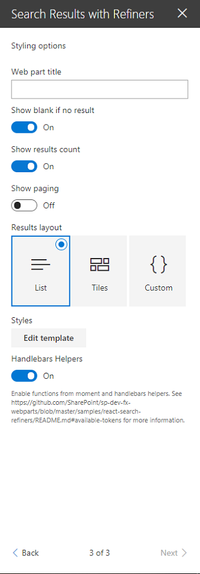
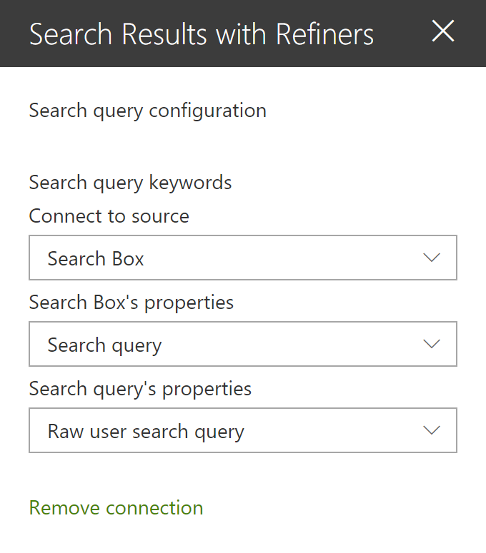
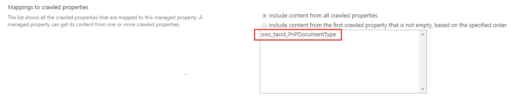
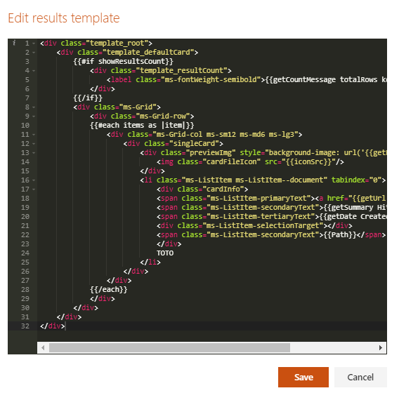
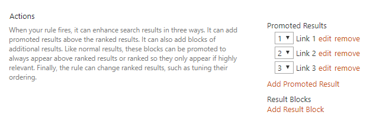
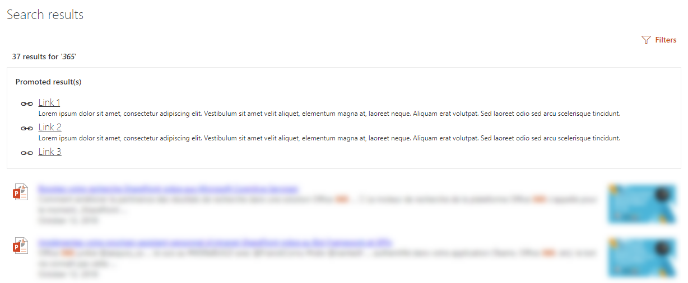

# SharePoint Framework search with search box, refiners and paging sample

## Summary
This sample shows you how to build user friendly SharePoint search experiences using SPFx in the modern interface. The main features include:

- Fully customizable SharePoint search query like the good old Content Search Web Part.
- Can either use a static query or be connected to a search box component using SPFx dynamic data.
- Live templating system with Handlebar to meet your requirements in terms of UI + builtin list and tiles templates. Can alos use template from an external file.
- Search results includings previews for Office documents and Office 365 videos.
- Customizable refiners supporting multilingual values for taxonomy based filters.
- Sortable results (unique field).
- Results paging.
- SharePoint best bets support.
- Search query enhancement with NLP tools (like Microsoft LUIS).

  

This sample includes the following components and service(s):

**Web Part(s)**

Component | Description 
----- | ----- 
Search Box Web Part | Allows users to enter free text/KQL search queries connected to a search results Web Part.
Search Results Web Part | Performs static or dynamic search query with customizable parameters like refiners, sorting and templating. An associated [blog post](http://thecollaborationcorner.com/2017/10/16/build-dynamic-sharepoint-search-experiences-with-refiners-and-paging-with-spfx-office-ui-fabric-and-pnp-js-library/) is available to give you more details about this Web Part implementation.

**Back-end service(s)**

Service | Description 
----- | ----- 
Search Query Enhancer | Sample Azure function to demonstrate the use of Microsoft LUIS and other cognitive services to interpret user intents and enhance the search box query accordingly.

## Used SharePoint Framework Version 

## Applies to

* [SharePoint Framework](https:/dev.office.com/sharepoint)
* [Office 365 tenant](https://dev.office.com/sharepoint/docs/spfx/set-up-your-development-environment)

## Solution

Solution|Author(s)
--------|---------
react-search-refiners | Franck Cornu (aequos) - [@FranckCornu](http://www.twitter.com/FranckCornu) Mikael Svenson -[@mikaelsvenson](http://www.twitter.com/mikaelsvenson)

## Version history

Version|Date|Comments
-------|----|--------
1.0 | Oct 17, 2017 | Initial release
1.1 | Jan 03, 2018 | Improvements and updating to SPFx drop 1.4
1.2 | Feb 12, 2018 | Added a search box Web Part + Added a "Result Source Id" and "Enable Query Rules" parameters.
1.3 | Apr1, 2018 | Added the result count + entered keywords option
1.4 | May 10, 2018 | <ul><li>Added the query suggestions feature to the search box Web Part</li><li>Added the automatic translation for taxonomy filter values according to the current site locale.</li> <li>Added the option in the search box Web Part to send the query to an other page</ul>
1.5 | Jul 2, 2018 | <ul><li>Added a templating feature for search results with Handlebars inspired by the [react-content-query-webpart](https://github.com/SharePoint/sp-dev-fx-webparts/tree/master/samples/react-content-query-webpart) sample.</li><li>Upgraded to 1.5.1-plusbeta to use the new SPFx dynamic data feature instead of event aggregator for Web Parts communication.</li> <li>Code refactoring and reorganization.</ul>
2.0.0.5 | Sept 18, 2018 | <ul><li>Upgraded to 1.6.0-plusbeta.</li><li>Added dynamic loading of parts needed in edit mode to reduce web part footprint.</li><li>Added configuration to sort.</li><li>Added option to set web part title.</li><li>Added result count tokens.</li><li>Added toggle to load/use handlebars helpers/moment.</li></ul>
2.1.0.0 | Oct 14, 2018 | <ul><li>Bug fixes ([#641](https://github.com/SharePoint/sp-dev-fx-webparts/issues/641),[#642](https://github.com/SharePoint/sp-dev-fx-webparts/issues/642))</li><li>Added document and Office 365 videos previews for the list template.</li><li>Added SharePoint best bets support.</li></ul>
2.1.1.0 | Oct 30, 2018 | <ul><li>Bug fix for editing custom template.</li><li>Bug fix for dynamic loading of video helper library.</li><li>Added support for Page context query variables.</li><li>Added `getUniqueCount` helper function.</li></ul>
2.1.2.0 | Nov 9, 2018 | <ul><li>Bug fix for IE11.</li><li>Added date query variables.</li><li>Added support for both result source id and query template.</li><li>Added `getUniqueCount` helper function.</li></ul>
2.2.0.0 | Nov 11, 2018 | <ul><li>Upgraded to SPFx 1.7.0</li><li>Added a TypeScript Azure Function to demonstrate NLP processing on search query</li><li>Removed extension data source. Now we use the default SPFx 'Page Environment' data source.</li></ul>

## Disclaimer
**THIS CODE IS PROVIDED *AS IS* WITHOUT WARRANTY OF ANY KIND, EITHER EXPRESS OR IMPLIED, INCLUDING ANY IMPLIED WARRANTIES OF FITNESS FOR A PARTICULAR PURPOSE, MERCHANTABILITY, OR NON-INFRINGEMENT.**

---

## Minimal Path to Awesome

- Clone this repository

### SPFx 
- Go to the [spfx](./spfx) directory
- In the command line run:
  - `npm install`
  - `gulp serve`

### Azure Function (Not mandatory)

- Go to the [functions](./functions) directory
- Follow the README.md file instructions
- Set the correct service URL in the Search Box Web Part

## Web Parts Configuration

### Search Box Web Part

#### Default Search Query Settings 

Setting | Description 
-------|----
Use a dynamic data source | You can set a default query text coming from am other data source. This case is particularly useful when you want to put a search box Web Part on the front page redirecting to an other page with the same query. Use the query string parameter 'q' from the builtin 'Page Environment' data source.

#### Search box options

Setting | Description 
-------|----
Enable query suggestions | The search box supports query suggestions from SharePoint. Refer to the following [article](https://docs.microsoft.com/en-us/sharepoint/search/manage-query-suggestions) to know how to add query suggestions in your SharePoint tenant (caution: it can take up to 24h for changes to take effect).
Send the query to a new page | Sends the search query text to a new page. On that page, use an other searh box Web Part configured with a dynamic data source as the default query. This Web Part uses the 'q' query string parameter.

#### Search query enhancement

Setting | Description 
-------|----
Use Natural Language Processing service | Turn this option 'on' if you want to enhance the query text with NLP services like LUIS. In the _'Service Url'_ field, enter the URL of the Azure Function endpoint. Refer the instructions in the `'/functions/README.md'` file to set up the service. In this sample, only relevant detected keywords are returned as q new query using LUIS. Enabling debug mode will show you relevant information about the entered query.

---

### Search Results Web Part

<table>
  <tr>
    <td>
      

    </td>
    <td>
      

    </td>
    <td>
      

    </td>
  </tr>
<table>

#### Search Query Configuration 

Setting | Description 
-------|----
Search query keywords | Here you choose to use a static search query or a query coming from a data source. It is recommended to use the associated Web Part coming with this sample. The search query is in KQL format so you can use search query variables (See this [post](http://www.techmikael.com/2015/07/sharepoint-rest-do-support-query.html) to know which ones are allowed). You can only plug one source to this Web Part.

#### Search Settings

Setting | Description 
-------|----
Query template | The search query template in KQL format. You can use search variables here (like Path:{Site}).
Result Source Identifier | The GUID of a SharePoint result source.
Initial sort order | The initial search results sort order. You can use mutliple properties here.
Sortable fields | The search managed properties to use for sorting. Make sure these are sortable. With SharePoint Online, you have to reuse the default ones to do so (RefinableStringXX etc.). The order is the same as they will appear in the sort panel. You can also provide your own custom labels using the following format RefinableString01:"You custom filter label",RefinableString02:"You custom filter label",... If no sortable fields are provided, the 'Sort' button will not be visible.
Enable Query Rules | Enable the query rules if applies. Turn this options  'on' to display your SharePoint Promoted results (links only).
Selected properties | The search managed properties to retrieve. You can use these properties then in your Handlebar template with the syntax (`item.property_name`).
Refiners | The search managed properties to use as refiners. Make sure these are refinable. With SharePoint Online, you have to reuse the default ones to do so (RefinableStringXX etc.). The order is the same as they will appear in the refnement panel. You can also provide your own custom labels using the following format RefinableString01:"You custom filter label",RefinableString02:"You custom filter label",... This Web Part supports dynamic translation of taxonomy based refiners with few additional configurations (see below).
Number of items to retrieve per page | Quite explicit. The paging behavior is done directly by the search API (See the *SearchDataProvider.ts* file), not by the code on post-render.

##### Miscellaneous: Taxonomy values dynamic translation

This Web Part supports the translation for taxonomy based filters according to current site language. To get it work, you must map a new refinable managed property associated with *ows_taxId_<your_column_name>* crawled property.

  

#### Styling Options

Setting | Description 
-------|----
Web Part Title | Shows a title for this Web Part. Set blank if you don't want a title.
Show blank if no result | Shows nothing if there is no result
Show result count | Shows the result count and entered keywords  
Show paging | Indicates whether or not the component should show the paging control at the bottom.
Result Layouts options | Choose the template to use to display search results. Some layouts are defined by default (List oand Tiles) but you can create your own either by clinkg on the **"Custom"** tile, or **"Edit template"** from an existing chosen template. In custom mode, you can set an external template. It has to be in the same SharePoint tenant. Behind the scenes, the Office UI Fabric core CSS components are used in a isolated way.
Handlebars Helpers | Load [handlebar helpers](https://github.com/helpers/handlebars-helpers) to use in your template. Disable this option will make Web Part loading faster if you don't need them.

---

#### Templates with Handlebars

This Web Part allows you change customize the way you display your search results. The templating feature comes directly from the original [react-content-query-webpart](https://github.com/SharePoint/sp-dev-fx-webparts/tree/master/samples/react-content-query-webpart) so thanks to @spplante!

  

##### Available tokens

Setting | Description 
-------|----
`{{showResultsCount}}` | Boolean flag corresponding to the associated in the property pane.
`{{totalRows}}` | The result count.
`{{maxResultsCount}}` | The number of results configured to retrieve in the web part.
`{{actualResultsCount}}` | The actual number of results retreived.
`{{keywords}}` | The search query.
`{{getSummary HitHighlightedSummary}}` | Format the *HitHighlightedSummary* property with recognized words in bold.
`{{getDate <date_managed_property> "<format>}}"` | Format the date with moment.ts according to the current language.
`{{getPreviewSrc item}}` | Determine the image thumbnail URL if applicable.
`{{getUrl item}}` | Get the item URL. For a document, it means the URL to the Office Online instance or the direct URL (to download it).
`{{getUrlField managed_propertyOWSURLH "URL/Title"}}` | Return the URL or Title part of a URL field managed property.
`{{getCountMessage totalRows <?keywords>}}` | Display a friendly message displaying the result and the entered keywords.
`` | Any valid search managed property returned in the results set. These are typically managed properties set in the *"Selected properties"* setting in the property pane. You don't need to prefix them with `item.` if you are in the "each" loop.
`{{webUrl}}` | The current web relative url. Use `{{../webUrl}}` inside a loop.
`{{siteUrl}}` | The current site relative url. Use `{{../siteUrl}}` inside a loop.
`{{getUniqueCount items "property"}}` | Get the unique count of a property over the result set (or another array)
`{{getUniqueCount array}}` | Get the unique count of objects in an array. Example: [1,1,1,2,2,4] would return `3`.

Also the [Handlebars helpers](https://github.com/helpers/handlebars-helpers) (188 helpers) are also available. You can also define your own in the *BaseTemplateService.ts* file. See [helper-moment](https://github.com/helpers/helper-moment) for date samples using moment.

#### Query variables

The following out of the box query variables are supported/tested:

* {searchTerms}
* {Site}
* {SiteCollection}
* {URLToken}
* {User}
* {Today}
* {SearchBoxQuery}
* {CurrentDisplayLanguage}
* {CurrentDisplayLCID}

The following custom query variables are supported:

* {Page.&lt;column&gt;} - where column is the internal name of the column.
   * When used with taxonomy columns, use `{Page.Column.Label}` or `{Page.Column.TermID}`
* {CurrentYear} - Todays's date four digits, 2018
* {CurrentMonth} - Today's month, 1-12
* {CurrentDate} - Today's date, 1-31
   * Sample query template: {searchTerms} Write>2010-{CurrentMonth}-{CurrentDate}

#### Best bets

This WP supports SharePoint best bets via SharePoint query rules:

  

  

#### Elements previews

Previews are available, **only for the list view**, for Office documents and Office 365 videos (not Microsoft Stream). The embed URL is directly taken from the `ServerRedirectedEmbedURL` managed property retrieved from the search results. 

  

The WebPart must have the following selected properties in the configuration to get the preview feature work (they are set by default): 
- ServerRedirectedPreviewURL
- ServerRedirectedURL
- contentclass
- ServerRedirectedEmbedURL
- DefaultEncodingURL

This preview is displayed as an _iframe_ when the user clicks on the corresponding preview image. DOM manipulations occur to add the _iframe_ container dynamically aside with the __ container.

## Features
This Web Part illustrates the following concepts on top of the SharePoint Framework:

- Build an user friendly search experience on the top of the SharePoint search REST API with paging, refiners and query suggestions using the *@pnp* JavaScript library.
- Use [Handlebars](https://handlebarsjs.com/) to create templates for search results according to your requirements like the good old display templates. 
- Using the SPFx [dynamic data feature](https://docs.microsoft.com/en-us/sharepoint/dev/spfx/dynamic-data) to connect Web Parts and/or Extensions.
- Using SharePoint taxonomy using JSOM in SPFx (filter translations)
- Integrate the [@pnp/spfx-property-controls](https://github.com/SharePoint/sp-dev-fx-property-controls) in your solution (*PlaceHolder* control).
- Integrate multiple Office UI Fabric components (DocumentCard, Panel, GroupedList, ...) to fit with the native Office 365 theme.
- Use the React container component approach inspiring by the [react-todo-basic sample](https://github.com/SharePoint/sp-dev-fx-webparts/tree/master/samples/react-todo-basic).
- Use [on-el-resize](https://www.npmjs.com/package/on-el-resize) by [Andrew Koltyakov](https://github.com/koltyakov) to resize iframes dynamically

